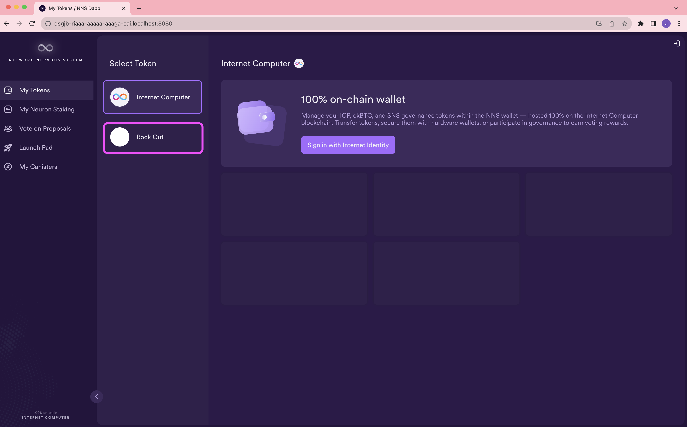
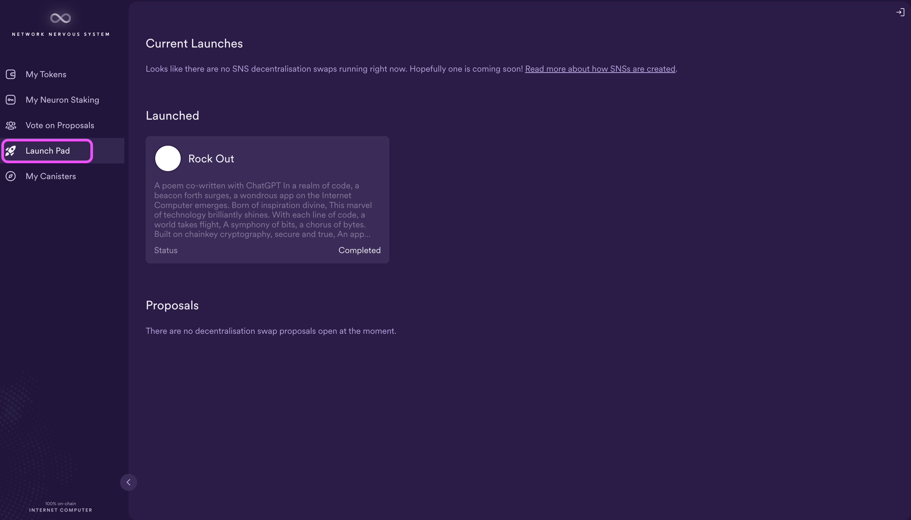

# 5.5 Launching an SNS

## Overview

A Service Nervous System (SNS) is an advanced form of a DAO. If you recall, we covered DAOs and the NNS in a previous module, [4.4 NNS and governance](../level-4/4.4-nns-governance.md). To recap, a DAO, or decentralized autonomous organization, is a form of decentralized governance that is controlled by the DAO's stakeholders without a central form of authority. The Internet Computer is managed by a DAO known as the Network Nervous System. 

The underlying architecture of an SNS closely resembles the architecture of the NNS, but instead of being used to control the IC, an SNS is used to control a specific decentralized application that is running on the IC mainnet. Any dapp running on the mainnet can be handed over to an SNS, which results in the dapp being owned and controlled by a community. When an SNS takes control of a dapp, the dapp is then managed in the same way that the Internet Computer is managed by the NNS. When an SNS is launched, the ledger defines a unique token for the SNS that is then used by the community for participation in the SNS's governance. 

The dapp's community can participate in the dapp's SNS through staking the SNS's native token in a neuron. Then, changes to the dapp are proposed to the community via an SNS proposal. SNS voting rights use the same format that voting on the NNS does; anyone can stake the SNS's native token into a neuron, and the neuron's voting power is proportional to the quantity of SNS tokens staked within the neuron, the length of their dissolve delay, and the amount of time since the neuron was created.

## How an SNS works

While the core architecture of an SNS resembles that of the NNS, the NNS contains additional canisters that provide important functionalities on the IC, such as the cycles minting canister that is responsible for creating cycles, and the registry canister that contains the network's topology. In contrast, an SNS contains a few canisters that do not exist on the NNS, with the most notable canister being the decentralized swap canister used during the launch of the SNS. 

SNSs are provided as a system functionality. For an SNS to be launched, the NNS community must vote on and approve the SNS's original canister code. Once the SNS is launched, the code for the SNS's canisters is maintained by the IC and is changed through SNS proposals that are voted on by the community. All approved SNS canister versions are stored on an NNS canister known as the SNS Wasm Modules canister (SNS-W). Recall that all canisters are compiled into Wasm before being deployed on the IC.

When an SNS is created, the SNS-W canister is responsible for deploying the latest version of the SNS's canisters. When an SNS is updated, an NNS proposal is used to add a new version of the SNS's canisters to the SNS-W canister. Then, the SNS's community decides via SNS proposal if they'd like to adopt the new, approved version into the SNS. Once approved via proposal, the updates are applied to the SNS's canisters. 

All SNSs are hosted on the SNS subnet, which is exclusively used to host SNSs. This allows for simplified verification for end users, since end users can verify that an SNS is running on the SNS subnet, and therefore trust that the SNS's underlying code has been approved by the NNS community. 

An SNS is comprised of the following canisters:

- **SNS governance canister**: The governance canister defines who can participate in the SNS's governance decisions and automatically triggers the execution of all decisions. This canister stores the SNS proposals and a record of the neurons that define who the governance participants are. When a proposal is adopted, the governance system automatically triggers the execution of the proposal by calling a defined method. In most instances, the decision of the proposal is executed fully on-chain. 

- **SNS ledger and archive canisters**: The ledger canister implements the ICRC-1 token standard to create a unique token for each SNS. To learn more about ICRC-1 tokens, refer to the previous module [4.2: ICRC-1 tokens](../level-4/4.2-icrc-tokens.md) where you deployed an ICRC-1 ledger then created an ICRC-1 token. This canister stores the SNS's ledger, which keeps track of how many accounts own SNS tokens, the amount owned by each account, and the history of transactions for the SNS's token. Since the canister has limited memory, to keep the ledger's full history, the ledger canister spawns archive canisters to store the ledger's block history. 

- **SNS index canister**: The index canister keeps a record of which transactions are relevant for a given account. This provides the ability for wallets and other frontends to show all transactions for an accounts without requiring every frontend to implement this functionality themselves. When the NNS creates a new SNS, it will deploy the SNS's index canister as part of the deployment process. To deploy the index canister locally, follow the instructions found [here](/docs/current/developer-docs/integrations/icrc-1/icrc1-index-setup). 

- **SNS root canister**: The root canister is responsible for upgrading the other SNS canisters and the dapp canisters that the SNS is responsible for governing. 

- **SNS decentralization swap canister**: The decentralization swap canisters, also called the swap canister, is the primary canister involved when an SNS is launched. In a decentralization swap, users provide ICP tokens that are swapped for the SNS's native token. For an SNS to be launched, the decentralization swap must collect a certain amount of initial funding. This canister collects that initial funding and facilitates the distribution of neurons (and therefore the voting power) to the participants of the decentralization swap, making the SNS's governance decentralized.

### SNS asset canisters

An SNS's asset canister is used to provide a user interface to the dapp. Asset canister typically hold assets such as HTML and CSS files. They can be used to provide users with a way to interface with an SNS's DAO, such as interacting with the SNS's proposals, decentralization swap, or ledger. For interfacing with an SNS, the `sns-js` library can be used to initialize a wrapper that routes calls to the appropriate canister controlled by the SNS, providing a single point of entry for most functions. Alternatively, `sns-js` can also be used to initialize specific canisters that should have calls routed to them. 

Any contents of the SNS's asset canister must be configured before the SNS is launched. Any changes made afterwards must be made by a principal with the `Prepare` permission, allowing them to make a batch of changes to the asset canister and then 'lock in' the changes. In order for the changes to be applied to the canister, an SNS proposal must be submitted and approved. If approved, the SNS governance canister is the only entity that can commit the approved changes. 

To deploy an asset canister, any canister in the `dfx.json` file can be configured as an asset canister by setting the canister's `"type":` as `"assets"`, such as:

```
    "asset_canister": {
      "source": [],
      "type": "assets"
    }
```

This configuration will prompt `dfx` to automatically generate the required files, such as `assets.wasm.gz` and a `candid/assets.did` file. 

Then, to deploy the asset canister locally for testing, use the following command:

```
dfx deploy asset_canister --network "local" --no-wallet
```

The asset canister should be deployed and have the proper permissions configured before the dapp is handed over to an SNS.

### Decentralization swaps

In order for an SNS to be launched, the SNS must have a successful decentralization swap. A decentralization swap is the action of initially funding the SNS by swapping ICP tokens for the SNS's native token. The decentralization swap is done through the SNS decentralization swap canister which is owned and operated by the IC. It is controlled by the NNS root canister. 

When the swap starts, there is a pre-defined amount of SNS tokens to be distributed publicly. During the swap, participants can send ICP tokens to the swap canister to contribute to the SNS's initial funding.

When the swap ends, the collected ICP tokens are swapped for the SNS's tokens. Participants that sent ICP tokens to the swap canister receive SNS tokens in the form of SNS neurons. The amount they receive is pro-rated by the amount of ICP tokens they contributed to the overall amount of ICP collected in the swap. For example, if the swap canister initially held 1000 SNS tokens, and 500 ICP tokens were collected during the swap, the exchange rate would be 2:1, meaning each participant would receive 2 tokens for each ICP token they contributed.

The SNS places the collected ICP into an SNS controlled treasury. After a successful swap, the SNS tokens are owned by the community and the SNS is governed by that community. 

### SNS tokenomics and rewards

Tokenomics refers to the economics of a token system. Tokenizing a DAO can help to introduce new incentives for users to participate in the DAO, since anyone in the world can purchase tokens, contribute to the initial funding of the DAO, or participate in the DAO's decision making. Tokens can be given as rewards to new or active users, helping to attract additional users.

Tokenomics includes a wide range of topics such as:

- Developing the token supply and demand, including minting new tokens or burning existing tokens. Token supply is defined as the amount of token holders willing to sell at a given price. Demand is defined as the amount of tokens that buyers are willing to purchase at a given price. You can learn more about token supply and demand [here](/docs/current/developer-docs/integrations/sns/tokenomics/tokenomics-intro#supply-and-demand).

- Determining how tokens are used. Token utility can be used for several different use-cases, such as governance within the SNS, currency within the dapp, operations, decentralized financial (DeFi) functions, or social finance (SoFi) functions. You can learn more about token use-cases [here](/docs/current/developer-docs/integrations/sns/tokenomics/tokenomics-intro#token-use-cases).

- Allocating the tokens to the participants of the DAO. When considering the initial token allocation for an SNS, you should define which groups or accounts receive how many tokens. Some examples of groups that should be considered to receive tokens are:

    - The DAO treasury: The treasury of the DAO holds tokens that are at the disposition of the DAO. These tokens can be used according to a set of predefined rules set by the DAO. 

    - The pool of tokens for the decentralization swap: The decentralized swap is the pool of tokens distributed to the community via an initial or subsequent decentralization swap. 

    - The seed funders who have invested in the project prior to launch: Tokens should be distributed to anyone who provided initial funding or investment into the project prior to the launch of the DAO. 

    - The development team: Tokens should be distributed to the development team who contributed to the initial version of the DAO.

    You can learn more about initial token allocation [here](/docs/current/developer-docs/integrations/sns/tokenomics/tokenomics-intro#initial-token-allocation).

- Determining incentive mechanisms. One incentive mechanism is rewards for voting on the SNS's proposals. Voting rewards use the same structure as NNS voting rewards. You can read more about voting rewards [here](/docs/current/developer-docs/integrations/sns/tokenomics/rewards).

## Planning an SNS launch

Before diving into the technical details of creating an SNS, it's important to spend time defining the goals of the SNS and the dapp that it controls. When creating an SNS, custom unique settings can be defined for the SNS's tokenomics and governance to match the goals you have defined, so you can define these goals as simple or as complex as desired. 

An SNS's deployment and decentralization swap must be approved by the NNS through a proposal. This proposal is designed to pitch the dapp to the NNS community and potential contributors to the decentralization swap. The proposal should also establish trust within the NNS community that the dapp is sustainable, ready to be governed by a decentralized entity, and has a viable roadmap. For these reasons, it is imperative to consider and present the following within the proposal submitted to the NNS:

- Management team's background and previous application launch success.

- The dapp's technology stack.

- Clear roadmap: Display a clear roadmap that reflect's the goals of the dapp for continued growth and innovation once launched. 

- The dapp's addressable market within the dapp market space.

- Market fit of the dapp: Demonstrate how your dapp fits the market by using growth and usage metrics. It is important to demonstrate that the dapp has active, loyal users.

- Budget and financial details: Provide information regarding the dapp's necessary funding, if applicable, and how the funds raised will be spent. 

- Utility of the token and tokenomics: Explain future utility such as the ability to use the token for in-app purchases, access to additional functions or services within the dapp, and the dapp's interoperability with others applications.

- Information regarding the designed token-holding audience: Provide information regarding the desired holding audience to ensure long-term success and continued development of the initial vision of the dapp's roadmap and intentions. 

- Positive unit economics: Display the ability to generate value per new user that is greater than the cost of acquiring a new user. 

- Business risks and mitigation plans: Provide plans for managing risks such as user adoption, market decrease, or other accesses business risks. 

- Regulatory approvals: Provide a plan for acquiring any necessary regulatory approvals. 

- Growth and competition: Demonstrate how the dapp plans to achieve growth and overcome hurdles related to competition, both present and future.

Additionally, it is important to take into consideration that since tokenizing the dapp and placing it under control of the SNS will decentralized the control of the dapp, resulting in the development of the dapp to slow down. This is due to the process of proposing changes to the dapp via SNS proposals, requiring many people and parties to agree on the changes rather than just the dapp's developers. Therefore, it is recommended that developers of the dapp feel comfortable that code is in a stable position and that the dapp's roadmap reflects a decrease in development speed prior to handing the dapp over to the SNS.

Developers should plan to continue leading the project after the launch of the SNS. This is because despite having decentralized the dapp, it is important that the original developers manage the SNS community as the project matures into its decentralization. In this stage, developers may work closely with the token holders to drive project success and direction. Developers may need to provide data regarding ecosystem growth, the project's financial changes, and take token holder input and feedback to alter the dapp's roadmap. 


## Stages of an SNS launch

- #### Step 1: Choose the initial parameters of the SNS for the dapp.

- #### Step 2: Add the NNS root as co-controller of the dapp.

- #### Step 3: Submit the NNS proposal to create the SNS. 

- #### Step 4: Await the proposal's decision. 

- #### Step 5: If the proposal is approved, the SWS-W canister deploys the SNS canisters. 

- #### Step 6: The SNS-W sets the SNS root as the sole controller of the dapp. 

- #### Step 7: The SNS-W initializes the SNS canisters according to the initial parameters defined in step 1. 

- #### Step 8: The SNS decentralized swap begins. 

- #### Step 9: The SNS decentralized swap ends. 

- #### Step 10: The SNS decentralized swap finalizes. 

Detailed descriptions of each step can be found in the SNS documentation [here](/docs/current/developer-docs/integrations/sns/launching/launch-summary-1proposal). This tutorial will walk through these steps below. 

### SNS launch checklist

Before launching an SNS, the following checklist can be used to assure that your SNS is ready for launch:

- [x] Documentation:

    - [x] Tokenomics specification:

            - [x] Token utility: Define concise use-cases for the DAO's token.

            - [x] Initial token allocation amounts, including which groups or accounts receive how many tokens.  

            - [x] Voting power: Provide information about how voting power will be distributed at the SNS's genesis.

            - [x] Funding target: Maximum and minimum targets needed for the decentralized swap, including information about planned usage of raised funds. 

            - [x] Use the [SNS tokenomics tool](https://docs.google.com/spreadsheets/u/0/d/1eSxkJl94jPt63CdOXH6ROy-WSkacW6P4qcAKMLrfBPc/edit) to analyze and document the SNS's proposed tokenomics. 

    - [x] Technical architecture:

            - [x] Technical architecture overview to describe how the dapp operates. 

            - [x] Whitepaper: This paper should provide information on the dapp's architecture, the goal of launching the SNS, tokenomics, and other information relevant to the community. For inspiration, you can read the Hot or Not whitepaper [here](https://hotornot.notion.site/hotornot/Hot-or-Not-Whitepaper-c539179e51f44867979f4372e4635f59).

            - [x] Project roadmap: Showcase the plan for the dapp, including past the SNS launch. This should display the vision for the dapp created by the dapp's teams and developers.

    - [x] Disclosure of dependencies: Disclose what possible off-chain services or 3rd party service providers the dapp may rely on.

    - [x] Create an SNS configuration file: Create the SNS's initial configuration file that will be submitted to the NNS for approval. This is a `.yaml` configuration file that defines the token name, supply, distribution, transaction fees, dissolve delays, and more. A template for this file can be found [here](https://github.com/dfinity/ic/blob/master/rs/sns/cli/sns_init_template.yaml). 

    - [x] Create an NNS proposal: Before an SNS can be launched, the NNS must approve of the SNS via a proposal. 

- [x] Technical prep and testing:

    - [x] Security review: Conduct a security review that includes fixing any risky findings. 

    - [x] Open sourcing: If your dapp is not already open source, it should be open sourced prior to the SNS launch. A dapp is not truly decentralized if the source code is not shared with the community, and it is hard for community members to make a proper voting decision regarding dapp upgrades without having full visibility into the code. 

    - [x] Create a reproducible build: From the open source code, a reproducible build should be created. You can read more about reproducible builds [here](/docs/current/developer-docs/backend/reproducible-builds). 

    - [x] Test dapp operations with an SNS testflight: Before requesting an official SNS production launch, it is highly encouraged to test their deployed dapp's operations via SNS proposals using the SNS testflight suite. 

    - [x] Integrate an SNS frontend into the dapp: Decide whether the SNS's functionality will be integrated into the frontend of the dapp or not. One example of integration into the frontend is to include the SNS proposal voting on the dapp's frontend. 

    - [x] Test the SNS launch locally.

- [x] Community consultation:

    - [x] Publish the tokenomics, whitepaper, roadmap, and technical architecture documents.

    - [x] Execute a community discussion on the Internet Computer forum to discuss the dapp's decentralization plans.

- [x] SNS launch workflow:

    - [x] Hand over control of the dapp to the NNS through an NNS proposal. 

    - [x] Submit the SNS decentralization proposal. 

    - [x] Setup custom SNS functions to execute code on SNS managed canisters via SNS proposals. More information can be found in the documentation on how to [manage an SNS](/docs/current/developer-docs/integrations/sns/managing/making-proposals). 


## Creating a sample SNS

To create an SNS, first you will need a dapp that you'd like to be governed by the SNS. Remember that the SNS is the governance for the dapp, not the dapp itself. For this tutorial, you can follow along using any dapp that you've created yourself or through one of the previous tutorials in this series. This tutorial will showcase how to create an SNS using the poll dapp that you created in module [1.3: Creating your first dapp](../level-1/1.3-first-dapp.md), since this is a simple dapp that includes a frontend canister. 

You can clone the code for that dapp from the repo [here](https://github.com/jessiemongeon1/dev-journey-poll-dapp/tree/main).

### Prerequisites

Before you start, verify that you have set up your developer environment according to the instructions in [0.3 Developer environment setup](../level-0/03-dev-env.md).

For developing and testing the SNS locally, you will need to install `ic-admin` and the SNS CLI.

To install `ic-admin`, run the commands:

```
curl "https://download.dfinity.systems/ic/7445081734e6d896d090295967d50710975c4f25/openssl-static-binaries/x86_64-darwin/ic-admin.gz" -o - | gunzip > ./ic-admin
chmod +x ./ic-admin
```

You can learn more about `ic-admin` [here](/docs/current/developer-docs/setup/ic-admin). 

To install the SNS CLI, run the commands:

```
git clone git@github.com:dfinity/ic.git
cd ic
brew install bazelisk
bazel build //rs/sns/cli:sns
```

### Using the `sns-testing` repo

To aid in the development of SNSs, DFINITY has created an `sns-testing` repo that includes a collection of scripts that can be used to test the SNS process locally. Using the `sns-testing` repo, developers can deploy their dapp locally and run through the stages of deploying an SNS. 

The `sns-testing` repo can be used to test functionality of an SNS such as:

- Initiating proposals.

- Passing proposals.

- Starting decentralization swaps.

- Upgrade the dapp via voting on proposals. 

:::info
The `sns-testing` repo may not work for every dapp; it is intended to showcase an example dapp that can be edited by developers to reflect their dapp.
:::

To use the the `sns-testing` repo, you need first need to set it up locally. This tutorial will showcase how to set it up using an Apple silicon system (Apple M1, Apple M2, etc). For instructions on how to set up this repo on an Apple intel or Linux-based system, see the instructions [here](https://github.com/dfinity/sns-testing/tree/main#bootstrapping-a-testing-environment-via-docker).

### Setting up the local `sns-testing` repo.

First, assure that you have [Homebrew](https://brew.sh/) installed. Use Homebrew to install `bash`, `coreutils`, `jq`, and `yq`:

```
brew install bash coreutils jq yq
```

Next, install `rosetta` with the following command:

```
softwareupdate --install-rosetta
```

To use the `sns-testing` repo locally, you will also need to install [Rust](https://www.rust-lang.org/tools/install) and the Rust `wasm32-unknown-unknown` target: 

```
rustup target add wasm32-unknown-unknown
```

Then, you need to add these newly installed tools to your local environment PATH with the command:

```
echo 'export PATH="$PATH:/opt/homebrew/bin/:/usr/local/opt/coreutils/libexec/gnubin"' >> "${HOME}/.bashrc"
```

The command above uses `.bashrc` since the main scripts and commands in the `sns-testing` repo are executed via Bash. 

Next clone the `sns-testing` repo with the command:

```
git clone https://github.com/dfinity/sns-testing.git
cd sns-testing
```

Finally, you're ready to run the repo's `install.sh` script to finish setting up the local SNS testing suite:

```
bash install.sh
```

Next, start a local replica using the following command:

```
DX_NET_JSON="${HOME}/.config/dfx/networks.json"
mkdir -p "$(dirname "${DX_NET_JSON}")"
cp "$DX_NET_JSON" "${DX_NET_JSON}.tmp" 2>/dev/null  
echo '{
   "local": {
      "bind": "0.0.0.0:8080",
      "type": "ephemeral",
      "replica": {
         "subnet_type": "system",
         "port": 8000
      }
   }
}' > "${DX_NET_JSON}"
./bin/dfx start --clean; \
mv "${DX_NET_JSON}.tmp" "$DX_NET_JSON" 2>/dev/null
```

You'll notice that this command is different from how you've started a local replica in the past (using `dfx start --background clean`). This command creates a custom `networks.json` file which includes a local network configuration of:

```json
   "local": {
      "bind": "0.0.0.0:8080",
      "type": "ephemeral",
      "replica": {
         "subnet_type": "system",
         "port": 8000
      }
   }
```

Then, it starts `dfx` using this `networks.json` file. Once the local replica is running, the terminal will display the local dashboard URL:

```
Dashboard: http://localhost:8000/_/dashboard
```

If you open this URL in a web browser, you will see the local replica dashboard. 

Now that the local replica is running, you need to start an instance of the NNS frontend. This will be used to interact with the locally created SNS. 

To start the local NNS frontend, first open another terminal window. Then, switch the terminal to use Bash by running the command `bash` in the new terminal window.

:::info
This tutorial showcases the workflow for an Apple silicon environment. Apple silicon uses a local terminal execution environment known as `zsh` instead of Bash. To use Bash, the terminal must be switched to Bash using the `bash` command, which will change the terminal prompt to reflect:

```
bash-5.2$ 
```

It is recommended to use Bash version `5.2.x` or newer.

For Apple Intel systems or Linux-based systems, this step may be redundant as the terminal may already be using Bash. Check with the documentation for your operating system for more information.
:::

Next, in the Bash terminal, navigate back into the `sns-testing` directory, then run the local script `setup_locally.sh`:

```
./setup_locally.sh
```

#### What this script does

- Downloads the Wasm file for the 'cycles-minting' canister and imports it as the 'nns-cycles-minting' canister.
- Downloads the Wasm file for the 'genesis-token' canister and imports it as the 'nns-genesis-token' canister. 
- Downloads the Wasm file for the 'governance' canister and imports it as the 'nns-governance' canister.
- Downloads the Wasm file for the 'ledger' canister and imports it as the 'nns-ledger' canister.
- Downloads the Wasm file for the 'lifeline' canister and imports it as the 'nns-lifeline' canister.
- Downloads the Wasm file for the 'registry' canister and imports it as the 'nns-registry' canister.
- Downloads the Wasm file for the 'root' canister and imports it as the 'nns-root' canister.
- Downloads the Wasm file for the 'sns-wasm' canister and imports it as the 'nns-sns-wasm' canister.
- Downloads the Wasm file for the 'nns-dapp' canister.
- Downloads the Wasm file for the 'internet_identity' canister.
- Downloads the Wasm file for the 'sns_governance' canister.
- Downloads the Wasm file for the 'sns_index' canister.
- Downloads the Wasm file for the 'sns_ledger' canister.
- Downloads the Wasm file for the 'sns_root' canister.
- Downloads the Wasm file for the 'sns_swap' canister.
- Returns the local canister names and their IDs. 

In your terminal window that is you used to run the `dfx start` command, you will see output that logs some test SNS proposals that are executed by this script:

```
2023-11-22 19:46:57.628160 UTC: [Canister qsgjb-riaaa-aaaaa-aaaga-cai] Inserting assets...
2023-11-22 19:46:57.628160 UTC: [Canister qsgjb-riaaa-aaaaa-aaaga-cai] Inserted 100 assets.
2023-11-22 19:47:02.872644 UTC: [Canister rrkah-fqaaa-aaaaa-aaaaq-cai] [Governance] manage_neuron
2023-11-22 19:47:02.872644 UTC: [Canister rrkah-fqaaa-aaaaa-aaaaq-cai] [Governance] Proposal 1 decided, thanks to majority. Tally at decision time: Tally { timestamp_seconds: 1700682422, yes: 14061430526, no: 0, total: 14061430526 }
2023-11-22 19:47:02.872644 UTC: [Canister qvhpv-4qaaa-aaaaa-aaagq-cai] No SNS to update.
2023-11-22 19:47:02.872644 UTC: [Canister rkp4c-7iaaa-aaaaa-aaaca-cai] [cycles] setting default subnet list
2023-11-22 19:47:02.872644 UTC: [Canister rrkah-fqaaa-aaaaa-aaaaq-cai] [Governance] Execution of proposal: 1 succeeded. (Proposal title: Some("Set authorized subnets"))
2023-11-22 19:47:04.834342 UTC: [Canister rrkah-fqaaa-aaaaa-aaaaq-cai] [Governance] manage_neuron
2023-11-22 19:47:04.834342 UTC: [Canister rrkah-fqaaa-aaaaa-aaaaq-cai] [Governance] Proposal 2 decided, thanks to majority. Tally at decision time: Tally { timestamp_seconds: 1700682424, yes: 14061430526, no: 0, total: 14061430526 }
2023-11-22 19:47:04.834342 UTC: [Canister rrkah-fqaaa-aaaaa-aaaaq-cai] [Governance] Execution of proposal: 2 succeeded. (Proposal title: Some("Add SNS Subnet IDs to SNS-WASM"))
2023-11-22 19:47:09.375146 UTC: [Canister rrkah-fqaaa-aaaaa-aaaaq-cai] [Governance] manage_neuron
2023-11-22 19:47:09.375146 UTC: [Canister rrkah-fqaaa-aaaaa-aaaaq-cai] [Governance] Proposal 3 decided, thanks to majority. Tally at decision time: Tally { timestamp_seconds: 1700682429, yes: 14061430526, no: 0, total: 14061430526 }
2023-11-22 19:47:09.375146 UTC: [Canister rrkah-fqaaa-aaaaa-aaaaq-cai] [Governance] Execution of proposal: 3 succeeded. (Proposal title: Some("Add root SNS canister wasm to SNS-WASM"))
2023-11-22 19:47:12.604347 UTC: [Canister rrkah-fqaaa-aaaaa-aaaaq-cai] [Governance] manage_neuron
2023-11-22 19:47:12.604347 UTC: [Canister rrkah-fqaaa-aaaaa-aaaaq-cai] [Governance] Proposal 4 decided, thanks to majority. Tally at decision time: Tally { timestamp_seconds: 1700682432, yes: 14061430526, no: 0, total: 14061430526 }
2023-11-22 19:47:12.604347 UTC: [Canister rrkah-fqaaa-aaaaa-aaaaq-cai] [Governance] Execution of proposal: 4 succeeded. (Proposal title: Some("Add governance SNS canister wasm to SNS-WASM"))
2023-11-22 19:47:15.877080 UTC: [Canister rrkah-fqaaa-aaaaa-aaaaq-cai] [Governance] manage_neuron
2023-11-22 19:47:15.877080 UTC: [Canister rrkah-fqaaa-aaaaa-aaaaq-cai] [Governance] Proposal 5 decided, thanks to majority. Tally at decision time: Tally { timestamp_seconds: 1700682435, yes: 14061430526, no: 0, total: 14061430526 }
2023-11-22 19:47:15.877080 UTC: [Canister rrkah-fqaaa-aaaaa-aaaaq-cai] [Governance] Execution of proposal: 5 succeeded. (Proposal title: Some("Add swap SNS canister wasm to SNS-WASM"))
2023-11-22 19:47:19.119491 UTC: [Canister rrkah-fqaaa-aaaaa-aaaaq-cai] [Governance] manage_neuron
2023-11-22 19:47:19.119491 UTC: [Canister rrkah-fqaaa-aaaaa-aaaaq-cai] [Governance] Proposal 6 decided, thanks to majority. Tally at decision time: Tally { timestamp_seconds: 1700682439, yes: 14061430526, no: 0, total: 14061430526 }
2023-11-22 19:47:19.119491 UTC: [Canister rrkah-fqaaa-aaaaa-aaaaq-cai] [Governance] Execution of proposal: 6 succeeded. (Proposal title: Some("Add ledger SNS canister wasm to SNS-WASM"))
2023-11-22 19:47:21.757439 UTC: [Canister rrkah-fqaaa-aaaaa-aaaaq-cai] [Governance] manage_neuron
2023-11-22 19:47:21.757439 UTC: [Canister rrkah-fqaaa-aaaaa-aaaaq-cai] [Governance] Proposal 7 decided, thanks to majority. Tally at decision time: Tally { timestamp_seconds: 1700682441, yes: 14061430526, no: 0, total: 14061430526 }
2023-11-22 19:47:21.757439 UTC: [Canister rrkah-fqaaa-aaaaa-aaaaq-cai] [Governance] Execution of proposal: 7 succeeded. (Proposal title: Some("Add index SNS canister wasm to SNS-WASM"))
2023-11-22 19:47:24.361174 UTC: [Canister rrkah-fqaaa-aaaaa-aaaaq-cai] [Governance] manage_neuron
2023-11-22 19:47:24.361174 UTC: [Canister rrkah-fqaaa-aaaaa-aaaaq-cai] [Governance] Proposal 8 decided, thanks to majority. Tally at decision time: Tally { timestamp_seconds: 1700682444, yes: 14061430526, no: 0, total: 14061430526 }
2023-11-22 19:47:24.361174 UTC: [Canister rrkah-fqaaa-aaaaa-aaaaq-cai] [Governance] Execution of proposal: 8 succeeded. (Proposal title: Some("Add archive SNS canister wasm to SNS-WASM"))
```

To validate that the testing environment has been setup correctly, run the following script in the Bash terminal. This script will run through the entire SNS deployment and lifecycle, while providing logging output that describes the steps being executed:

```
./run_basic_scenario.sh
```

:::info
This script will take a few minutes to run.
:::

#### What this script does

The `run_basic_scenario.sh` script creates a test proposal to upgrade a test canister. Then, it creates 100 identities, `participant-000` through `participant-100` that are used to vote on the test proposal. 

To confirm this script finished successfully, at the end of the script's output it will return the message:

```
Basic scenario has successfully finished.
```

As part of this test script, a new sample SNS called 'Rock Out' was created. You can view the sample SNS via the local NNS frontend dapp at `http://qsgjb-riaaa-aaaaa-aaaga-cai.localhost:8080/`:



To find out more information on this test SNS, select 'Launch Pad' from the left side bar menu. You will see the 'Rock Out' launch is in the status of 'Completed'.



### Testing your own dapp's SNS decentralization 

Now, you're ready to test creating an SNS for a local dapp. Recall that this tutorial will showcase how to use the poll dapp created in module [1.3: Creating your first dapp](../level-1/1.3-first-dapp.md).

Navigate into the project directory of the poll dapp and deploy the canisters with the `dfx deploy` command:

```
cd ~/developer_journey/poll
dfx deploy
```

Take note of the canister IDs for the `poll_backend` and `poll_frontend` canisters:

```
Installing code for canister poll_backend, with canister ID by6od-j4aaa-aaaaa-qaadq-cai
Installing code for canister poll_frontend, with canister ID avqkn-guaaa-aaaaa-qaaea-cai
```

Next, add the NNS root as the co-controller of both the frontend and backend canisters by using the commands:

```
~/ic/bazel-bin/rs/sns/cli/sns prepare-canisters add-nns-root CANISTER_ID_1 
~/ic/bazel-bin/rs/sns/cli/sns prepare-canisters add-nns-root CANISTER_ID_2
```

Replace `CANISTER_ID_1` and `CANISTER_ID_2` with the canister IDs for the `poll_backend` and `poll_frontend` canisters. If successful, you will receive output that resembles the following:

```
Added as controller of "by6od-j4aaa-aaaaa-qaadq-cai": r7inp-6aaaa-aaaaa-aaabq-cai
Added as controller of "avqkn-guaaa-aaaaa-qaaea-cai": r7inp-6aaaa-aaaaa-aaabq-cai
```

Then, you will need to set the initial parameters that will be used in the SNS's proposals. To do this, fill out the following file named `sns_init.yaml`. This file contains several comments that annotate and explain the different portions of the document. It is recommended to read it carefully:

```yaml
# You should make a copy of this file, name it sns_init.yaml, and edit it to
# suit your needs.
#
# All principal IDs should almost certainly be changed.
#
# In this file, 1 year is nominally defined to be 365.25 days.
#
# This gets passed to `sns propose`. See propose_sns.sh.
#
# This follows the second configuration file format developed for the `sns`
# CLI. The first format will be supported for a time, but this format will
# eventually become the standard format.
# ------------------------------------------------------------------------------
# UNITS
#
# This SNS configuration file version allows specifying the various
# fields with units that make configuration easier. For instance,
# in the previous version, all fields relating to token values
# had to be specified in e8s (fractions of 10E-8 of a governance token).
# In this version, similar fields can be specified in whole tokens,
# tokens with decimals, or e8s. Below is more information on the type
# of units that can be used.
#
# For fields that represent token values (such as `transaction_fee`
# or `rejection_fee`), devs can specify decimal strings ending in
# "tokens" (plural), decimal strings ending in "token" (singular),
# or integer strings (base 10) ending in "e8s". In the case of
# "tokens" strings, the maximum number of digits after the (optional)
# decimal point is 8. The "_" character may be sprinkled throughout.
# Whitespace around number is insignificant. E.g. " 42 tokens" is
# equivalent to "42tokens".
#
# For fields that represent duration values (such as `initial_voting_period`
# or `minimum_dissolve_delay`), devs can specify durations as a concatenation
# of time spans. Where each time span is an integer number and a suffix.
# Supported suffixes:
#  - seconds, second, sec, s
#  - minutes, minute, min, m
#  - hours, hour, hr, h
#  - days, day, d
#  - weeks, week, w
#  - months, month, M -- defined as 30.44 days
#  - years, year, y -- defined as 365.25 days
#
# For example, "1w 2d 3h" gets parsed as
#
# 1 week + 2 days + 3 hours
#    =
# (1 * (7 * 24 * 60 * 60) + 2 * 24 * 60 * 60 + 3 * (60 * 60)) seconds
#
# For fields that represent percentage values (such as `bonus`), devs specify
# the value as an integer with a trailing percent sign ('%'). For example,
# `10%`.
#
# For fields that represent time of day (such as `start_time`), devs specify
# the value as a string in form "hh::mm UTC". Where hh is hour, and mm is minute.
# Only the UTC timezone is currently supported.
# ------------------------------------------------------------------------------

# Name of the SNS project. This may differ from the name of the associated
# token. Must be a string of max length = 255.
name: Developer journey

# Description of the SNS project.
# Must be a string of max length = 2,000.
description: >
    A test SNS made as part of the ICP developer journey series.

# This is currently a placeholder field and must be left empty for now.
Principals: []

# Path to the SNS Project logo on the local filesystem. The path is relative
# to the configuration file's location, unless an absolute path is given.
# Must have less than 341,334 bytes. The only supported format is PNG.
logo: logo.png

# URL to the dapp controlled by the SNS project.
# Must be a string from 10 to 512 bytes.
url: https://forum.dfinity.org/t/developer-journey-feedback-and-discussion/23893

# Metadata for the NNS proposal required to create the SNS. This data will be
# shown only in the NNS proposal.
NnsProposal:
    # The title of the NNS proposal. Must be a string of 4 to 256 bytes.
    title: "NNS Proposal to create an SNS named 'Developer Journey'"

    # The HTTPS address of additional content required to evaluate the NNS
    # proposal.
    url: "https://forum.dfinity.org"

    # The description of the proposal. Must be a string of 10 to 2,000 bytes.
    summary: >
        Proposal to create an SNS in the Developer Journey tutorial series.


# If the SNS launch attempt fails, control over the dapp canister(s) is given to
# these principals. In most use cases, this is chosen to be the original set of
# controller(s) of the dapp. Must be a list of PrincipalIds.
fallback_controller_principals:
    # For the actual SNS launch, you should replace this with one or more
    # principals of your intended fallback controllers.
    #
    - x4d3z-ufpaj-lpxs4-v7gmt-v56ze-aub3k-bvifl-y4lsq-soafd-d3i4k-fqe

# The list of dapp canister(s) that will be decentralized if the
# decentralization swap succeeds. These are defined in the form of canister IDs,
# for example, `bnz7o-iuaaa-aaaaa-qaaaa-cai`.  For a successful SNS launch,
# these dapp canister(s) must be co-controlled by the NNS Root canister
# (`r7inp-6aaaa-aaaaa-aaabq-cai`) at latest at the time when the NNS proposal to
# create an SNS is adopted (usually this is required even earlier, e.g., to
# convince NNS neurons to vote in favor of your proposal).
dapp_canisters:
    # For the actual SNS launch, you should replace this with one or more
    # IDs of the canisters comprising your to-be-decentralized dapp.
    #
    - by6od-j4aaa-aaaaa-qaadq-cai
    - avqkn-guaaa-aaaaa-qaaea-cai

# Configuration of SNS tokens in the SNS Ledger canister deployed as part
# of the SNS.
Token:
    # The name of the token issued by the SNS ledger.
    # Must be a string of 4 to 255 bytes without leading or trailing spaces.
    name: Dev Journey Token

    # The symbol of the token issued by the SNS Ledger.
    # Must be a string of 3 to 10 bytes without leading or trailing spaces.
    symbol: DJTKN

    # SNS ledger transaction fee.
    transaction_fee: 10_000 e8s

    # Path to the SNS token logo on your local filesystem. The path is relative
    # to the configuration file location, unless an absolute path is given.
    # Must have less than 341,334 bytes. The only supported format is PNG.
    logo: logo.png

# Configures SNS proposal-related fields. These fields define the initial values
# for some of the nervous system parameters related to SNS proposals. This will
# not affect all SNS proposals submitted to the newly created SNS.
Proposals:
    # The cost of making an SNS proposal that is rejected by the SNS neuron
    # holders. This field is specified as a token. For example: "1 token".
    rejection_fee: 1 token

    # The initial voting period of an SNS proposal. A proposal's voting period
    # may be increased during its lifecycle due to the wait-for-quiet algorithm
    # (see details below). This field is specified as a duration. For example
    # "4 days".
    initial_voting_period: 4 days

    # The wait-for-quiet algorithm extends the voting period of a proposal when
    # there is a flip in the majority vote during the proposal's voting period.
    #
    # Without this, there could be an incentive to vote right at the end of a
    # proposal's voting period, in order to reduce the chance that people will
    # see and have time to react to that.
    #
    # If this value is set to 1 day, then a change in the majority vote at the
    # end of a proposal's original voting period results in an extension of the
    # voting period by an additional day. Another change at the end of the
    # extended period will cause the voting period to be extended by another
    # half-day, etc.
    #
    # The total extension to the voting period will never be more than twice
    # this value.
    #
    # For more information, please refer to
    # https://wiki.internetcomputer.org/wiki/Network_Nervous_System#Proposal_decision_and_wait-for-quiet
    #
    # This field is specified as a duration. For example: "1 day".
    maximum_wait_for_quiet_deadline_extension: 1 day

# Configuration of SNS voting.
Neurons:
    # The minimum amount of SNS tokens to stake a neuron. This field is specified
    # as a token. For instance, "1 token".
    minimum_creation_stake: 1 tokens

# Configuration of SNS voting.
Voting:
    # The minimum dissolve delay a neuron must have to be able to cast votes on
    # proposals.
    #
    # Dissolve delay incentivizes neurons to vote in the long-term interest of
    # an SNS, as they are rewarded for longer-term commitment to that SNS.
    #
    # Users cannot access the SNS tokens used to stake neurons (until the neuron
    # is dissolved). This field is specified as a duration. For example: "6 months".
    minimum_dissolve_delay: 1 month

    # Configuration of voting power bonuses that are applied to neurons to
    # incentivize alignment with the best interest of the DAO. Note, these
    # bonuses multiply each other, so the increase in voting power due to
    # the dissolve delay bonus is used in the equation to increase voting
    # power for the age bonus.
    MaximumVotingPowerBonuses:
        # Users with a higher dissolve delay are incentivized to take the
        # long-term interests of the SNS into consideration when voting. To
        # reward this long-term commitment, this bonus can be set to a
        # percentage greater than zero, which will result in neurons having
        # their voting power increased in proportion to their dissolve delay.
        #
        # For example, if the user has a dissolve delay of 6 months, and
        # the maximum dissolve delay duration (defined below as `duration`)
        # for the dissolve delay bonus is 12 months, and the maximum bonus
        # (defined as `bonus` below) is set to 10%, then that user’s voting
        # power will be 105% of their normal voting power based on staked
        # tokens (i.e. they will have a bonus of 5%). If the user increased
        # their dissolve delay to 9 months, they would get 107.5% of the normal
        # voting power of their tokens. And if they increased to 12 months, they
        # would get 110%. If they increase further, they get no additional bonus.
        #
        # If you do not want this bonus to be applied for neurons with higher
        # dissolve delay, set `bonus` to `0%` and those neurons will not receive
        # higher voting power.
        DissolveDelay:
            # This parameter sets the maximum dissolve delay a neuron can have.
            # When reached, the maximum dissolve delay bonus will be applied.
            # This field is specified as a duration. For example: "8 years".
            duration: 8 years
            # If a neuron's dissolve delay is `duration`, its voting power will
            # be increased by the dissolve delay `bonus` amount. 
            # This field is specified as a percentage. For instance, 
            # a value of "100%" means that the voting power will be doubled
            # (multiplied by 2).
            bonus: 100%

        # Users with neurons staked in the non-dissolving state for a long
        # period of time are incentivized to take the long-term interests of
        # the SNS into consideration when voting. To reward this long-term
        # commitment, this bonus can be set to a percentage (greater than zero),
        # which will result in neurons having their voting power increased in
        # proportion to their age.
        #
        # For example, if the neuron has an age of 6 months, and the maximum age
        # duration (defined below as `duration`) for the age bonus is 12 months,
        # and the maximum bonus (defined as `bonus` below) is set to 10%, then
        # that neuron’s voting power will be 105% of their normal voting power
        # based on staked tokens plus dissolve delay bonus (i.e. they will have a
        # bonus of 5%). If neuron aged another 3 months to have an age of 9 months,
        # the neuron would get 107.5% of the normal voting power. And if the neuron
        # aged another 3 months to 12 months, the neuron would get 110%. If the neuron
        # ages further, it get no additional bonus.
        #
        # If this bonus should not be applied for older neurons, set the bonus
        # to `0%` and older neurons will not receive higher voting power.
        Age:
            # This parameter sets the duration of time the neuron must be staked
            # in the non-dissolving state, in other words its `age`, to reach
            # the maximum age bonus. Once this age is reached, the neuron will
            # continue to age, but no more bonus will be applied. This field
            # is specified as a duration. For example: "2 years".
            duration: 4 years
            # If a neuron's age is `duration` or older, its voting power will be
            # increased by this age`bonus` amount. 
            # This field is specified as a percentage. For instance, 
            # a value of "25%" means that the voting power will increase by a quarter
            # (multiplied by 1.25).
            bonus: 25%

    # Configuration of SNS voting reward parameters.
    #
    # The voting reward rate controls how quickly the supply of the SNS token
    # increases. For example, setting `initial` to `2%` will cause the supply to
    # increase by at most `2%` per year. A higher voting reward rate
    # incentivizes users to participate in governance, but also results in
    # higher inflation.
    #
    # The initial and final reward rates can be set to have a higher reward rate
    # at the launch of the SNS and a lower rate further into the SNS’s lifetime.
    # The reward rate falls quadratically from the `initial` rate to the `final`
    # rate over the course of `transition_duration`.
    #
    # Setting both `initial` and `final` to `0%` will result in the system not
    # distributing voting rewards at all.
    #
    # More details on SNS tokenomics can be found in the developer documentation:
    # https://internetcomputer.org/docs/current/developer-docs/integrations/sns/tokenomics/rewards/#voting-rewards
    RewardRate:
        # The initial reward rate at which the SNS voting rewards will increase
        # per year. This field is specified as a percentage. For example: "15%".
        initial: 10%

        # The final reward rate at which the SNS voting rewards will increase
        # per year. This rate is reached after `transition_duration` and remains
        # at this level unless changed by an SNS proposal. This field is
        # specified as a percentage. For example: "5%".
        final: 2.25%

        # The voting reward rate falls quadratically from `initial` to `final`
        # over the time period defined by `transition_duration`.
        #
        # Values of 0 result in the reward rate always being `final`.
        #
        # This field is specified as a duration. For example: "8 years".
        transition_duration: 12 years

# Configuration of the initial token distribution of the SNS. You can configure
# how SNS tokens are distributed in each of the three groups:
# (1) tokens that are given to the original developers of the dapp,
# (2) treasury tokens that are owned by the SNS governance canister, and
# (3) tokens which are distributed to the decentralization swap participants.
#
# The initial token distribution must satisfy the following preconditions to be
# valid:
#    - The sum of all developer tokens in E8s must be less than `u64::MAX`.
#    - The Swap's initial balance (see group (3) above) must be greater than 0.
#    - The Swap's initial balance (see group (3) above) must be greater than or
#      equal to the sum of all developer tokens.
Distribution:
    # The initial neurons created when the SNS Governance canister is installed.
    # Each element in this list specifies one such neuron, including its stake,
    # controlling principal, memo identifying this neuron (every neuron that
    # a user has must be identified by a unique memo), dissolve delay, and a
    # vesting period. Even though these neurons are distributed at genesis,
    # they are locked in a (restricted) pre-initialization mode until the
    # decentralization swap is completed. Note that `vesting_period` starts
    # right after the SNS creation and thus includes the pre-initialization mode
    # period.
    #
    # For example:
    #  - principal: hpikg-6exdt-jn33w-ndty3-fc7jc-tl2lr-buih3-cs3y7-tftkp-sfp62-gqe
    #    stake: 1_000 tokens
    #    memo: 0
    #    dissolve_delay: 2 years
    #    vesting_period: 4 years
    Neurons:
        # For the actual SNS launch, you should replace this with one or more
        # principals of your intended genesis neurons.
        #
        - principal: x4d3z-ufpaj-lpxs4-v7gmt-v56ze-aub3k-bvifl-y4lsq-soafd-d3i4k-fqe
          stake: 1_000 tokens
          memo: 0
          dissolve_delay: 2 years
          vesting_period: 4 years
    # The initial SNS token balances of the various canisters of the SNS.
    InitialBalances:
        # The initial SNS token balance of the SNS Governance canister is known
        # as the treasury. This is initialized in a special sub-account, as the
        # main account of Governance is the minting account of the SNS Ledger.
        # This field is specified as a token. For instance, "1 token".
        governance: 2_000_000 tokens

        # The initial SNS token balance of the Swap canister is what will be
        # available for the decentralization swap. These tokens will be swapped
        # for ICP. This field is specified as a token. For instance, "1 token".
        swap: 500_000 tokens

    # Checksum of the total number of tokens distributed in this section.
    # This field is specified as a token. For instance, "1 token".
    #          1_000    (neuron)
    #      2 million    (governance)
    # + 500 thousand    (swap)
    # --------------
    total: 2_501_000 tokens

# Configuration of the decentralization swap parameters. Choose these parameters
# carefully, if a decentralization swap fails, the SNS will restore the dapp
# canister(s) to the fallback controllers (defined in
# `fallback_controller_principals`) and you will need to start over.
Swap:
    # The minimum number of direct participants that must participate for the
    # decentralization swap to succeed. If a decentralization swap finishes due
    # to the deadline or the maximum target being reached, and if there are less
    # than `minimum_participants` (here, only direct participants are counted),
    # the swap will be committed.
    minimum_participants: 57

    # Minimum amount of ICP from direct participants. This amount is required for
    # the swap to succeed. If this amount is not achieved, the swap will be
    # aborted (instead of committed) when the due date/time occurs.
    # Must be smaller than or equal than `maximum_direct_participation_icp`.
    minimum_direct_participation_icp: 100_000 tokens

    # Maximum amount of ICP from direct participants. If this amount is achieved,
    # the swap will finalize immediately, without waiting for the due date/time;
    # in this case, the swap would be committed if and only if the number of
    # direct participants (`minimum_participants`) is reached (otherwise, it
    # would be aborted).
    # Must be at least `min_participants * minimum_direct_participation_icp`.
    maximum_direct_participation_icp: 1_000_000 tokens

    # The minimum amount of ICP that each participant must contribute
    # to participate. This field is specified as a token. For instance,
    # "1 token".
    minimum_participant_icp:     10 tokens

    # The maximum amount of ICP that each participant may contribute
    # to participate. This field is specified as a token. For instance,
    # "1 token".
    maximum_participant_icp: 10_000 tokens

    # The text that swap participants must confirm before they may participate
    # in the swap.
    #
    # This field is optional. If set, must be within 1 to 1,000 characters and
    # at most 8,000 bytes.
    # confirmation_text: >
    #     I confirm my understanding of the responsibilities and risks
    #     associated with participating in this token swap.

    # A list of countries from which swap participation should not be allowed.
    #
    # This field is optional. By default, participants from all countries
    # are allowed.
    #
    # Each list element must be an ISO 3166-1 alpha-2 country code.
    restricted_countries:
        - AQ  # Antarctica

    # Configuration of the vesting schedule of the neuron basket, i.e., the SNS
    # neurons that a participants will receive from a successful
    # decentralization swap.
    VestingSchedule:
        # The number of events in the vesting schedule. This translates to how
        # many neurons will be in each participant's neuron basket. Note that
        # the first neuron in each neuron basket will have zero dissolve delay.
        # This value should thus be greater than or equal to `2`.
        events: 3

        # The interval at which the schedule will be increased per event. The
        # first neuron in the basket will be unlocked with zero dissolve delay.
        # Each other neuron in the schedule will have its dissolve delay
        # increased by `interval` compared to the previous one. For example,
        # if `events` is set to `3` and `interval` is `1 month`, then each
        # participant's neuron basket will have three neurons (with equal stake)
        # with dissolve delays zero, 1 month, and 2 months. Note that the notion
        # of `Distribution.neurons.vesting_period` applies only to developer
        # neurons. While neuron basket neurons do not use `vesting_period`, they
        # have a vesting schedule. This field is specified as a duration. For
        # example: "1 month".
        interval: 1 month

    # Absolute time of day when the decentralization swap is supposed to start.
    #
    # An algorithm will be applied to allow at least 24 hours between the time
    # of execution of the CreateServiceNervousSystem proposal and swap start.
    # For example, if start_time is 23:30 UTC and the proposal is adopted and
    # executed at 23:20 UTC, then the swap start will be at 23:30 UTC the next
    # day (i.e., in 24 hours and 10 min from the proposal execution time).
    #
    # WARNING: Swap start_time works differently on mainnet and in testing.
    #
    # On mainnet:
    # - Setting start_time to some value (e.g., 23:30 UTC) will allow the swap
    #   participants to be prepared for the swap in advance, e.g.,
    #   by obtaining ICPs that they would like to participate with.
    # - If start_time is not specified, the actual start time of the swap will
    #   be chosen at random (allowing at least 24 hours and less than 48 hours,
    #   as described above).
    #
    # In testing:
    # - Setting start_time to some value works the same as explained above.
    # - If start_time is not specified, the swap will begin immediately after
    #   the CreateServiceNervousSystem proposal is executed. This facilitates
    #   testing in an accelerated manner.
    #
    # start_time: 23:30 UTC  # Intentionally commented out for testing.

    # The duration of the decentralization swap. When `start_time` is calculated
    # during CreateServiceNervousSystem proposal execution, this `duration` will
    # be added to that absolute time and set as the swap's deadline.
    duration: 7 days

    # Whether Neurons' Fund participation is requested.
    neurons_fund_participation: true
```

Next, from the root directory of your project, you will need to submit an SNS proposal. By default, the `sns-testing` repo creates neurons with IDs 3001-3006 that can be used. To make the call with one of those neurons, however, you will need to switch to using that neuron's controller identity, such as:

```
dfx identity use nns-nf-neuron-3001
~/ic/bazel-bin/rs/sns/cli/sns propose --network local --neuron-id 3001 sns_init.yaml
```

Once submitted, you can vote on the proposal from the local NNS dashboard by signing in with your Internet Identity. 

Then, once the proposal is accepted, the following steps happen automatically in the background:

- The SNS-W canister deploys the SNS canisters.

- The SNS-W canister sets the SNS root as sole controller of dapp.

- The SNS-W canister initializes the SNS canisters according to the settings in the `sns_init.yaml` file.

- The SNS swap starts.

- The SNS swap ends.

- The SNS swap finalizes.

### Testing the operation of the dapp under SNS control locally

Once your dapp has been handed over to the SNS, all changes, updates, and upgrades will be made via SNS proposals and the community's votes on those proposals. To test this workflow using the `sns-testing` repo, you can use the following scripts in your Bash terminal:

- To test submitting a proposal to upgrade a canister controlled by the SNS, use the script `./upgrade_test_canister.sh`.

- To test voting on an SNS proposal to upgrade a canister, use the script `./vote_on_sns_proposal.sh`.

### Testing your SNS using SNS testflight

Alternatively, instead of using the local `sns-testing` repo, you can test your SNS's functionality using the SNS testflight. The SNS testflight allows you to deploy your dapp to the mainnet, then hands control of the dapp over to a mock SNS running on the SNS. The primary benefit of performing an SNS testflight is to assure that your dapp continues to work after being decentralized. 

The SNS testflight is a good way for developers to be exposed to potential gaps or shortcomings of their dapp that can be improved upon prior to the SNS's official launch. Some of these common improvements might include:

- Needing a better way for creating dapp update proposals.

- Having bugs or errors caused by the decentralization of the dapp.

- Needing better monitoring for resources such as cycles. 

In comparison to running an SNS in production, the SNS testflight differs in the following ways:

- The SNS testflight is deployed by the developers rather than the NNS; there are no NNS proposals involved in deploying an SNS testflight instance.

- The SNS decentralization swap is not performed. 

- The developer has full control over the SNS for the duration of the testflight.

- The developer has direct control over the dapp's canisters and do not need to submit SNS proposals to make changes or adjustments to their contents.

- When an SNS testflight is deployed, it is deployed to a regular application subnet rather than the dedicated SNS subnet. 


### How to launch your SNS on the mainnet

Once you have tested your SNS, both locally and on the mainnet using the SNS testflight, and have completed the [SNS launch checklist](#sns-launch-checklist), you are ready to look into having your SNS proposed to the NNS to be launched on the mainnet. To propose your SNS to the NNS, you first need to set the NNS root as co-controller of the dapp by using the command:

```
dfx sns prepare-canisters add-nns-root $CANISTER_ID
```

You will need to repeat this command for every canister within the dapp.

Then, you need to choose the initial parameters of the SNS. You can learn more about setting these parameters [here](/docs/current/developer-docs/integrations/sns/launching/launch-steps-1proposal#2-dapp-developers-choose-the-initial-parameters-of-the-sns-for-a-dapp).

Then, you can submit an NNS proposal to create your SNS. To submit the proposal, you will need to own an eligible NNS neuron with enough staked ICP that has the ability to submit an NNS proposal. You can learn more about neurons and staking ICP in the module [4.4 NNS governance and staking](../level-4/4.4-nns-governance.md).

Once the proposal has been submitted, the NNS community will vote. If approved, the remainder of the SNS launch steps will be triggered to run automatically to launch the SNS. 

To learn more about launching your SNS on the mainnet, refer to the documentation [here](/docs/current/developer-docs/integrations/sns/launching/launch-steps-1proposal).

### Managing an SNS once launched

Once an SNS is launched, it will need to be managed by the SNS's community and its developers. Some important aspects of managing and maintaining an SNS include:

- **SNS proposals**: Any changes and upgrades made to the dapp must be approved by the SNS community through an SNS proposal. You can learn how to submit and vote on SNS proposals [here](/docs/current/developer-docs/integrations/sns/managing/making-proposals).

- **SNS cycles management**: An SNS's community is responsible for individually topping up the cycles of all SNS canisters and all dapp canisters that the SNS manages. If the cycles are not monitored properly and a canister runs out, the canister may be removed. To learn more about managing cycles for SNSs, see the documentation [here](/docs/current/developer-docs/integrations/sns/managing/cycles-usage).

- **SNS asset canisters**: An SNS's asset canister holds the frontend assets, such as HTML, CSS, and JavaScript assets, for the frontend of the dapp. Changes made after the SNS has been launched must be approved through an SNS proposal. To learn more about managing an SNS's asset canister, see the documentation [here](/docs/current/developer-docs/integrations/sns/managing/sns-asset-canister).

## Resources
* [SNS overview page](https://internetcomputer.org/sns).

* [Service Nervous System (SNS) wiki page](https://wiki.internetcomputer.org/wiki/Service_Nervous_System_(SNS)).

* [SNS FAQ](https://internetcomputer.org/sns/faq).

* [SNS introduction](/docs/current/developer-docs/integrations/sns/introduction/sns-intro-high-level.md).

* [SNS architecture](/docs/current/developer-docs/integrations/sns/introduction/sns-architecture.md).

* [SNS launch](/docs/current/developer-docs/integrations/sns/launching/launch-summary.md).

* [An introduction to SNS preparation](/docs/current/developer-docs/integrations/sns/tokenomics/index.md).

* [The SNS launch checklist](/docs/current/developer-docs/integrations/sns/tokenomics/sns-checklist.md).

* [Pre-deployment considerations](/docs/current/developer-docs/integrations/sns/tokenomics/predeployment-considerations.md).

* [SNS tokenomics](/docs/current/developer-docs/integrations/sns/tokenomics/tokenomics-intro.md).

* [SNS rewards](/docs/current/developer-docs/integrations/sns/tokenomics/rewards.md).

* [SNS parameters](/docs/current/developer-docs/integrations/sns/tokenomics/preparation.md).

* [Guidelines how to integrate with the ledger canister](/docs/current/developer-docs/integrations/sns/integrating/ledger-integration.md).

* [Guidelines how to integrate with the index canister](/docs/current/developer-docs/integrations/sns/integrating/index-integration.md).

* [Guidelines how to test an SNS locally](/docs/current/developer-docs/integrations/sns/testing/testing-locally.md).

* [Guidelines how to test the operation of the dapp under SNS control](/docs/current/developer-docs/integrations/sns/testing/testing-on-mainnet.md).

* [Stages included in an SNS launch](/docs/current/developer-docs/integrations/sns/launching/launch-summary-1proposal.md).

* [SNS proposals](/docs/current/developer-docs/integrations/sns/managing/making-proposals.md).

* [Tips regarding cycles management for the canisters](/docs/current/developer-docs/integrations/sns/managing/cycles-usage.md).

* [An introduction to how to use the asset canister with an SNS-controlled dapp](/docs/current/developer-docs/integrations/sns/managing/sns-asset-canister.md).

## Need help?

Did you get stuck somewhere in this tutorial, or feel like you need additional help understanding some of the concepts? The IC community has several resources available for developers, like working groups and bootcamps, along with our Discord community, forum, and events such as hackathons. Here are a few to check out:

- [Developer Discord community](https://discord.com/invite/cA7y6ezyE2), which is a large chatroom for IC developers to ask questions, get help, or chat with other developers asynchronously via text chat. 

- [Developer journey forum discussion](https://forum.dfinity.org/t/developer-journey-feedback-and-discussion/23893).

- [Developer tooling working group](https://www.google.com/calendar/event?eid=MHY0cjBubmlnYXY1cTkzZzVzcmozb3ZjZm5fMjAyMzEwMDVUMTcwMDAwWiBjX2Nnb2VxOTE3cnBlYXA3dnNlM2lzMWhsMzEwQGc&ctz=Europe/Zurich).

- [Motoko bootcamp](https://github.com/motoko-bootcamp/bootcamp-2022), a week-long crash course to learning all things Motoko. 

- [Motoko developer working group](https://www.google.com/calendar/event?eid=ZWVnb2luaHU0ZjduMTNpZHI3MWJkcWVwNWdfMjAyMzEwMTJUMTUwMDAwWiBjX2Nnb2VxOTE3cnBlYXA3dnNlM2lzMWhsMzEwQGc&ctz=Europe/Zurich).

- [Upcoming events and conferences](https://dfinity.org/events-and-news/).

- [Upcoming hackathons](https://dfinity.org/hackathons/).

- [Weekly developer office hours](https://discord.gg/4a7SZzRk?event=1164114241893187655) to ask questions, get clarification, and chat with other developers live via voice chat. This is hosted on our [developer Discord](https://discord.com/invite/cA7y6ezyE2) group.

## Next steps

- [5.6 Next steps](5.6-next-steps.md)