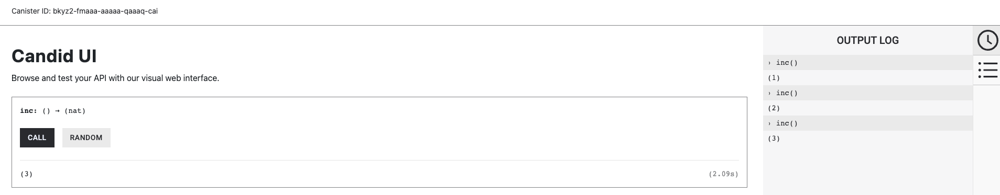
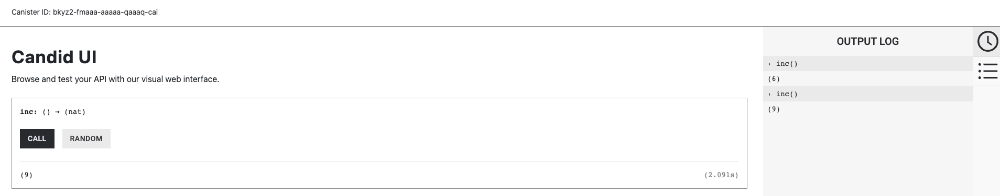

import { MarkdownChipRow } from "/src/components/Chip/MarkdownChipRow";
import '/src/components/CenterImages/center.scss';
import { GlossaryTooltip } from "/src/components/Tooltip/GlossaryTooltip";

# 2.1 Canister upgrades, storage, and persistence

<MarkdownChipRow labels={["Intermediate", "Tutorial"]} />

<div class="text--center">
<p> </p>
</div>
<div class="text--center">
<iframe width="660" height="415" src="https://www.youtube.com/embed/-aXjKSz_oXc?si=Tr9dl9-fXac3SfCS" title="YouTube video player" frameborder="0" allow="accelerometer; autoplay; clipboard-write; encrypted-media; gyroscope; picture-in-picture; web-share" referrerpolicy="strict-origin-when-cross-origin" allowfullscreen></iframe> </div>

ICP handles persistent data storage using a feature known as **stable memory**. Stable memory is a unique feature that defines a data store separate from the <GlossaryTooltip>canister</GlossaryTooltip>'s **heap memory**, which is its regular Wasm memory data store. A canister's heap memory is not persistent storage and does not persist across canister upgrades. Canister data and state stored in heap memory are removed when a canister is upgraded or reinstalled.

Using stable memory requires anticipating and indicating which canister data you want to be retained after a canister upgrade. For some canisters, this data might be all of the canister's data, while for others it may be only certain parts. By default, stable memory starts empty and can hold up to 500GiB as long as the <GlossaryTooltip>subnet</GlossaryTooltip> the canister is running on has the available space. If a canister uses more stable memory than 500GiB, the canister will trap and become unrecoverable.

To further understand stable memory and how to use it, let's learn about upgrading canisters.

## Upgrading canisters

Once a canister has been deployed and is running, there may need to be changes made to the canister's code to fix bugs or introduce new features. To make these changes, the canister must be upgraded.

Upgrading a canister is a key feature of ICP, since it allows canister smart contracts to be altered and have their data persist across changes. When a canister is upgraded, the existing state of the canister is preserved before the new Wasm module is installed.

### Motoko canister upgrade workflow

Motoko supports preserving a canister's state using ICP's stable memory through a Motoko-specific feature known as **stable storage**, which is designed to accommodate changes to both the application data and the Motoko compiler. Stable storage utilizes ICP's **stable memory** feature that was discussed previously.

:::info
Upgrading canisters written in Rust and other languages uses a different workflow that incorporates serialization of the canister's data. [Learn more about Rust upgrades](/docs/building-apps/developer-tools/cdks/rust/intro-to-rust).
:::

A **stable variable** is a variable defined within an actor that uses the `stable` keyword as a modifier in the variable's declaration. This indicates that the data stored in the variable should be stored using **stable storage**. If this `stable` keyword is not used, the variable is defined as `flexible` by default, which means its data does not persist across canister upgrades.

The upgrade process for Motoko canisters is as follows:

- First, the canister must be stopped so it does not accept any new incoming requests.
- A `pre_upgrade` hook is executed if one is defined. This hook can be used for functions such as creating a backup of data. Note: Having a `pre_upgrade` hook is strongly discouraged and not best practice, since the `pre_upgrade` hook is run in the current Wasm. If there are any bugs or errors, the canister will trap.
- Then, the system discards the canister's heap memory and initializes a new version of the canister's Wasm module. Stable memory is preserved and made available to the new Wasm module.
- Next, the new canister code is installed using the `--mode upgrade` flag.
- Then, the canister is started, now running the newly upgraded code.
- Any stable variables are reloaded as part of the `post_upgrade` hook. Note: Having a `pre_upgrade` hook is strongly discouraged and not best practice. After the stable variables are reloaded, the stable memory bytes that stored those variables are overwritten with zeroes to minimize stable memory costs for the canister.

## Interactive example

Let's take a look at defining and using a stable variable that uses Motoko's stable storage feature.

This project can be opened in [ICP Ninja](https://icp.ninja/s/JwL2z) or you can create a new local project with the command `dfx new stable_storage_example --type=motoko --no-frontend` and replace the code in `src/stable_storage_example_backend/main.mo` with the code detailed below.

### Defining a stable variable

```motoko title="src/counter_backend/main.mo"
import Nat "mo:base/Nat";

actor Counter {

  // Define a stable variable with an initial value of 0.
  // Any change to this value will be persisted across canister upgrades.
  stable var value = 0;

  public func inc() : async Nat {
    value += 1;
    return value;
  };
}
```

:::info
The Motoko `stable` or `flexible` variable modifications can only be used on `let` and `var` declarations that are within actor fields. These modifiers cannot be used elsewhere in the program.
:::

[Take a deeper dive into stable variables](https://internetcomputer.org/docs/building-apps/canister-management/upgrade#declaring-stable-variables).

### Deploying the example

To upgrade your canister, first you need to deploy the initial version of the canister. Deploy the canister by clicking the "Deploy" button on ICP Ninja or use the `dfx deploy` command if developing locally.

You can interact with the counter dapp through the Candid UI URL returned in the output log of ICP Ninja or in the output of the `dfx deploy` command, such as:

```bash
Deployed canisters.
URLs:
  Backend canister via Candid interface:
    stable_storage_example_backend: http://127.0.0.1:4943/?canisterId=bd3sg-teaaa-aaaaa-qaaba-cai&id=bkyz2-fmaaa-aaaaa-qaaaq-cai
```

Open the URL in a web browser, then interact with the `counter` method by clicking the 'Call' button 3 times. The counter value will now return '3':



Since this value is being stored in a stable variable, this value of '3' will persist through a canister upgrade.

### Stable variables in action

Now, let's make some changes to upgrade the canister. If you're developing locally with `dfx`, first stop the canister with the command:

```bash
dfx canister stop counter_backend
```

Then, let's alter the code of your canister. To keep things simple, you're going to change the counter increment value from '1' to '3'. Your altered code looks like this:

```motoko title="src/counter_backend/main.mo"
import Nat "mo:base/Nat";

actor Counter {

  stable var value = 0;

  public func inc() : async Nat {
    value += 3;
    return value;
  };
}
```

Now, to upgrade the canister, either click "Update code" in ICP Ninja or use the following `dfx` commands:

```bash
dfx build
dfx canister install counter_backend --mode upgrade
dfx canister start counter_backend
dfx deploy counter_backend
```

Now, navigate back to the Candid UI URL provided in the output and click the 'Call' button twice. This time, the counter should increment by 3, resulting in the value '9,' since our stable variable held our previous counter value of '3' that was saved prior to the upgrade.



import TutorialFooter from "@site/src/components/TutorialFooter/";

<TutorialFooter />
