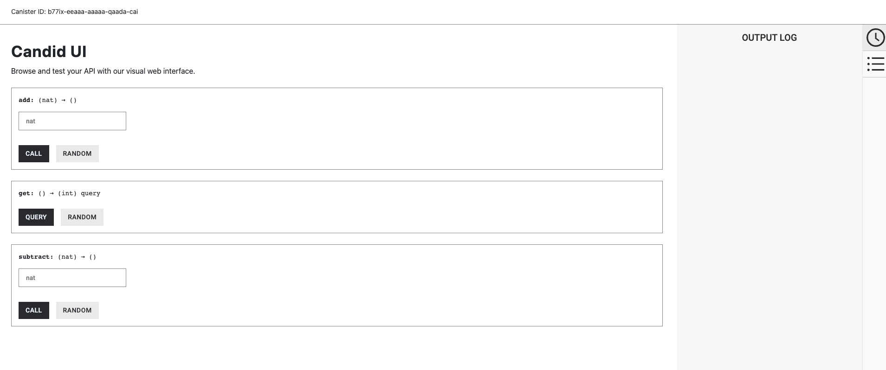
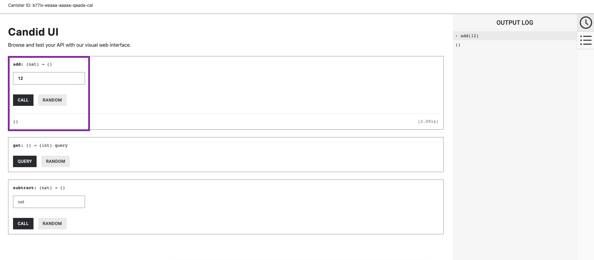
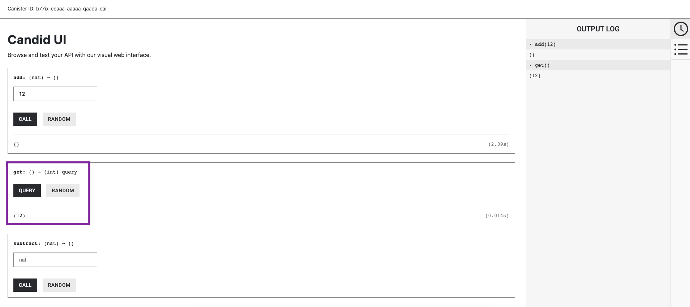
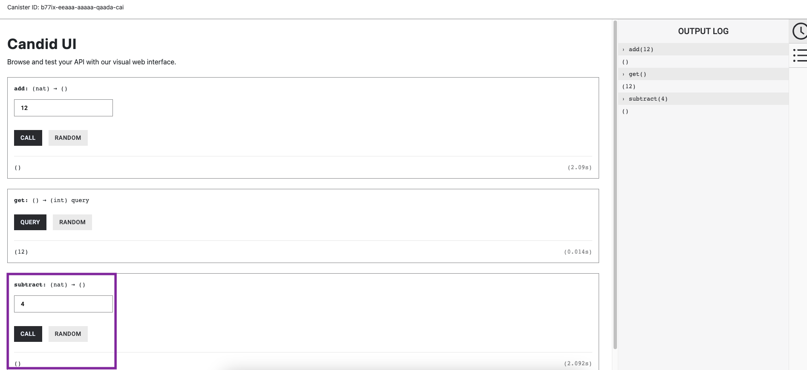
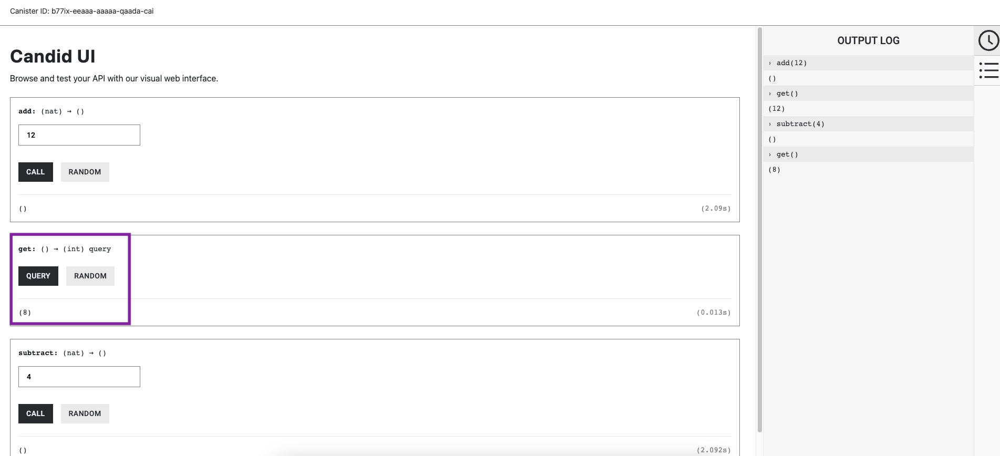

import { MarkdownChipRow } from "/src/components/Chip/MarkdownChipRow";
import '/src/components/CenterImages/center.scss';
import { GlossaryTooltip } from "/src/components/Tooltip/GlossaryTooltip";

# 2.4 Introduction to Candid

<MarkdownChipRow labels={["Intermediate", "Tutorial"]} />

<div class="text--center">
<p> </p>
</div>
<div class="text--center">
<iframe width="660" height="415" src="https://www.youtube.com/embed/tomc-Iny0O4?si=YYNNMhSA0r3pcleS" title="YouTube video player" frameborder="0" allow="accelerometer; autoplay; clipboard-write; encrypted-media; gyroscope; picture-in-picture; web-share" allowfullscreen></iframe> </div>

Candid is an interface description language that is used to describe the public interface of a service. A **service** is usually in the form of an application deployed as a <GlossaryTooltip>canister</GlossaryTooltip> on ICP. Public interfaces of canisters are used to interact with the canister. Candid supports interactions through the IC SDK via the terminal, through a web browser, or through the use of agents. It also provides a way to specify input argument values and display return values from different canister **methods**, regardless of the manner used to interact with the canister. Recall that a method is a piece of code specifying a task that declares a sequence of arguments and their associated result types.

Candid is language-agnostic, which is a key benefit since it allows for the interoperation between canisters written in different languages, such as Motoko, Rust, and JavaScript, and client applications.

Candid is unique since it provides functionality and features not available in other technologies, such as JSON or XML. Some of these features include the evolution of service interfaces, direct value mapping for Candid values to the types and values of the canister's language, and the ability to pass complex data such as references to services and methods. Candid also has built-in support for ICP-specific features like query annotation.

Up until now on this developer liftoff, you've utilized the Candid UI a few times through the web browser. If you recall, in several tutorials you've interacted with the backend canisters in the web browser with the URL from an output such as:

```
  Backend canister via Candid interface:
    dependencies_backend: http://127.0.0.1:4943/?canisterId=bd3sg-teaaa-aaaaa-qaaba-cai&id=bkyz2-fmaaa-aaaaa-qaaaq-cai
```

These URLs take you to the Candid user interface (UI). Now it's time to take a closer look at the fundamentals of Candid to understand how it works and how it can be used for more complex dapp development.

## Candid types and values

Candid supports the following set of types in order to provide a natural mapping of data types based on reasonable choices suited for each canister language:

- Unbounded integral number types (`Nat`, `Int`).

- Bounded integral numbers (`Nat8`, `Nat16`, `Nat32`, `Nat64`, `Int8`, `Int16`, `Int32`, `Int64`).

- Floating point types (`Float32`, `Float64`).

- Boolean type (`Bool`).

- Textual data (`Text`).

- Binary data (`Blob`).

- Container types and variants (`Opt`, `Vec`, `Record`, `Variant`).

- Reference types (`Service`, `Func`, `Principal`).

- Special types `Null`, `Reserved`, and `Empty`.

Each of these types is described in detail in the [Candid reference documentation](/docs/references/candid-ref).


### Candid textual values

Typically, as a developer you may not work with your program data as Candid values; instead, you may work with a host language such as Javascript and utilize Candid to transparently transport your dapp's data to your canister written in Motoko or Rust. The receiving canister treats this data as native Motoko or Rust values.

In some scenarios, like debugging, logging, or interacting with a service via the terminal command line, it may be useful to see the Candid values in a human-readable format. In these situations, the textual presentation of Candid values can be used.

The syntax for the textual presentation of Candid values is similar to that of Candid types. An example of a textual presentation for a Candid value is:

```candid
(record {
  first_name = "John";
  last_name = "Doe";
  age = 24;
  membership_status = variant { active };
  email_addresses =
    vec { "john@doe.com"; "john.doe@example.com" };
})
```

In contrast, the Candid binary format uses numeric hashes in place of field names. As a result, printing a value without the knowledge of what type that value is will not include the field name of records or variants. The above example would be printed as follows:

```candid
(record {
   4846783 = 14;
   456245371 = variant {373703110};
   1443915007 = vec {"john@doe.com"; "john.doe@example.com"};
   2797692922 = "John"; 3046132756 = "Doe"
})
```

## Candid service descriptions

Now that you've learned about Candid types, you can learn how to use them to describe a service. Candid uses a service description file with the file extension `.did`. Let's take a closer look at the structure of a service description.

### The `.did` file

To define Candid types and describe a service, a Candid service description file can be used. This file has the extension `.did` and can be generated from a service implementation or written manually.

The Candid files you have used thus far on the developer liftoff have been generated automatically. This is because a Motoko canister's Candid files are automatically generated by the Motoko compiler when the canister is compiled and then stored in the project's `/declarations` directory. When Candid files are auto-generated, it is not recommended to edit them manually, and any changes made to the file will be overwritten by `dfx` the next time the project is built and deployed. For canisters written in other languages, the Candid file must be written manually or generated using an external tool.

### Example Candid service descriptions

The simplest service description defines a service with no public methods. This would look like:

```candid
service : {}
```

Since this service description does not have any public methods, it is not very useful. To add a public method, you'll add a simple `ping` method:

```candid
service : {
  ping : () -> ();
}
```

Now our service description supports a single public method named `ping`. Note that method names can be arbitrary strings that can be quoted, such as "this is a method."

In this `ping` method, there are no arguments passed to the method, and there are no results returned, so the empty sequence of `()` is used for both the arguments and the results.

### Generating service descriptions

Now that you've taken a look at the basic structure of a Candid service description, let's take a look at how to generate the service description from your code.

:::info
Generating Candid files is supported for canisters written in Motoko. Canisters written in other languages will need to have their Candid files written manually. Check out the [Candid interface description](/docs/references/candid-ref) for more information on manually writing the service description.
:::

The following is an example Motoko canister that defines simple `add`, `subtract`, and `get` functions:

```motoko
actor {
  var v : Int = 0;
  public func add(d : Nat) : async () { v += d; };
  public func subtract(d : Nat) : async () { v -= d; };
  public query func get() : async Int { v };
}
```

When this code is compiled, the Motoko compiler will automatically generate a Candid service description file. This file will resemble the following:

```candid
service counter : {
  add : (nat) -> ();
  subtract : (nat) -> ();
  get : () -> (int) query;
}
```

This example describes a service called `counter` that consists of the following public methods:

- The `add` and `subtract` methods, which change the value of the counter.
- The `get` method, which reads the current value of the counter.

This example Candid interface description helps to illustrate that every method has a sequence of argument and result types. Methods can also include annotations, like the query notation shown in this example (`() -> (int) query;`), which is a feature specific to ICP.

For canisters written in other languages such as Rust, you can develop your service using the language's native types. [View Rust examples of how to write Candid service descriptions](/docs/building-apps/developer-tools/cdks/rust/candid/).

To generate Candid files from Rust code, the Rust CDK `v0.11.0` and higher support auto-generation using the [`candid-extractor` tool](https://internetcomputer.org//docs/building-apps/developer-tools/cdks/rust/generating-candid).


## Service upgrades

As your application changes and evolves over time, the methods will most likely change as well. New methods may be introduced, existing methods may expect additional arguments, or new data may be returned. Ideally, developers want to make these changes without breaking any existing workflows or clients.

Candid supports service upgrades through a set of specific rules that indicate when a new service type will be able to communicate with any running clients that are using the previous interface description. Services can be upgraded in the following ways:

- New methods can be added.

- Existing methods can return additional values; clients using the previous interface description will ignore these additional values.

- Existing methods can shorten their parameter list; clients using the previous interface description may still send extra arguments, but they will be ignored.

- Existing methods can extend their parameter list with optional arguments; clients using the previous interface description who do not pass that argument will use a `null` value.

- Existing parameter types may be changed, but only as a supertype of the previously used type.

- Existing result types may be changed, but only as a subtype of the previously used type.

For additional information about the supertypes and subtypes of any given type, check out the [Candid interface reference documentation](/docs/references/candid-ref) for each type.

To demonstrate an example of how a service might be upgraded, let's use the `counter` service example that you looked at in [generating service descriptions](#generating-service-descriptions).

Let's start with the following Candid service description:

```candid
service counter : {
  add : (nat) -> ();
  subtract : (nat) -> ();
  get : () -> (int) query;
}
```

This service might be upgraded in the following manner:

```candid
type timestamp = nat; // Define a new type of 'timestamp'
service counter : {
  set : (nat) -> (); // Define a new method
  add : (int) -> (new_val : nat); // Change the parameter and result types
  subtract : (nat, trap_on_underflow : opt bool) -> (new_val : nat); // Change the parameter and result types
  get : () -> (nat, last_change : timestamp) query; // Change the result types
}
```

## Using Candid

Now that you've taken a deep dive into Candid, let's explore the different ways to use it. There are three main ways to interact with Candid: using `dfx` on the command line, using the web browser, and using an agent. For this tutorial, you'll look at using `dfx` and using the web browser; you'll dive into agents in a future section of the developer liftoff.

### Prerequisites

Before you start, verify that you have set up your developer environment according to the instructions in [0.3 Developer environment setup](/docs/tutorials/developer-liftoff/level-0/dev-env).

### Creating a new project

To get started, create a new project in your working directory. Open a terminal window, navigate into your working directory (`developer_ladder`), then use the following commands to start `dfx` and create a new project:

```bash
dfx start --clean --background
dfx new candid_example
```

You will be prompted to select the language that your backend canister will use. Select 'Motoko':

```
? Select a backend language: ›
❯ Motoko
  Rust
  TypeScript (Azle)
  Python (Kybra)
```

:::info
`dfx` versions `v0.17.0` and newer support this `dfx new` interactive prompt. [Learn more about `dfx v0.17.0`](/blog/2024/02/14/news-and-updates/update#dfx-v0170).
:::

Then, select a frontend framework for your frontend canister. Select 'No frontend canister':

```
  ? Select a frontend framework: ›
  SvelteKit
  React
  Vue
  Vanilla JS
  No JS template
❯ No frontend canister
```

Lastly, you can include extra features to be added to your project:

```
  ? Add extra features (space to select, enter to confirm) ›
⬚ Internet Identity
⬚ Bitcoin (Regtest)
⬚ Frontend tests
```

Then, navigate into the new project directory:

```
cd candid_example
```

You'll be using the sample Motoko canister that you looked at in the [generating service descriptions](#generating-service-descriptions) section earlier. Open the `src/candid_example_backend/main.mo` file in your code editor and replace the existing code with the following:

```motoko title="src/candid_example_backend/main.mo"
actor {
  var v : Int = 0;
  public func add(d : Nat) : async () { v += d; };
  public func subtract(d : Nat) : async () { v -= d; };
  public query func get() : async Int { v };
}
```

Save this file. Then, compile and deploy the project with the command:

```bash
dfx deploy
```

Recall that the Motoko compiler will automatically generate the Candid service description file based on this code. This Candid file can be found at `src/declarations/candid_example_backend/candid_example_backend.did` and will contain the following:

```candid title="src/declarations/candid_example_backend/candid_example_backend.did"
service : {
  add: (nat) -> ();
  get: () -> (int) query;
  subtract: (nat) -> ();
}
```

### Interacting with a service using the command-line terminal

Now that your canister is deployed, let's use `dfx` to interact with the methods defined by your Candid file. This section of the tutorial will look familiar since in previous tutorials you've interacted with canisters in the same manner—you just hadn't known you were directly interacting with the Candid-defined services since the Candid files had been automatically generated for you in the background.

For example, let's call the `add` method to add a number to our counter with the command:

```bash
dfx canister call candid_example_backend add 12
```

Then, you can call the `get` method to return the value you just added:

```bash
dfx canister call candid_example_backend get
(12 : int)
```

You can then subtract from this value with the command:

```bash
dfx canister call candid_example_backend subtract 4
```

Then call the `get` method again:

```bash
dfx canister call candid_example_backend get
(8 : int)
```

Reset the counter's value by subtracting the remaining value:

```bash
dfx canister call candid_example_backend subtract 8
```


### Interacting with a service using a web browser

Based on the types of services offered by a canister, Candid can provide a web interface, known as the Candid UI, that allows the developer to call canister functions for debugging and testing from within a web browser. This functionality does not require the development of any frontend code and does not require a frontend canister to be created or deployed.

To interact with the Candid UI from a web browser, recall that when a canister is deployed, the following output is returned:

```bash
  Backend canister via Candid interface:
    candid_example_backend: http://127.0.0.1:4943/?canisterId=avqkn-guaaa-aaaaa-qaaea-cai&id=b77ix-eeaaa-aaaaa-qaada-cai
```

In this output, you can see the URL for the Candid interface under 'Backend canister via Candid interface.' Opening this URL in a web browser will display the following UI:



Let's use the same workflow you used on the command line. First, let's add 12 to the counter by entering '12' into the 'add' method, then selecting 'call.' The output log on the right will reflect this call.



Then, use the 'get' method's `query' button to query the counter's value. This will be returned in the output log as well:



Subtract 4 from the counter by entering '4' into the 'subtract' method, then selecting 'call.'



Lastly, call the 'get' method again to return our final counter value:



## Need help?

Did you get stuck somewhere in this tutorial, or do you feel like you need additional help understanding some of the concepts? The ICP community has several resources available for developers, like working groups and bootcamps, along with our Discord community, forum, and events such as hackathons. Here are a few to check out:

- [Developer Discord](https://discord.internetcomputer.org), which is a large chatroom for ICP developers to ask questions, get help, or chat with other developers asynchronously via text chat.

- [Developer liftoff forum discussion](https://forum.dfinity.org/t/developer-journey-feedback-and-discussion/23893).

- [Developer tooling working group](https://www.google.com/calendar/event?eid=MHY0cjBubmlnYXY1cTkzZzVzcmozb3ZjZm5fMjAyMzEwMDVUMTcwMDAwWiBjX2Nnb2VxOTE3cnBlYXA3dnNlM2lzMWhsMzEwQGc&ctz=Europe/Zurich).

- [Motoko Bootcamp - The DAO Adventure](https://github.com/motoko-bootcamp/dao-adventure) - Discover the Motoko language in this 7-day adventure and learn to build a DAO on the Internet Computer.

- [Motoko Bootcamp - Discord community](https://discord.gg/YbksCUxdzk) - A community for and by Motoko developers to ask for advice, showcase projects, and participate in collaborative events.

- [Motoko developer working group](https://www.google.com/calendar/event?eid=ZWVnb2luaHU0ZjduMTNpZHI3MWJkcWVwNWdfMjAyMzEwMTJUMTUwMDAwWiBjX2Nnb2VxOTE3cnBlYXA3dnNlM2lzMWhsMzEwQGc&ctz=Europe/Zurich).

- [Upcoming events and conferences](https://dfinity.org/events-and-news/).

- [Upcoming hackathons](https://dfinity.org/hackathons/).

- Weekly developer office hours to ask questions, get clarification, and chat with other developers live via voice chat. This is hosted on the [Discord](https://discord.internetcomputer.org) server.

- Submit your feedback to the [ICP Developer feedback board](https://dx.internetcomputer.org).

## Next steps

Next, let's explore how to test and debug projects and canisters.

- [2.5 Unit, integration, and end-to-end testing](/docs/tutorials/developer-liftoff/level-2/2.5-unit-testing).
