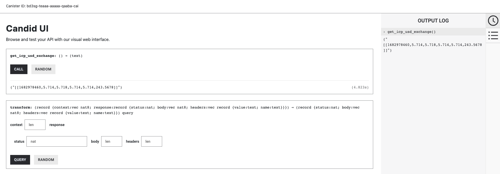
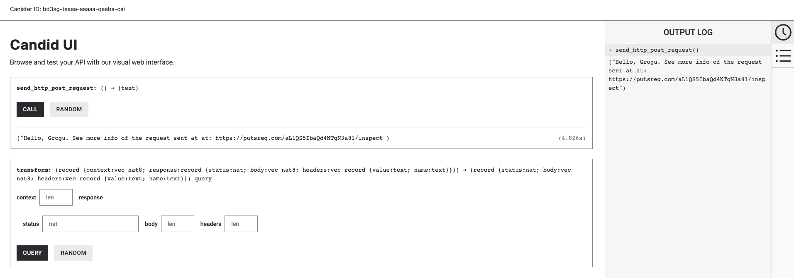

import { MarkdownChipRow } from "/src/components/Chip/MarkdownChipRow";
import '/src/components/CenterImages/center.scss';

# 3.2 Using HTTPS outcalls

<MarkdownChipRow labels={["Intermediate", "Tutorial"]} />

<div class="text--center">
<p> </p>
</div>
<div class="text--center">
<iframe width="660" height="415" src="https://www.youtube.com/embed/gEyfbFMyhwc?si=2Tmy6FZj-IQ9xU5c" title="YouTube video player" frameborder="0" allow="accelerometer; autoplay; clipboard-write; encrypted-media; gyroscope; picture-in-picture; web-share" referrerpolicy="strict-origin-when-cross-origin" allowfullscreen></iframe> </div>

In the past, blockchain networks were only able to communicate with external servers through blockchain oracles, or third-party entities that relayed calls from the blockchain to an external server and then routed the response back to the blockchain. This is because blockchains are a form of replicated state machine, where each replica must perform the same computations within the same state to make the same transitions each round. Since doing computations with results from an external source may lead to a state divergence, tools like oracles have been used in the past. However, on the Internet Computer, canisters can communicate directly with external servers or other blockchains through **HTTPS outcalls**.

HTTPS outcalls are a feature of canisters on ICP that allow smart contracts to directly make calls to HTTP servers that are external to ICP. The response of these HTTP calls can then be used by the smart contract in a way that the replica can safely be updated using the response without the risk of a state divergence.

:::info
This guide uses the term **HTTPS** to refer to both the **HTTP** and **HTTPS** protocols. This is because typically all traffic on a public network uses the secure HTTPS protocol.
:::

HTTPS outcalls provide the ability for different use cases and have several advantages compared to using oracles to handle external requests. Some of these HTTPS outcalls use a stronger trust model since there are no external intermediaries, such as an oracle, required for the canister to communicate with external servers, and using HTTPS outcalls for communicating with external servers makes using canisters feel much closer to a "traditional" programming workflow that may not use blockchains or oracles. Most real-world dapps have a need for accessing data stored in off-chain entities since most digital data is still stored in traditional 'Web 2' services.

## Supported HTTP methods

Currently, HTTPS outcalls support `GET`, `HEAD`, and `POST` methods for HTTP requests. In this guide, you'll look at examples for `GET` and `POST` methods.

## Cycles

Cycles used to pay for an HTTP call must be explicitly transferred with the call. They will not be automatically deducted from the caller's balance.

## HTTPS outcalls API

A canister can make an HTTPS outcall by using the `http_request` method. This method uses the following parameters:

- `url`: Specifies the requested URL; must be valid per the standard [RFC-3986](https://www.ietf.org/rfc/rfc3986.txt). The length must not exceed `8192` and may include a custom port number.

- `max_response_bytes`: Specifies the maximum size of the request in bytes and must not exceed 2MB. This field is optional; if this field is not specified, the maximum of 2MB will be used.

:::info
It is recommended to set `max_response_bytes`, since using it appropriately can save developers a significant amount of cycles.
:::

- `method`: Specifies the method; currently, only `GET`, `HEAD`, and `POST` are supported.

- `headers`: Specifies the list of HTTP request headers and their corresponding values.

- `body`: Specifies the content of the request's body. This field is optional.

- `transform`: Specifies a function that transforms raw responses to sanitized responses and a byte-encoded context that is provided to the function upon invocation, along with the response to be sanitized. This field is optional; if it is provided, the calling canister itself must export this function.

The returned response, including the response to the `transform` function if specified, will contain the following content:

- `status`: Specifies the response status (e.g., 200, 404).

- `headers`: Specifies the list of HTTP response headers and their corresponding values.

- `body`: Specifies the response's body.

### IPv6

When deploying applications to the Internet Computer, HTTPS outcalls can **only** be made to APIs that support **IPv6**. You can check if an API supports IPv6 by using a tool such as `https://ready.chair6.net/`.

## HTTP GET

To demonstrate how to use the HTTP `GET` outcall, you'll create a simple canister that has one public method named `get_icp_usd_exchange()`. This method will trigger an HTTP `GET` request to the external service Coinbase, which will return current data on the exchange rate between USD and ICP. This canister will have no frontend, and you will interact with its public methods via the Candid web UI.

### Prerequisites

Before you start, verify that you have set up your developer environment according to the instructions in [0.3: Developer environment setup](/docs/tutorials/developer-liftoff/level-0/dev-env).

### Creating a new project

To get started, create a new project in your working directory. Open a terminal window, navigate into your working directory (`developer_ladder`), then use the following commands to start `dfx` and create a new project:

```
dfx start --clean --background
dfx new https_get
```

You will be prompted to select the language that your backend canister will use. Select 'Motoko':

```
? Select a backend language: ›
❯ Motoko
  Rust
  TypeScript (Azle)
  Python (Kybra)
```

:::info
`dfx` versions `v0.17.0` and newer support this `dfx new` interactive prompt. [Learn more about `dfx v0.17.0`](/blog/2024/02/14/news-and-updates/update#dfx-v0170).
:::

Then, select a frontend framework for your frontend canister. Select 'No frontend canister':

```
  ? Select a frontend framework: ›
  SvelteKit
  React
  Vue
  Vanilla JS
  No JS template
❯ No frontend canister
```

Lastly, you can include extra features to be added to your project:

```
  ? Add extra features (space to select, enter to confirm) ›
⬚ Internet Identity
⬚ Bitcoin (Regtest)
⬚ Frontend tests
```

Then, navigate into the new project directory:

```
cd https_get
```

### Creating an HTTP `GET` request

Then, open the `src/https_get_backend/main.mo` file in your code editor and replace the existing content with:

```motoko no-repl title="src/https_get_backend/main.mo"
import Debug "mo:base/Debug";
import Blob "mo:base/Blob";
import Cycles "mo:base/ExperimentalCycles";
import Error "mo:base/Error";
import Array "mo:base/Array";
import Nat8 "mo:base/Nat8";
import Nat64 "mo:base/Nat64";
import Text "mo:base/Text";
```

This piece of code imports the libraries that you'll be using. Each of these libraries is part of the Motoko base package, as indicated by 'mo:base'.

Next, insert the following line below these import statements:

```motoko  no-repl title="src/https_get_backend/main.mo"
import Types "Types";
```

This line imports the custom types stored in `Types.mo`. You'll create this file later.

Following the `import Types "Types";` line, now let's insert the code to define our actor. This actor will contain two functions: a function to transform the response that you'll receive from our `GET` response and a function that sends our `GET` request. The code has been annotated with notes describing in detail what each piece does:

```motoko no-repl title="src/https_get_backend/main.mo"
actor {

    // Create a function that transforms the raw content into an HTTP payload.
    public query func transform(raw : Types.TransformArgs) : async Types.CanisterHttpResponsePayload {
      let transformed : Types.CanisterHttpResponsePayload = {
          status = raw.response.status;
          body = raw.response.body;
          headers = [
              {
                  name = "Content-Security-Policy";
                  value = "default-src 'self'";
              },
              { name = "Referrer-Policy"; value = "strict-origin" },
              { name = "Permissions-Policy"; value = "geolocation=(self)" },
              {
                  name = "Strict-Transport-Security";
                  value = "max-age=63072000";
              },
              { name = "X-Frame-Options"; value = "DENY" },
              { name = "X-Content-Type-Options"; value = "nosniff" },
          ];
      };
      transformed;
  };

  // This function sends our GET request

  public func get_icp_usd_exchange() : async Text {

    //First, declare the management canister
    let ic : Types.IC = actor ("aaaaa-aa");

    //Next, you need to set the arguments for our GET request

    // Start with the URL and its query parameters

    let ONE_MINUTE : Nat64 = 60;
    let start_timestamp : Types.Timestamp = 1682978460; //May 1, 2023 22:01:00 GMT
    let end_timestamp : Types.Timestamp = 1682978520;//May 1, 2023 22:02:00 GMT
    let host : Text = "api.pro.coinbase.com";
    let url = "https://" # host # "/products/ICP-USD/candles?start=" # Nat64.toText(start_timestamp) # "&end=" # Nat64.toText(end_timestamp) # "&granularity=" # Nat64.toText(ONE_MINUTE);

    // Prepare headers for the system http_request call.

    let request_headers = [
        { name = "Host"; value = host # ":443" },
        { name = "User-Agent"; value = "exchange_rate_canister" },
    ];

    // Next, you define a function to transform the request's context from a blob datatype to an array.

    let transform_context : Types.TransformContext = {
      function = transform;
      context = Blob.fromArray([]);
    };

    // Finally, define the HTTP request.

    let http_request : Types.HttpRequestArgs = {
        url = url;
        max_response_bytes = null; //optional for request
        headers = request_headers;
        body = null; //optional for request
        method = #get;
        transform = ?transform_context;
    };

    // Now, you need to add some cycles to your call, since cycles to pay for the call must be transferred with the call.
    // The way Cycles.add() works is that it adds those cycles to the next asynchronous call.
    // "Function add(amount) indicates the additional amount of cycles to be transferred in the next remote call".
    // See: /docs/references/ic-interface-spec#ic-http_request

    Cycles.add(20_949_972_000);

    // Now that you have the HTTP request and cycles to send with the call, you can make the HTTP request and await the response.

    let http_response : Types.HttpResponsePayload = await ic.http_request(http_request);

    // Once you have the response, you need to decode it. The body of the HTTP response should come back as [Nat8], which needs to be decoded into readable text.
    // To do this, you:
    //  1. Convert the [Nat8] into a Blob
    //  2. Use Blob.decodeUtf8() method to convert the Blob to a ?Text optional
    //  3. Use a switch to explicitly call out both cases of decoding the Blob into ?Text

    let response_body: Blob = Blob.fromArray(http_response.body);
    let decoded_text: Text = switch (Text.decodeUtf8(response_body)) {
        case (null) { "No value returned" };
        case (?y) { y };
    };

    // Finally, you can return the response of the body.

    // The API response will look like this:

    // ("[[1682978460,5.714,5.718,5.714,5.714,243.5678]]")

    // Which can be formatted as this
    //  [
    //     [
    //         1682978460, <-- start/timestamp
    //         5.714, <-- low
    //         5.718, <-- high
    //         5.714, <-- open
    //         5.714, <-- close
    //         243.5678 <-- volume
    //     ],
    // ]

    decoded_text
  };

};
```

The code above is annotated with detailed notes and explanations. Take a moment to read through the code's content and annotations to fully understand the code's functionality.

A few important points to note are:

- `get_icp_usd_exchange()` is an update call. All methods that make HTTPS outcalls must be update calls because they go through consensus, even if the HTTPS outcall is a `GET`.

- The code above adds `20_949_972_000` cycles. This is typically enough for `GET` requests, but this may need to change depending on your use case.

- The code above imports `Types.mo` to separate the custom types from the actor file as a best practice.

### The `transform` function

The `transform` function in the code above is important because it takes the raw content and transforms it into a raw HTTP payload. This step sets the payload's headers, which include the Content Security Policy and Strict Transport Security headers.

When developing locally, this function doesn't have much of an effect since only the local replica (one node) is making the call.

When HTTP calls are used on the mainnet, a common error message may appear that indicates not all replicas on the subnet get the same response:

```
Reject text: Canister http responses were different across replicas, and no consensus was reached
```

This error occurs when the replicas on the subnet don't all return the same value for a piece of data within the HTTP response. For example, if you have an application that sends an HTTP request to the Coinbase API for the current price of a token, due to latency the replicas will not all return the same response. To remedy this, you can request the token price for a specific timestamp to assure that the replicas all return the same response.

Once you've inserted these snippets of code into the `src/https_get_backend/main.mo` file, save the file. The file should look like this:

```motoko no-repl title="src/https_get_backend/main.mo"
import Debug "mo:base/Debug";
import Blob "mo:base/Blob";
import Cycles "mo:base/ExperimentalCycles";
import Error "mo:base/Error";
import Array "mo:base/Array";
import Nat8 "mo:base/Nat8";
import Nat64 "mo:base/Nat64";
import Text "mo:base/Text";

import Types "Types";

actor {

  public query func transform(raw : Types.TransformArgs) : async Types.CanisterHttpResponsePayload {
      let transformed : Types.CanisterHttpResponsePayload = {
          status = raw.response.status;
          body = raw.response.body;
          headers = [
              {
                  name = "Content-Security-Policy";
                  value = "default-src 'self'";
              },
              { name = "Referrer-Policy"; value = "strict-origin" },
              { name = "Permissions-Policy"; value = "geolocation=(self)" },
              {
                  name = "Strict-Transport-Security";
                  value = "max-age=63072000";
              },
              { name = "X-Frame-Options"; value = "DENY" },
              { name = "X-Content-Type-Options"; value = "nosniff" },
          ];
      };
      transformed;
  };

  public func get_icp_usd_exchange() : async Text {

    let ic : Types.IC = actor ("aaaaa-aa");

    let ONE_MINUTE : Nat64 = 60;
    let start_timestamp : Types.Timestamp = 1682978460; //May 1, 2023 22:01:00 GMT
    let end_timestamp : Types.Timestamp = 1682978520;//May 1, 2023 22:02:00 GMT
    let host : Text = "api.pro.coinbase.com";
    let url = "https://" # host # "/products/ICP-USD/candles?start=" # Nat64.toText(start_timestamp) # "&end=" # Nat64.toText(end_timestamp) # "&granularity=" # Nat64.toText(ONE_MINUTE);

    let request_headers = [
        { name = "Host"; value = host # ":443" },
        { name = "User-Agent"; value = "exchange_rate_canister" },
    ];

    let transform_context : Types.TransformContext = {
      function = transform;
      context = Blob.fromArray([]);
    };

    let http_request : Types.HttpRequestArgs = {
        url = url;
        max_response_bytes = null; //optional for request
        headers = request_headers;
        body = null; //optional for request
        method = #get;
        transform = ?transform_context;
    };

    Cycles.add(20_949_972_000);

    let http_response : Types.HttpResponsePayload = await ic.http_request(http_request);

    let response_body: Blob = Blob.fromArray(http_response.body);
    let decoded_text: Text = switch (Text.decodeUtf8(response_body)) {
        case (null) { "No value returned" };
        case (?y) { y };
    };

    decoded_text
    };
}
```

Next, create the `src/https_get_backend/Types.mo` file with the command:

```bash
touch `src/https_get_backend/Types.mo`
```

Then, open the `src/https_get_backend/Types.mo` file in your code editor and insert the following content:

```motoko title="src/https_get_backend/Types.mo"
module Types {

  public type Timestamp = Nat64;

  // First, define the Type that describes the Request arguments for an HTTPS outcall.

    public type HttpRequestArgs = {
        url : Text;
        max_response_bytes : ?Nat64;
        headers : [HttpHeader];
        body : ?[Nat8];
        method : HttpMethod;
        transform : ?TransformRawResponseFunction;
    };

    public type HttpHeader = {
        name : Text;
        value : Text;
    };

    public type HttpMethod = {
        #get;
        #post;
        #head;
    };

    public type HttpResponsePayload = {
        status : Nat;
        headers : [HttpHeader];
        body : [Nat8];
    };

    // HTTPS outcalls have an optional "transform" key. These two types help describe it.
    // The transform function can transform the body in any way, add or remove headers, or modify headers.
    // This Type defines a function called 'TransformRawResponse', which is used above.

    public type TransformRawResponseFunction = {
        function : shared query TransformArgs -> async HttpResponsePayload;
        context : Blob;
    };

    // This Type defines the arguments the transform function needs.
    public type TransformArgs = {
        response : HttpResponsePayload;
        context : Blob;
    };

    public type CanisterHttpResponsePayload = {
        status : Nat;
        headers : [HttpHeader];
        body : [Nat8];
    };

    public type TransformContext = {
        function : shared query TransformArgs -> async HttpResponsePayload;
        context : Blob;
    };


    // Lastly, declare the management canister which you use to make the HTTPS outcall.
    public type IC = actor {
        http_request : HttpRequestArgs -> async HttpResponsePayload;
    };

}
```

The code above is annotated with detailed notes and explanations. Take a moment to read through the code's content and annotations to fully understand the code's functionality.

Now, you can deploy the canister locally with the commands:

```bash
dfx start --clean --background
dfx deploy
```

:::caution
Recall that if you'd like to deploy this canister on the mainnet, you can use the `--network ic` flag.
:::

These commands should return the canister's URL. Open the `http_get_backend` canister's URL to open the Candid UI:

```bash
  Backend canister via Candid interface:
    http_get_backend: http://127.0.0.1:4943/?canisterId=a3shf-5eaaa-aaaaa-qaafa-cai&id=avqkn-guaaa-aaaaa-qaaea-cai
```

### Calling the HTTP `GET` request

Once you open the Candid UI, you can use the 'Call' button to call the `get_icp_usd_exchange()` method, which sends an HTTP `GET` request. The result will be returned in the UI, such as:



You can play with a version of this canister running onchain: https://a4gq6-oaaaa-aaaab-qaa4q-cai.raw.ic0.app/?id=fm664-jyaaa-aaaap-qbomq-cai

## HTTP `POST`

To demonstrate how to use the HTTP `POST` outcall, you'll create a simple canister that has one public method named `send_http_post_request()`. This method will trigger an HTTP `POST` request to a public API service where the HTTP request can be inspected, and you can inspect the request's headers and body to validate that it reflects what the canister sent.

The following are some important notes on `POST` requests:

- Since HTTPS outcalls go through consensus, it is expected that any HTTP `POST` request may be sent several times to its destination. This is because it is common for clients to retry requests for a variety of reasons.

- It is recommended that HTTP `POST` requests add the idempotency keys in the header of the request so that the destination knows which `POST` requests from the client are identical.

- Developers should be cautious using idempotency keys since the destination server may not know how to understand and use them.

### Creating a new project

For simplicity, you'll create a new project for our HTTP `POST` request. Navigate into your working directory and create another new project:

```bash
dfx new https_post
cd https_post
```

### Creating an HTTP `POST` request

Then, open the `src/https_post_backend/main.mo` file in your code editor and replace the existing content with:

```motoko no-repl title="src/https_post_backend/main.mo"
import Debug "mo:base/Debug";
import Blob "mo:base/Blob";
import Cycles "mo:base/ExperimentalCycles";
import Array "mo:base/Array";
import Nat8 "mo:base/Nat8";
import Text "mo:base/Text";

import Types "Types";
```

This code is the same way you started your HTTP `GET` code. Now, you'll define an actor that contains two functions; a function to transform the response that you'll receive from our `POST` response, and a function that sends our `POST` request. The code has been annotated with notes describing in detail what each piece does:

```motoko no-repl title="src/https_post_backend/main.mo"
actor {

  // This function is used to transform the response received from our POST request

  public query func transform(raw : Types.TransformArgs) : async Types.CanisterHttpResponsePayload {
      let transformed : Types.CanisterHttpResponsePayload = {
          status = raw.response.status;
          body = raw.response.body;
          headers = [
              {
                  name = "Content-Security-Policy";
                  value = "default-src 'self'";
              },
              { name = "Referrer-Policy"; value = "strict-origin" },
              { name = "Permissions-Policy"; value = "geolocation=(self)" },
              {
                  name = "Strict-Transport-Security";
                  value = "max-age=63072000";
              },
              { name = "X-Frame-Options"; value = "DENY" },
              { name = "X-Content-Type-Options"; value = "nosniff" },
          ];
      };
      transformed;
  };

  // This function sends our POST request
  public func send_http_post_request() : async Text {

    // First, declare the management canister
    let ic : Types.IC = actor ("aaaaa-aa");

    // Next, setup the URL and its query parameters. This portion uses a free API.
    let host : Text = "putsreq.com";
    let url = "https://putsreq.com/aL1QS5IbaQd4NTqN3a81";

    // Then, prepare headers for the system http_request call. Note that idempotency keys should be unique, so you create a function that generates them.

    let idempotency_key: Text = generateUUID();
    let request_headers = [
        { name = "Host"; value = host # ":443" },
        { name = "User-Agent"; value = "http_post_sample" },
        { name= "Content-Type"; value = "application/json" },
        { name= "Idempotency-Key"; value = idempotency_key }
    ];

    // Since the the request body is an array of [Nat8], next you do the following:
    // 1. Write a JSON string
    // 2. Convert ?Text optional into a Blob, which is an intermediate representation before you cast it as an array of [Nat8]
    // 3. Convert the Blob into an array [Nat8]

    let request_body_json: Text = "{ \"name\" : \"Grogu\", \"force_sensitive\" : \"true\" }";
    let request_body_as_Blob: Blob = Text.encodeUtf8(request_body_json);
    let request_body_as_nat8: [Nat8] = Blob.toArray(request_body_as_Blob); // e.g [34, 34,12, 0]


    // Then you transform the content
    let transform_context : Types.TransformContext = {
      function = transform;
      context = Blob.fromArray([]);
    };

    // Next, you make the POST request
    let http_request : Types.HttpRequestArgs = {
        url = url;
        max_response_bytes = null; //optional for request
        headers = request_headers;
        //note: type of `body` is ?[Nat8] so you pass it here as "?request_body_as_nat8" instead of "request_body_as_nat8"
        body = ?request_body_as_nat8;
        method = #post;
        transform = ?transform_context;
    };

    // Now, you need to add some cycles to your call, since cycles to pay for the call must be transferred with the call.
    // The way Cycles.add() works is that it adds those cycles to the next asynchronous call
    // "Function add(amount) indicates the additional amount of cycles to be transferred in the next remote call"
    // See: /docs/references/ic-interface-spec#ic-http_request

    Cycles.add(21_850_258_000);

    // Now that you have the HTTP request and cycles to send with the call, you can make the HTTP request and await the response.

    let http_response : Types.HttpResponsePayload = await ic.http_request(http_request);

    // Once you have the response, you need to decode it. The body of the HTTP response should come back as [Nat8], which needs to be decoded into readable text.
    // To do this, you:
    //  1. Convert the [Nat8] into a Blob
    //  2. Use Blob.decodeUtf8() method to convert the Blob to a ?Text optional
    //  3. Use Motoko syntax "Let... else" to unwrap what is returned from Text.decodeUtf8()

    let response_body: Blob = Blob.fromArray(http_response.body);
    let decoded_text: Text = switch (Text.decodeUtf8(response_body)) {
        case (null) { "No value returned" };
        case (?y) { y };
    };

    // Finally, you can return the response of the body.
    let result: Text = decoded_text # ". See more info of the request sent at at: " # url # "/inspect";
    result
  };

  // As a final step, you define a private helper function that generates a universally unique identifier. In this exercise, it returns a constant but in practice it should return a unique identifier.

  func generateUUID() : Text {
    "UUID-123456789";
  }
};
```

:::info
The `transform` function in this HTTP `POST` request should be used in the same manner that it was in the HTTP `GET` example. You can revisit the [transform function](#the-transform-function) description above for more information.
:::

The code above is annotated with detailed notes and explanations. Take a moment to read through the code's content and annotations to fully understand the code's functionality.

Once you've inserted these snippets of code into the `src/https_post_backend/main.mo` file, save the file. The file should look like this:

```motoko title="src/https_post_backend/main.mo"
import Debug "mo:base/Debug";
import Blob "mo:base/Blob";
import Cycles "mo:base/ExperimentalCycles";
import Array "mo:base/Array";
import Nat8 "mo:base/Nat8";
import Text "mo:base/Text";

import Types "Types";

actor {


  public query func transform(raw : Types.TransformArgs) : async Types.CanisterHttpResponsePayload {
      let transformed : Types.CanisterHttpResponsePayload = {
          status = raw.response.status;
          body = raw.response.body;
          headers = [
              {
                  name = "Content-Security-Policy";
                  value = "default-src 'self'";
              },
              { name = "Referrer-Policy"; value = "strict-origin" },
              { name = "Permissions-Policy"; value = "geolocation=(self)" },
              {
                  name = "Strict-Transport-Security";
                  value = "max-age=63072000";
              },
              { name = "X-Frame-Options"; value = "DENY" },
              { name = "X-Content-Type-Options"; value = "nosniff" },
          ];
      };
      transformed;
  };

  public func send_http_post_request() : async Text {

    let ic : Types.IC = actor ("aaaaa-aa");

    let host : Text = "putsreq.com";
    let url = "https://putsreq.com/aL1QS5IbaQd4NTqN3a81";

    let idempotency_key: Text = generateUUID();
    let request_headers = [
        { name = "Host"; value = host # ":443" },
        { name = "User-Agent"; value = "http_post_sample" },
        { name= "Content-Type"; value = "application/json" },
        { name= "Idempotency-Key"; value = idempotency_key }
    ];

    let request_body_json: Text = "{ \"name\" : \"Grogu\", \"force_sensitive\" : \"true\" }";
    let request_body_as_Blob: Blob = Text.encodeUtf8(request_body_json);
    let request_body_as_nat8: [Nat8] = Blob.toArray(request_body_as_Blob); // e.g [34, 34,12, 0]

    let transform_context : Types.TransformContext = {
      function = transform;
      context = Blob.fromArray([]);
    };

    let http_request : Types.HttpRequestArgs = {
        url = url;
        max_response_bytes = null; //optional for request
        headers = request_headers;
        //note: type of `body` is ?[Nat8] so you pass it here as "?request_body_as_nat8" instead of "request_body_as_nat8"
        body = ?request_body_as_nat8;
        method = #post;
        transform = ?transform_context;
    };

    Cycles.add(21_850_258_000);

    let http_response : Types.HttpResponsePayload = await ic.http_request(http_request);

    let response_body: Blob = Blob.fromArray(http_response.body);
    let decoded_text: Text = switch (Text.decodeUtf8(response_body)) {
        case (null) { "No value returned" };
        case (?y) { y };
    };

    // Finally, you can return the response of the body.
    let result: Text = decoded_text # ". See more info of the request sent at: " # url # "/inspect";
    result
  };

  func generateUUID() : Text {
    "UUID-123456789";
  }
};
```

Next, create the `src/https_post_backend/Types.mo` file with the command:

```bash
touch `src/https_post_backend/Types.mo`
```

Open the `src/https_post_backend/Types.mo` file in your code editor and insert the following content:

```motoko title="src/https_post_backend/Types.mo"
module Types {

  // First, define the Type that describes the Request arguments for an HTTPS outcall.
    public type HttpRequestArgs = {
        url : Text;
        max_response_bytes : ?Nat64;
        headers : [HttpHeader];
        body : ?[Nat8];
        method : HttpMethod;
        transform : ?TransformRawResponseFunction;
    };

    public type HttpHeader = {
        name : Text;
        value : Text;
    };

    public type HttpMethod = {
        #get;
        #post;
        #head;
    };

    public type HttpResponsePayload = {
        status : Nat;
        headers : [HttpHeader];
        body : [Nat8];
    };

    // HTTPS outcalls have an optional "transform" key. These two types help describe it.
    // The transform function can transform the body in any way, add or remove headers, or modify headers.
    // This Type defines a function called 'TransformRawResponse', which is used above.

    public type TransformRawResponseFunction = {
        function : shared query TransformArgs -> async HttpResponsePayload;
        context : Blob;
    };

    // This Type defines the arguments the transform function needs.
    public type TransformArgs = {
        response : HttpResponsePayload;
        context : Blob;
    };

    public type CanisterHttpResponsePayload = {
        status : Nat;
        headers : [HttpHeader];
        body : [Nat8];
    };

    public type TransformContext = {
        function : shared query TransformArgs -> async HttpResponsePayload;
        context : Blob;
    };


    // Lastly, declare the management canister which you use to make the HTTPS outcall.
    public type IC = actor {
        http_request : HttpRequestArgs -> async HttpResponsePayload;
    };

}
```

The code above is annotated with detailed notes and explanations. Take a moment to read through the code's content and annotations to fully understand the code's functionality.

Now, you can deploy the canister locally with the commands:

```bash
dfx start --clean --background
dfx deploy
```

:::caution
Recall that if you'd like to deploy this canister on the mainnet, you can use the `--network ic` flag.
:::

These commands should return the canister's URL. Open the `http_get_backend` canister's URL to open the Candid UI:

```
  Backend canister via Candid interface:
    http_post_backend: http://127.0.0.1:4943/?canisterId=a3shf-5eaaa-aaaaa-qaafa-cai&id=avqkn-aaaaa-guaaa-qaaea-cai
```

### Calling the HTTP `POST` request

Once you open the Candid UI, you can use the 'Call' button to call the `send_http_post_request()` method, which sends an HTTP `POST` request. The result will be returned in the UI, such as:



You can play with a version of this canister running onchain: https://a4gq6-oaaaa-aaaab-qaa4q-cai.raw.ic0.app/?id=fc4tu-siaaa-aaaap-qbonq-cai.


## Need help?

Did you get stuck somewhere in this tutorial, or do you feel like you need additional help understanding some of the concepts? The ICP community has several resources available for developers, like working groups and bootcamps, along with our Discord community, forum, and events such as hackathons. Here are a few to check out:

- [Developer Discord](https://discord.internetcomputer.org), which is a large chatroom for ICP developers to ask questions, get help, or chat with other developers asynchronously via text chat.

- [Developer liftoff forum discussion](https://forum.dfinity.org/t/developer-journey-feedback-and-discussion/23893).

- [Developer tooling working group](https://www.google.com/calendar/event?eid=MHY0cjBubmlnYXY1cTkzZzVzcmozb3ZjZm5fMjAyMzEwMDVUMTcwMDAwWiBjX2Nnb2VxOTE3cnBlYXA3dnNlM2lzMWhsMzEwQGc&ctz=Europe/Zurich).

- [Motoko Bootcamp - The DAO Adventure](https://github.com/motoko-bootcamp/dao-adventure) - Discover the Motoko language in this 7-day adventure and learn to build a DAO on the Internet Computer.

- [Motoko Bootcamp - Discord community](https://discord.gg/YbksCUxdzk) - A community for and by Motoko developers to ask for advice, showcase projects, and participate in collaborative events.

- [Motoko developer working group](https://www.google.com/calendar/event?eid=ZWVnb2luaHU0ZjduMTNpZHI3MWJkcWVwNWdfMjAyMzEwMTJUMTUwMDAwWiBjX2Nnb2VxOTE3cnBlYXA3dnNlM2lzMWhsMzEwQGc&ctz=Europe/Zurich).

- [Upcoming events and conferences](https://dfinity.org/events-and-news/).

- [Upcoming hackathons](https://dfinity.org/hackathons/).

- Weekly developer office hours to ask questions, get clarification, and chat with other developers live via voice chat. This is hosted on the [Discord](https://discord.internetcomputer.org) server.

- Submit your feedback to the [ICP Developer feedback board](https://dx.internetcomputer.org).

## Next steps

Next, let's dive deeper into certified variables:

- [3.3 Certified variables](/docs/tutorials/developer-liftoff/level-3/3.3-certified-data).
