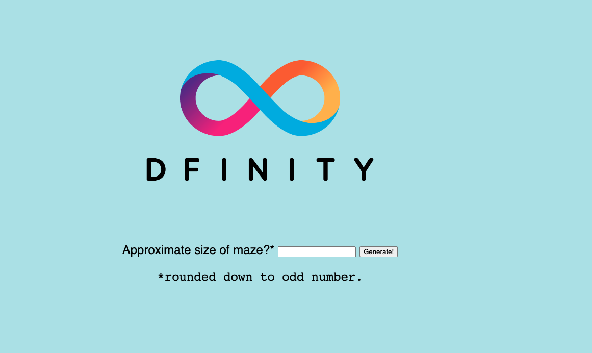
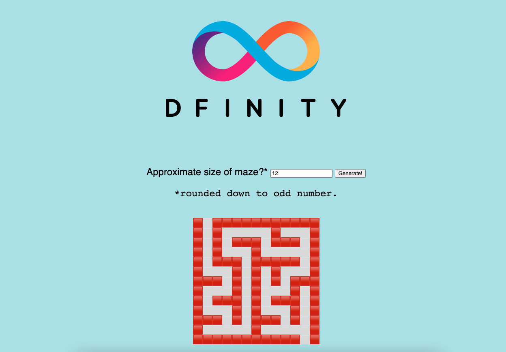

import { MarkdownChipRow } from "/src/components/Chip/MarkdownChipRow";
import '/src/components/CenterImages/center.scss';


# 3.4 Introduction to agents

<MarkdownChipRow labels={["Intermediate", "Tutorial"]} />

<div class="text--center">
<p> </p>
</div>
<div class="text--center">
<iframe width="660" height="415" src="https://www.youtube.com/embed/8Z_w_JQkxfk?si=guvxAAwK5-IUOPPK" title="YouTube video player" frameborder="0" allow="accelerometer; autoplay; clipboard-write; encrypted-media; gyroscope; picture-in-picture; web-share" referrerpolicy="strict-origin-when-cross-origin" allowfullscreen></iframe> </div>

On ICP, an **agent** is a library used to make calls to ICP's public interface.

One of the first responsibilities of an agent is to structure data. As was discussed in previous modules, such as [2.2: Advanced canister calls](/docs/tutorials/developer-liftoff/level-2/2.2-advanced-canister-calls), calls to ICP can be an update or a query call. An agent submits a `POST` request to a canister's API at the URL `/api/v2/canister/<canister_id>/call`. This `POST` request contains the following components:

- `request_type`.
- Authentication, comprised of the `sender`, `nonce`, and `ingress_expiry`.
- `canister_id`.
- `method_name`.
- `request_id`, which is required for update calls. The `request_id` value is the result of hashing the other fields in the request and is used for polling while ICP reaches consensus on the update call. **Polling** is a technique used to check for fresh data over a given interval of time by making repeated API requests to a server.
- `arg`, which contains the rest of the call's payload. The agent assembles the `arg` portion of the call with data from the client application, ensuring that the Candid interface matches the method that it calls.

Each of these components is assembled into a certificate, which is then transformed into a [CBOR-encoded](https://cbor.io/) buffer. The agent takes this certificate and attaches it to the body of the `POST` request. When the canister begins to process the request asynchronously, the agent begins polling the `read_state` requests until the canister returns a response.

### Decoding data

Once a response has been returned from the mainnet, the agent takes the certificate from the call's payload and verifies it. This certificate can be verified using the public root key of the NNS subnet. The network will return a CBOR-encoded buffer for the agent to decode, then transform into a useful structure using semantic language-specific types. For example, if the canister returns a type `Text`, and the agent is a JavaScript agent, the text will get turned into a JavaScript string.

### Managing authentication

Each call to the mainnet needs to have a cryptographic identity attached to it. This identity can be anonymous or authenticated using a cryptographic signature. Canisters use a the attached identity to determine how to respond to the call, which enables canisters to use identities for other purposes as well.

#### Accepted identities

The following types of identity signatures can be attached to calls:

- [Ed25519](https://ed25519.cr.yp.to/) and [ECDSA](https://en.wikipedia.org/wiki/Elliptic_Curve_Digital_Signature_Algorithm) signatures.
  - Plain signatures are supported for the schemes.
- [Ed25519](https://ed25519.cr.yp.to/) or [ECDSA](https://en.wikipedia.org/wiki/Elliptic_Curve_Digital_Signature_Algorithm) on curve P-256 (also known as [secp256r1](https://neuromancer.sk/std/secg/secp256r1)).
  - Using SHA-256 as a hash function.
  - Using the Koblitz curve in [secp256k1](https://en.bitcoin.it/wiki/Secp256k1).

When an agent encodes these identities as a principal, they attach a suffix byte that indicates whether the identity is anonymous or self-authenticating. An anonymous identity will use a suffix byte of `4`, which resolves to `2vxsx-fae`, while self-authenticating identities that use one of the curves above use a suffix of `2`.

## Available agents

Currently, there are two agents developed by DFINITY: the [ICP JavaScript/TypeScript](/docs/building-apps/interact-with-canisters/agents/javascript-agent) agent and the [ICP Rust](/docs/building-apps/interact-with-canisters/agents/overview) agent.

Additionally, there are several community-supported agents, including:

- .NET
    - [`ICP.NET` by Gekctek](https://github.com/Gekctek/ICP.NET)
- Dart
    - [`agent_dart` by AstroX](https://github.com/AstroxNetwork/agent_dart) (supports mobile development with Flutter)
- Go
    - [`agent-go` by Aviate Labs](https://github.com/aviate-labs/agent-go)
- Java
    - [`ic4j-agent` by IC4J](https://github.com/ic4j/ic4j-agent) (supports Android)
- C
    - [`agent-c` by Zondax](https://github.com/Zondax/icp-client-cpp) (C Wrapper for IC Rust Agent)
- Elixir
    - [`icp_agent`](https://github.com/diodechain/icp_agent)

## Using the JavaScript agent

import TabItem from "@theme/TabItem";
import { AdornedTabs } from "/src/components/Tabs/AdornedTabs";

<AdornedTabs>
<TabItem label="Prerequisites">

:::caution
This example is currently not available in ICP Ninja and must be run locally with `dfx`.
:::

<input type="checkbox"/> Before you start, verify that you have set up your developer environment according to the instructions in <a href="docs/tutorials/developer-liftoff/level-1/1.2-dev-env"> 1.2 Developer environment setup</a>.

</TabItem>
</AdornedTabs>
### Creating a new project

To get started, open a terminal window, navigate into your working directory (`developer_liftoff`), then use the following commands to start `dfx` and clone the sample code's repository:

```bash
dfx start --clean --background
git clone https://github.com/dfinity/examples/
cd examples/motoko/random_maze
```

### Generating Candid declarations

For this example, you'll use an example project that takes a variable size input and generates a random maze using that size. For example, if `6` is entered, a 6x6 maze will be generated. Recall that Motoko projects have the ability to autogenerate the project's Candid files. Let's start with generating those Candid files with the command:

```bash
dfx generate
```

This command writes the following files to the project's `src/declarations`:

```bash
|── src
│   ├── declarations
│   │   ├── random_maze
│   │   │   ├── random_maze.did
|   |   |   ├── random_maze.did.d.js
│   │   │   ├── random_maze.did.d.ts
│   │   │   ├── random_maze.did.js
│   │   │   ├── index.d.ts
│   │   │   └── index.js
```

Now, let's view the contents of the Candid interface file for the `random_maze` canister:

```candid title="src/declarations/random_maze/random_maze.did" file=../../../references/samples/motoko/random_maze/src/declarations/random_maze/random_maze.did
```

Recall that this Candid interface specification defines a service interface with a single method. The single method, `generate` accepts a single argument of type `Nat` and returns type `Text`. This is because you will enter a number (`Nat`) to generate the maze, which will then be displayed using emoji characters of type `Text`. Recall that unless a call is defined as a query, all calls are treated as an update call by default.

In JavaScript, type `Text` maps to type `String`. You can see a full mapping list of Candid types and their JavaScript equivalents in the [Candid types reference](/docs/references/candid-ref).

Next, let's look at the `src/declarations/random_maze/random_maze.did.d.ts` file:

```typescript title="src/declarations/random_maze/random_maze.did.d.ts" file=../../../references/samples/motoko/random_maze/src/declarations/random_maze/random_maze.did.d.ts
```

In this file, the `_SERVICE` export includes the generate method with typings for an array of arguments and a return type. This export will be typed as an `ActorMethod`, which will be used as a handler that takes arguments and returns a response with the specified type in the Candid declaration.

Then, open the `src/declarations/random_maze/random_maze.did.js` file:

```javascript title="src/declarations/random_maze/random_maze.did.js" file=../../../references/samples/motoko/random_maze/src/declarations/random_maze/random_maze.did.js
```

In this file, the `idlFactory` function is defined. This handles the structuring of the network calls according to the ICP API and the application's Candid declaration. Unlike the declarations in the `src/declarations/random_maze/random_maze.did.d.ts` file, the `idlFactory` must be available during the application's runtime. To accomplish this, the `idlFactory` gets loaded by an actor.

In this example, the `idlFactory` represents a service with a `generate` method using the same two arguments you defined before (type `Nat` and type `Text`), though it includes a third argument of an empty array, which represents additional annotations that the function may be tagged with, such as 'query'.

### Creating the agent

Now, let's put all of these different pieces together in the `src/declarations/random_maze/index.js` file:

```javascript title="src/declarations/random_maze/index.js" file=../../../references/samples/motoko/random_maze/src/declarations/random_maze/index.js
```

In this code, the constructor first creates an `HTTPAgent` that creates the JavaScript agent, then uses it to encode calls through the public interface of the canister. If the deployment is on the mainnet, the root key of the replica is fetched. Then, an actor is created using the automatically generated Candid interface for the canister and is passed the canister ID and the `HTTPAgent`.

:::caution
This example uses `fetchRootKey`. It is not recommended that dapps deployed on the mainnet call this function from the [ICP JavaScript agent](https://www.npmjs.com/package/@dfinity/agent), since using `fetchRootKey` on the mainnet poses severe security concerns for the dapp making the call. It is recommended to put it behind a condition so that it only runs locally.

This API call will fetch a root key for verification of update calls from a single replica, so it’s possible for that replica to respond with a malicious key. A verified mainnet root key is already embedded into the [ICP JavaScript agent](https://www.npmjs.com/package/@dfinity/agent), so this only needs to be called on your local replica, which will have a different key from mainnet that the ICP JavaScript agent does not know ahead of time.
:::

Now the actor is set up to call all of the defined public methods; in this instance, there is just the `generate` method.

Let's deploy our canisters with the command:

```bash
dfx deploy
```

Then, open the URL for the `random_maze_assets` canister in your web browser:

```
URLs:
  Frontend canister via browser
    random_maze_assets: http://avqkn-guaaa-aaaaa-qaaea-cai.localhost:4943/
  Backend canister via Candid interface:
    random_maze: http://asrmz-lmaaa-aaaaa-qaaeq-cai.localhost:4943/?id=by6od-j4aaa-aaaaa-qaadq-cai
```

### Using the agent

Now let's interact with the frontend of our canister, which is using the JavaScript agent (`index.js`) to interact with the canister code stored in the `src/random_maze/main.mo` file.



Enter a value, then select 'Generate!' You will see a random maze generated in the UI:



That'll wrap things up for this module! You can read more about agents, such as the [Node.js agent](/docs/building-apps/interact-with-canisters/agents/overview).

import TutorialFooter from "@site/src/components/TutorialFooter/";

<TutorialFooter />
