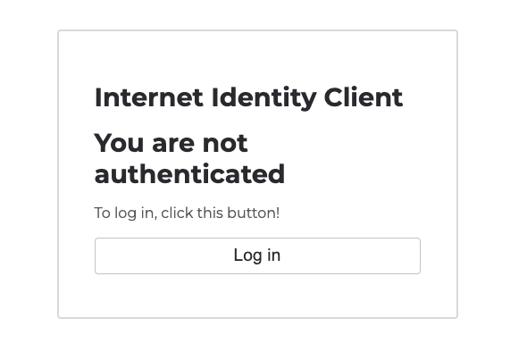

import { MarkdownChipRow } from "/src/components/Chip/MarkdownChipRow";
import '/src/components/CenterImages/center.scss';


# 3.5 Identities and authentication

<MarkdownChipRow labels={["Intermediate", "Tutorial"]} />

<div class="text--center">
<p> </p>
</div>
<div class="text--center">
<iframe width="660" height="415" src="https://www.youtube.com/embed/BsTlPMn6SR8?si=oNH36Um1fH6ueKFA" title="YouTube video player" frameborder="0" allow="accelerometer; autoplay; clipboard-write; encrypted-media; gyroscope; picture-in-picture; web-share" referrerpolicy="strict-origin-when-cross-origin" allowfullscreen></iframe> </div>

Developer identities and ledger accounts are two types of authentication that are used for interacting with canisters and cycles, but what about interacting with applications or websites built on ICP? For that, end users can use **Internet Identity**. It is ICP's native form of digital identity that can be used to authenticate with apps, such as the NNS dashboard, without having to manage a username or password. Instead, Internet Identity uses a cryptographic key pair that's stored in your computer's hardware. Through this simple and flexible authentication method, developers can provide end users with a frictionless way to authenticate and use applications.

## Types of identity

First, let's clearly define the identity and authentication terminology on ICP:

- **Developer identity**: Created using `dfx`. It contains a private/public key pair and has a `principal` data type derived from the public key. It can be compared to a Bitcoin or Ethereum wallet address.

- **Principals**: Generic identifiers that are used for users, canisters, and potentially other future concepts. There is intentionally no way to tell canister principal IDs and user principal IDs apart. You can learn more in the IC [specification](/docs/references/ic-interface-spec#principal).

- **Account identifier**: The identifier associated with your ICP ledger account, as specified in the [ledger](/docs/defi/token-standards/) specification.

- **Wallets**: Used to store forms of currency or other assets, such as cycles, ICP, or NFTs.

- **Internet Identity**: ICP's native authentication service. Internet Identity doesn't use usernames and passwords; instead it uses a **passkey** that is stored in your local device's hardware.

In this guide, you'll learn how to use Internet Identity.

## Internet Identity

On traditional Web2 websites and applications, many of them have the option for you to 'Sign in with Google,' which allows you to authenticate with the application using your username and password credentials for Google, preventing you from having to make a new username and password for that application.

ICP uses Internet Identity as the network's native form of authentication.

Internet Identity allows users to register and authenticate with websites or applications without using a username and password. Instead, users can use a unique cryptographic public/private key pair called a **passkey** that is stored in the secure hardware chip of your computer or phone. This allows you to authenticate with your Internet Identity using methods that unlock your device, such as TouchID, FaceID, or another method.

A different identity is issued for each dapp a user authenticates to and cannot be linked back to the user. With Internet identity, no personal data is shared with dapps or the Internet Identity application itself.

### Internet Identity architecture

Internet Identity uses an implementation of the WebAuthn API that runs within a single canister that serves both the II frontend application code and handles the authentication requests. The app's authentication service issues 'delegations' on the user's behalf, which are signed with private cryptographic material created by the WebAuth API that is owned by the user. This private material never leaves the user's device, as it is stored in the local hardware securely. Then, the II frontend uses the WebAuthn API to sign the delegation with the cryptographic material.

For more details on how the Internet Identity architecture works, please refer to the [official Internet Identity specification](/docs/references/ic-interface).

## Creating an Internet Identity

To create an Internet Identity, navigate to the II frontend URL: https://identity.internetcomputer.org/

Select 'Create New' from the UI.


Next, select 'Create Passkey.'


When prompted, choose how to create your passkey, either on your current device or another device.


Then, enter the CAPTCHA to continue.


Your Internet Identity has been created! It'll be shown on the screen, and it is recommended that you write it down in a safe location to save it.

With this number and your passkey, you will be able to create and securely connect to ICP dapps. If you lose this number and its associated secret recovery methods, you will lose any accounts that were created with it. This number is not secret but is unique to you.

Once you save it, select the 'I saved it, continue' button.


Then, you can connect your Internet Identity to dapps, such as one shown in the Dapps Explorer:


If you scroll down, you will see an option to add another passkey and options to enable recovery methods. **It is highly recommended to enable the recovery methods so that you can recover your Internet Identity if the hardware passkey is ever lost.**


## Integrating Internet Identity into your dapp

Now let's look at a simple example of how to integrate Internet Identity into the frontend of a dapp.

Open the [ICP Ninja Who am I? example](https://icp.ninja/projects/who-am-i). In the project's `dfx.json` file, you will see a definition for the Internet Identity canister:

```json title="dfx.json" file=../../../references/samples/motoko/who_am_i/dfx.json
```

In the file, you will see the code that initializes and creates the AuthClient, which uses Internet Identity to provide user authentication:

```js title="frontend/src/App.jsx" file=../../../references/samples/motoko/who_am_i/frontend/src/App.jsx
```

This code does the following:

- First, it creates an `AuthClient` instance using `AuthClient.create()`. This is from the [`auth-client`](/docs/current/developer-docs/developer-tools/off-chain/agents/javascript-agent#authentication) library used for handling authentication with Internet Identity.

- It gets the user's identity from the `authClient`.

- Then it creates an actor using the `createActor` function.

- Checks if the user is authenticated using `authClient.isAuthenticated()`.

- Updates the component's state with the new actor, `authClient`, and `isAuthenticated` status.

- Lastly, the `result` variable awaits the response of a call to the backend's `whoami` function. When the response is returned, the `principal` variable stores it as a `String` data type.

The backend's `whoami` function is defined in `backend/app.mo`:

```motoko title="backend/app.mo" file=../../../references/samples/motoko/who_am_i/backend/app.mo
```

### Interacting with the integration

Click the "Run" button in ICP Ninja. Once deployed, navigate to the application's frontend URL returned in the output log. You will see the frontend of the app:



Then, select 'Log in.' You'll be redirected to the II frontend. Since you're running this locally, note that this is for **testing** only, and you should not use your production II. It is recommended to create another for local testing purposes. To do so, follow the on-screen steps that you walked through previously.


Once you are redirected back to the frontend of the app, click the 'Who am I?' button.


Your Internet Identity's principal ID will be returned:


You've now integrated Internet Identity into a local dapp! That'll wrap things up for this module.

import TutorialFooter from "@site/src/components/TutorialFooter/";

<TutorialFooter />
