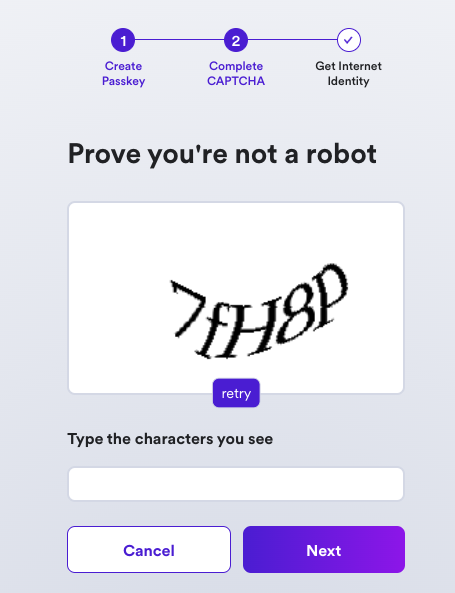
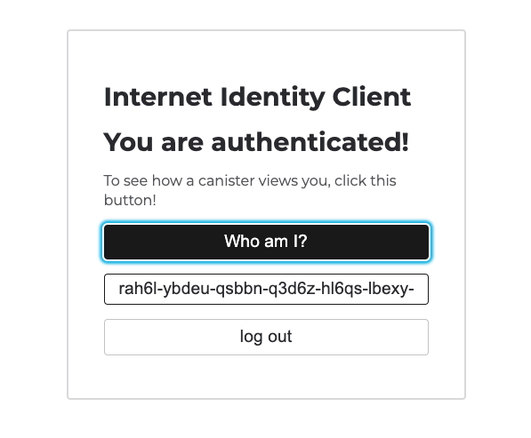

import { MarkdownChipRow } from "/src/components/Chip/MarkdownChipRow";
import '/src/components/CenterImages/center.scss';


# 3.5 Identities and authentication

<MarkdownChipRow labels={["Intermediate", "Tutorial"]} />

<div class="text--center">
<p> </p>
</div>
<div class="text--center">
<iframe width="660" height="415" src="https://www.youtube.com/embed/BsTlPMn6SR8?si=oNH36Um1fH6ueKFA" title="YouTube video player" frameborder="0" allow="accelerometer; autoplay; clipboard-write; encrypted-media; gyroscope; picture-in-picture; web-share" referrerpolicy="strict-origin-when-cross-origin" allowfullscreen></iframe> </div>

When developing on the Internet Computer, there are several types of identities and methods of authentication that you'll encounter. In the previous module, [1.4: acquiring and using cycles](/docs/tutorials/developer-liftoff/level-1/1.4-using-cycles), you created a **developer identity** that has a **cycles balance**. You also looked at how to convert ICP tokens stored in a **ledger account** into cycles.

Devleoper identities and ledger accounts are two types of authentication that are used for interacting with canisters and cycles, but what about interacting with applications or websites built on ICP? For that, end-users can use **Internet Identity**, ICP's native form of digital identity that can be used to authenticate with apps, such as the NNS dashboard, without having to manage a username or password. Instead, Internet Identity uses a cryptographic key pair that's stored in your local computer's hardware. Through this simple and flexible authentication method, developers can provide end users with a frictionless way to authenticate and use their applications.

## Types of identity

First, let's clearly define the identity and authentication terminology on the Internet Computer.

- **Developer identity**: Created using `dfx`. It contains a private/public key pair and has a `principal` data type derived from the public key. It can be compared to a Bitcoin or Ethereum wallet address.

- **Principals**: generic identifiers that are used for users, canisters, and potentially other future concepts. There is intentionally no way to tell canister principal IDs and user principal IDs apart. You can learn more in the IC [specification](/docs/references/ic-interface-spec#principal).

- **Principal identifiers**: Principals associated with a user principal ID. Principal identifiers are related to account identifiers but use a different format. Each principal identity can control multiple accounts in the ICP (and other) ledgers.

- **Account identifier**: the identifier associated with your ICP ledger account, as specified in the [ledger](/docs/defi/token-standards/) specification.

- **Wallets**: Used to store forms of currency or other assets, such as cycles, ICP, or NFTs. Developers primarily use the cycles ledger to send cycles to and from canisters.

- **Internet Identity**: ICP's native authentication service. Internet Identity doesn't use usernames and passwords; instead it uses a **passkey** that is stored in your local device's hardware.

In this guide, you'll learn how to use Internet Identity.

## Internet Identity

On traditional Web2 websites and applications, many of them have the option for you to 'Sign in with Google,' which allows you to authenticate with the application using your username and password credentials for Google, preventing you from having to make a new username and password for that application.

On the Internet Computer, a native form of identity is used for authentication, called the Internet Identity.

Internet Identity allows users to register and authenticate with websites or applications without using a username and password. Instead, users can use a **passkey**, which is a unique cryptographic public/private key pair that is stored in the secure hardware chip of your computer or phone. This allows you to authenticate your Internet Identity using methods that unlock your device, such as TouchID, FaceID, or another method.

A different identity is issued for each app a user authenticates to and cannot be linked back to the user. With Internet identity, no personal data is shared with dapps or the Internet Identity application itself, and no software needs to be downloaded and installed.

### Internet Identity architecture

Internet Identity uses an implementation of the WebAuthn API that runs within a single canister that serves both the II frontend application code and handles the requests that are sent by the frontend code. The app's authentication service issues 'delegations' on the user's behalf, which are signed with private cryptographic material created by the WebAuth API that is owned by the user. This private material never leaves the user's device, as it is stored in the local hardware securely. Then, the II frontend uses the WebAuthn API to sign the delegation with the cryptographic material.

For more details on how the Internet Identity architecture works, please refer to the [official Internet Identity Specification](/docs/references/ic-interface).

### What is a passkey?

A **passkey** is a public/private key pair that is stored in your local device's secure hardware chip. This passkey value is a more secure and convenient alternative to using a username/password combination, and it enables users to sign into dapps by using biometric authentication options, such as FaceID or TouchID.

## Creating an Internet Identity

To create an Internet Identity, navigate to the II frontend URL: https://identity.ic0.app/

Select 'Create New' from the UI.


Next, select 'Create Passkey.'


When prompted, choose how to create your passkey, either on your current device or you can use another device.


Then, enter the CAPTCHA to continue.



Your Internet Identity has been created! It'll be shown on the screen, and it is recommended that you write it down in a safe location to save it.

This number is your Internet Identity. With this number and your passkey, you will be able to create and securely connect to Internet Computer dapps. If you lose this number, you will lose any accounts that were created with it. This number is not secret but is unique to you.

Once you save it, select the 'I saved it, continue' button.


Then, you can connect your Internet Identity to dapps, shown in the Dapps Explorer:


If you scroll down, you will see an option to add another passkey, and you will see options to enable recovery methods. **It is highly recommended to enable the recovery methods so that you can recover your Internet Identity if the hardware passkey is ever lost.**


## Integrating Internet Identity into your dapp

Now let's look at a simple example of how to integrate Internet Identity into the frontend of your dapp.

### Prerequisites

Before you start, verify that you have set up your developer environment according to the instructions in [0.3: Developer environment setup](/docs/tutorials/developer-liftoff/level-0/dev-env).

### Creating a new project

To get started, open a terminal window, navigate into your working directory (`developer_ladder`), then use the commands:

```bash
dfx start --clean --background
git clone https://github.com/dfinity/examples.git
cd examples/archive/motoko/auth-client-demo
npm install
```

### Creating an actor

To start, let's take a look at the backend canister, which uses a simple 'Who am I?' service in the `src/whoami/main.mo` file:

```motoko title="src/whoami/main.mo"
import Principal "mo:base/Principal";

actor {
    public shared (msg) func whoami() : async Principal {
        msg.caller
    };
};
```

In this code, the actor has one method, `whoami`, which responds with the message's caller. You'll use this to test if you make a request from the frontend using an `AnonymousIdentity` or an authenticated Internet Identity.

### Importing the auth-client package

Next, let's take a look at the assets for the frontend of the application. This demo project comes with a few different options for the frontend, such as React and Vue, but for this guide you'll stick with using the vanilla JavaScript option. If you take a look at the `src/auth_client_demo_assets/vanilla/index.ts` file, you can see that first, you import the `AuthClient` from `@dfinity/auth-client`:

```typescript title="src/auth_client_demo_assets/vanilla/index.ts"
import { AuthClient } from "@dfinity/auth-client";
import { handleAuthenticated, renderIndex } from "./views";
```

Then, you define some variables to define a day in nanoseconds:

```typescript title="src/auth_client_demo_assets/vanilla/index.ts"
// One day in nanoseconds
const days = BigInt(1);
const hours = BigInt(24);
const nanoseconds = BigInt(3600000000000);
```

Next, you'll set some default options, including the `loginOptions`, which will allow the `identityProvider` to be either the II mainnet canister if you are using the local environmental variable `DFX_NETWORK` set to `ic` or the locally deployed II canister. Your local replica will not accept signatures from the mainnet canister.

```typescript title="src/auth_client_demo_assets/vanilla/index.ts"
export const defaultOptions = {
  createOptions: {
    idleOptions: {
      // Set to true if you do not want idle functionality
      disableIdle: true,
    },
  },
  loginOptions: {
    identityProvider:
      process.env.DFX_NETWORK === "ic"
        ? "https://identity.ic0.app/#authorize"
        : `http://localhost:4943?canisterId=rdmx6-jaaaa-aaaaa-aaadq-cai#authorize`,
    // Maximum authorization expiration is 8 days
    maxTimeToLive: days * hours * nanoseconds,
  },
};
```

Depending on your web browser, you may need to change the `http://localhost:4943?canisterId=rdmx6-jaaaa-aaaaa-aaadq-cai#authorize` value:

- Chrome, Firefox: `http://<canister_id>.localhost:4943#authorize`

- Safari: `http://localhost:4943?canisterId=<canister_id>#authorize`

Now, let's initialize the AuthClient. Then, you check to see if the user has previously logged in. If so, their previous identity is verified:

```typescript title="src/auth_client_demo_assets/vanilla/index.ts"
const init = async () => {
  const authClient = await AuthClient.create(defaultOptions.createOptions);

  if (await authClient.isAuthenticated()) {
    handleAuthenticated(authClient);
  }
  renderIndex();
  setupToast();
};
```

Lastly, you define a function that listens for the button on the frontend to be clicked and initializes the client:

```typescript title="src/auth_client_demo_assets/vanilla/index.ts"
async function setupToast() {
  const status = document.getElementById("status");
  const closeButton = status?.querySelector("button");
  closeButton?.addEventListener("click", () => {
    status?.classList.add("hidden");
  });
}


init();
```

### Pulling the Internet Identity canister

Now, if you noticed, you didn't create a canister for the Internet Identity service. That's because, if you take a look at this project's `dfx.json` file, you **pull** the Internet Identity canister from the mainnet. This is an example of using the `dfx deps` functionality, which you covered in [2.3: Using third-party canisters](/docs/tutorials/developer-liftoff/level-2/2.3-third-party-canisters).

```json title="dfx.json"
{
  "canisters": {
    "whoami": {
      "main": "src/whoami/main.mo",
      "type": "motoko",
      "declarations": {
        "node_compatibility": true
      },
      "pullable": {
        "dependencies": [],
        "wasm_url": "https://github.com/krpeacock/auth-client-demo/releases/latest/download/whoami.wasm",
        "wasm_hash": "a5af74d01aec228c5a717dfb43f773917e1a9138e512431aafcd225ad0001a8b",
        "init_guide": "null"
      }
    },
    "internet-identity": {
      "type": "pull",
      "id": "rdmx6-jaaaa-aaaaa-aaadq-cai"
    },
    "auth_client_demo_assets": {
      "dependencies": [
        "whoami",
        "internet-identity"
      ],
      "source": [
        "src/auth_client_demo_assets/vanilla"
      ],
      "type": "assets"
    },
    "svelte": {
      "dependencies": [
        "whoami",
        "internet-identity"
      ],
      "source": [
        "src/auth_client_demo_assets/svelte/build"
      ],
      "type": "assets"
    }
  },
  "defaults": {
    "build": {
      "args": "",
      "packtool": ""
    }
  },
  "output_env_file": ".env",
  "version": 2
}
```

Now let's deploy this project locally. First, pull the II canister using `dfx deps`, then deploy the project:

```bash
dfx deps pull
```

Then, you need to initialize the canister. By running the `dfx deps init` command:
```bash
dfx deps init
```

Then, you can deploy the II canister and the other canisters in the project with the command:

```bash
dfx deps deploy
dfx deploy
```

Then, start the local development server:

```bash
npm start
```

This command will output the following:

```bash
  VITE v4.3.6  ready in 137 ms

  ➜  Local:   http://127.0.0.1:5173/
  ➜  Network: use --host to expose
  ➜  press h to show help
```

### Interacting with the integration

Navigate to the 'Local' URL in your web browser. You will see the frontend of the app:


Then, select 'Log in.' You'll be redirected to the II frontend. Since you're running this locally, note that this is for **testing** only, and you should not use your production II. It is recommended to create another for local testing purposes. To do so, follow the on-screen steps that you walked through previously.


Once you are redirected back to the frontend of the app, click the 'Who am I?' button.


Your Internet Identity's principal ID will be returned:



You've now integrated Internet Identity into a local dapp! That'll wrap things up for this module.

## Need help?

Did you get stuck somewhere in this tutorial, or do you feel like you need additional help understanding some of the concepts? The ICP community has several resources available for developers, like working groups and bootcamps, along with our Discord community, forum, and events such as hackathons. Here are a few to check out:

- [Developer Discord](https://discord.internetcomputer.org), which is a large chatroom for ICP developers to ask questions, get help, or chat with other developers asynchronously via text chat.

- [Developer liftoff forum discussion](https://forum.dfinity.org/t/developer-journey-feedback-and-discussion/23893).

- [Developer tooling working group](https://www.google.com/calendar/event?eid=MHY0cjBubmlnYXY1cTkzZzVzcmozb3ZjZm5fMjAyMzEwMDVUMTcwMDAwWiBjX2Nnb2VxOTE3cnBlYXA3dnNlM2lzMWhsMzEwQGc&ctz=Europe/Zurich).

- [Motoko Bootcamp - The DAO Adventure](https://github.com/motoko-bootcamp/dao-adventure) - Discover the Motoko language in this 7-day adventure and learn to build a DAO on the Internet Computer.

- [Motoko Bootcamp - Discord community](https://discord.gg/YbksCUxdzk) - A community for and by Motoko developers to ask for advice, showcase projects, and participate in collaborative events.

- [Motoko developer working group](https://www.google.com/calendar/event?eid=ZWVnb2luaHU0ZjduMTNpZHI3MWJkcWVwNWdfMjAyMzEwMTJUMTUwMDAwWiBjX2Nnb2VxOTE3cnBlYXA3dnNlM2lzMWhsMzEwQGc&ctz=Europe/Zurich).

- [Upcoming events and conferences](https://dfinity.org/events-and-news/).

- [Upcoming hackathons](https://dfinity.org/hackathons/).

- Weekly developer office hours to ask questions, get clarification, and chat with other developers live via voice chat. This is hosted on the [Discord](https://discord.internetcomputer.org) server.

- Submit your feedback to the [ICP Developer feedback board](https://dx.internetcomputer.org).

## Next steps

Next, you'll take a look at Motoko level 3:

- [3.6 Motoko level 3](/docs/tutorials/developer-liftoff/level-3/3.6-motoko-lvl3).
