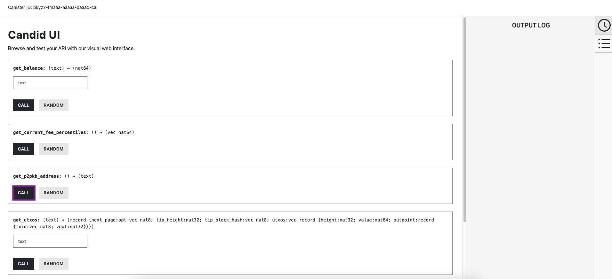

import { MarkdownChipRow } from "/src/components/Chip/MarkdownChipRow";

# 4.3 ckBTC and Bitcoin integration

<MarkdownChipRow labels={["Advanced", "Tutorial"]} />

<div class="text--center">
<p> </p>
</div>
<div class="text--center">
<iframe width="660" height="415" src="https://www.youtube.com/embed/LmoE3-jzwmo?si=-ODc1BYFu_HSLhTA" title="YouTube video player" frameborder="0" allow="accelerometer; autoplay; clipboard-write; encrypted-media; gyroscope; picture-in-picture; web-share" referrerpolicy="strict-origin-when-cross-origin" allowfullscreen></iframe> </div>

Chain-key cryptography is a feature that encompasses several cryptographic mechanisms that enable novel workflows and functionalities such as chain-key tokens. Chain-key tokens are not wrapped tokens; they are twin tokens that are backed 1:1 by the original token (BTC, ETH). They use chain-key cryptography to enable token transfers with cheaper fees and higher transfer speeds than using the original token's native blockchain network.

Currently, ICP supports an integration with the Bitcoin network that includes the chain-key bitcoin (ckBTC) token. Other chain-key tokens include ckETH and variations of ckERC20 tokens, such as ckUSDC and ckLINK.

## Bitcoin integration architecture

ICP's direct integration with Bitcoin uses a novel protocol for chain-key signatures based on **threshold signatures**. [Threshold ECDSA](/docs/references/t-sigs-how-it-works/) and threshold Schnorr are protocol suites that include several features like [key generation](https://csrc.nist.gov/glossary/term/key_generation), [periodic key re-sharing](https://www.youtube.com/watch?v=gKUi-2T7tdc), [computing pre-signatures](/docs/references/t-sigs-how-it-works/#:~:text=Computing%20pre%2Dsignatures%2C%20signing%3A,requests%20to%20precompute%20pre%20signatures), [XNet key re-sharing](/docs/references/t-sigs-how-it-works//#:~:text=XNet%20key%20re,source%20subnet%20uses), and public key retrieval.

On a high level, subnets that have ECDSA and Schnorr enabled hold a master key, which is generated using ICP's key generation protocol. A master key can be used to generate canister ECDSA or Schnorr keys. It is important to know that an ECDSA or Schnorr private key only exists in a secret-shared form during its lifetime, whether it is being generated, shared within a subnet, or shared from one subnet to another.

The Developer Liftoff will dive deeper into threshold signatures in a future tutorial. You can also take a deep dive in the [technology overview to learn more](/docs/references/t-sigs-how-it-works/).

On the protocol level, the [Bitcoin integration](https://wiki.internetcomputer.org/wiki/Bitcoin_Integration) and chain-key signatures each expose an API on the management canister. While the Bitcoin API is specific to the Bitcoin network, the chain-key ECDSA and Schnorr signature APIs can be used for other workflows, such as the integration with other blockchains like Ethereum.

Through ICP's integration with the Bitcoin network, canisters deployed on ICP are able to receive, hold, and send bitcoin. Each of these functions utilizes transactions on the Bitcoin network and allows canisters to act as if they are users on the Bitcoin network.

For a canister to make a Bitcoin transaction, a request must be sent to a Bitcoin-enabled subnet. On that subnet, a Bitcoin canister is implemented as a typical NNS-managed canister that is accessible through the management canister's Bitcoin API. The Bitcoin canister holds ICP's onchain Bitcoin state, which includes the UTXO set, the most recent Bitcoin blocks, and the current queue of outgoing transactions being sent to the Bitcoin network. When a canister submits a transaction to the Bitcoin API, the transaction is queued to be submitted to the Bitcoin network. An adapter connects to the nodes of the Bitcoin network and functions similarly to a traditional Bitcoin node. In every subnet round, the Bitcoin adapter obtains the pending transactions and queues them for being submitted asynchronously.

## What is ckBTC?

The ckBTC token is an onchain ICP token that is backed 1:1 by bitcoin (BTC), where 1 BTC can be redeemed for 1 ckBTC and vice versa. The unique chain-key cryptography used to create ckBTC makes it different from other tokens that are pegged to the price of BTC, such that other tokens typically rely on a third-party bridge to convert BTC to the pegged token. ckBTC does not use a third-party bridge, making it more secure than other pegged, or 'wrapped,' tokens.

In comparison to traditional BTC, ckBTC has much faster transfers at a much cheaper rate. A ckBTC transfer is finalized within seconds and costs 0.0000001 ckBTC, which is approximately two orders of magnitude lower than the traditional Bitcoin miner fees.

The functionality of ckBTC is provided through the combination of two canisters:

- The ckBTC minter: Responsible for minting and burning ckBTC. New ckBTC tokens are minted whenever the ckBTC minter receives bitcoin, while ckBTC tokens are burned whenever there is a request to withdraw bitcoin.

- The ckBTC ledger: Responsible for transferring ckBTC between accounts and keeping a record of account balances.

## Bitcoin use cases on ICP

The ICP's Bitcoin integration enables use cases such as:

- Decentralization swaps: ckBTC can be used to buy tokens in an SNS decentralization swap.

- Bitcoin smart contracts: Powerful smart contracts can offer Bitcoin functionality. For example, onchain Bitcoin wallets that use biometric authentication would allow users to complete Bitcoin transactions within the application without managing a Bitcoin private key.

- Trading bitcoin: ckBTC can be traded directly on decentralized exchanges for bitcoin without third-party custody of the assets.

## Deploying a Bitcoin dapp

In this tutorial, you'll deploy an example application using a local instance of the Bitcoin network, then simulate Bitcoin transactions using it. This example showcases ICP's Bitcoin integration; however, it does not use ckBTC.

:::info
Developing with ckBTC uses a different workflow, which will be showcased in a future variation of this series focused entirely on ckBTC.
:::

import TabItem from "@theme/TabItem";
import { AdornedTabs } from "/src/components/Tabs/AdornedTabs";

<AdornedTabs>
<TabItem label="Prerequisites">

:::caution
This example is currently not available in ICP Ninja and must be run locally with `dfx`.
:::

<input type="checkbox"/> Before you start, verify that you have set up your developer environment according to the instructions in <a href="/docs/tutorials/developer-liftoff/level-1/1.2-dev-env"> 1.2 Developer environment setup</a>.

</TabItem>
</AdornedTabs>
### Setting up a local Bitcoin network

To develop a Bitcoin dapp locally, first a local Bitcoin network instance must be running. This allows developers to mine blocks quickly and facilitates testing without having to rely on the slow Bitcoin testnet or the Bitcoin mainnet.


- #### Step 1: Download [Bitcoin core v27](https://bitcoin.org/bin/bitcoin-core-27.0/). It is recommended to use the `.tar.gz` version for Mac users.
- #### Step 2: Unpack the `.tar.gz` file: `tar -xf bitcoin-27.0-arm64-apple-darwin.tar.gz`. Don't use any other approach of unpacking the file, as it may lead to issues.
- #### Step 3: Create a directory named `data` inside the unpacked folder: cd bitcoin-27.0 && mkdir data
- #### Step 4:


To get started, first download the [Bitcoin core v27](https://bitcoin.org/bin/bitcoin-core-27.0/). It is recommended to use the `.tar.gz` version for Mac users.

Then, unpack the `.tar.gz` file with the command:

```bash
tar -xf bitcoin-27.0-arm64-apple-darwin.tar.gz
```

It is not recommended to use another approach of unpacking the file, as it may lead to issues.

Navigate into the newly unpacked directory and create a new empty directory called `data`:

```bash
cd bitcoin-27.0
mkdir data
```

Then, while still in the root directory of `bitcoin-27.0`, replace the content of the file called `bitcoin.conf` with the following contents:

```
# Enable regtest mode. This is required to set up a private bitcoin network.
regtest=1

# Dummy credentials that are required by `bitcoin-cli`.
rpcuser=ic-btc-integration
rpcpassword=QPQiNaph19FqUsCrBRN0FII7lyM26B51fAMeBQzCb-E=
rpcauth=ic-btc-integration:cdf2741387f3a12438f69092f0fdad8e$62081498c98bee09a0dce2b30671123fa561932992ce377585e8e08bb0c11dfa
```

This snippet of configuration enables `regtest` mode, which is required for a local, private Bitcoin network instance. 'Regtest' is short for "regression testing mode." Then, it sets some test credentials that will be used by the Bitcoin network for authentication.

Then, start the local Bitcoin instance with the command:

```bash
./bin/bitcoind -conf=$(pwd)/bitcoin.conf -datadir=$(pwd)/data --port=18444
```

:::caution
The above command uses port `18444`, assuming it is available on your machine. If this port isn't available, specify a different port in the `--port` argument.
:::

Once running, the Bitcoin instance will take a moment to spin up and synchronize block headers. Once finished, it is ready to use. The output will take up the entirety of the terminal window.

### Cloning the `basic_bitcoin` example

Now that our local instance of the Bitcoin network is up and running, it's time to start developing a Bitcoin dapp locally.

To get started, open a new terminal window, navigate into your working directory (`developer_liftoff`), then use the following commands to clone the DFINITY examples repo and navigate into the `basic_bitcoin` directory:

```bash
git clone https://github.com/dfinity/examples/
cd examples/motoko/basic_bitcoin
```

Then, start the local replica with the command:

```bash
dfx start --clean
```

Once the local replica has been started, it should return output that indicates it has connected to the local Bitcoin node:

```bash
Oct 17 21:09:20.046 INFO s:/n:/ic_btc_adapter/ic_btc_adapter Starting the adapter with config: {
  "network": "regtest",
  "dns_seeds": [],
  "nodes": [
    "127.0.0.1:18444"
  ],
  "socks_proxy": null,
  "idle_seconds": 3600,
  "ipv6_only": false,
  "logger": {
    "node_id": 100,
    "dc_id": 200,
    "level": "info",
    "format": "text_full",
    "debug_overrides": [],
    "sampling_rates": {},
    "enabled_tags": [],
    "target": "Stdout",
    "block_on_overflow": true
  },
  "incoming_source": {
    "Path": "/var/folders/_k/vfkshzzs0yb6w81nh24q5ccm0000gn/T/ic-btc-adapter-socket.1416.1697576959"
  }
}
Creating canister: g4xu7-jiaaa-aaaan-aaaaq-cai (bitcoin integration)
Installing canister: bitcoin integration
2023-10-17 21:09:27.650935 UTC: [Canister g4xu7-jiaaa-aaaan-aaaaq-cai] Sending request: Initial(GetSuccessorsRequestInitial { network: Regtest, anchor: BlockHash([6, 34, 110, 70, 17, 26, 11, 89, 202, 175, 18, 96, 67, 235, 91, 191, 40, 195, 79, 58, 94, 51, 42, 31, 199, 178, 183, 60, 241, 136, 145, 15]), processed_block_hashes: [] })
Initialized replica.
Dashboard: http://localhost:49497/_/dashboard
```

:::caution
If you receive the error message "Failed to connect to 127.0.0.1:18444 Connecting to the stream timed out." This indicates that `dfx` isn't able to connect to your local Bitcoin instance. This error may occur if you used a port other than `18444` but did not edit the `dfx.json` file to reflect your custom port.
:::

The output will take up the terminal window, so open another terminal window and navigate back into the `examples/motoko/basic_bitcoin` directory.

### Deploying the example canister

To deploy the Bitcoin example canister locally, run the command:

```bash
dfx deploy basic_bitcoin --argument '(variant { regtest })'
```

You will receive output that resembles the following:

```bash
Installing canisters...
Creating UI canister on the local network.
The UI canister on the "local" network is "bd3sg-teaaa-aaaaa-qaaba-cai"
Installing code for canister basic_bitcoin, with canister ID bkyz2-fmaaa-aaaaa-qaaaq-cai
Deployed canisters.
URLs:
  Backend canister via Candid interface:
    basic_bitcoin: http://127.0.0.1:4943/?canisterId=bd3sg-teaaa-aaaaa-qaaba-cai&id=bkyz2-fmaaa-aaaaa-qaaaq-cai
```

Your local Bitcoin dapp is ready to use! Let's take a look at how you can interact with it.

### Generating a Bitcoin address

To receive Bitcoin, you will need a Bitcoin address. There are different types of Bitcoin addresses, such as a `P2PKH` address or a `P2SH` address. Most Bitcoin addresses can be generated using an ECDSA public key. In this Bitcoin example canister, the code contains an example that generates a `P2PKH` address using the `ecdsa_public_key` API.

To generate a `P2PKH` address, make the following call to the canister's method `get_p2pkh_address`:

```bash
dfx canister call basic_bitcoin get_p2pkh_address
```

<details>
<summary>Output</summary>

```bash
("mmucK4F2UhnjGU9V9rhKjTsjyrUzMCyKnt")
```

Your output will be different since each ECDSA public key is unique.


</details>

Alternatively, you can use the Candid UI by opening the Candid UI URL that was returned in the deployment output. Find the `get_p2pkh_address` method, then select the `Call` button under it:



The `P2PKH` address will be returned in the UI:


### Receiving BTC

To receive BTC on your local network, you need to mine blocks since BTC is minted as a reward for mining a block. On the Bitcoin testnet and mainnet, you cannot control when blocks are mined. On your local Bitcoin network, however, you can manually mine blocks using the following command within the `bitcoind` directory:

```bash
./bin/bitcoin-cli -conf=$(pwd)/bitcoin.conf generatetoaddress <number-of-blocks> <address>
```

For example, to mine a block and have the canister receive the BTC reward, use the command:

```bash
./bin/bitcoin-cli -conf=$(pwd)/bitcoin.conf generatetoaddress 1 $(dfx canister call basic_bitcoin get_p2pkh_address)
```

If successful, you'll receive the hash of the block that was just mined, which resembles the following:

```bash
[
  "639b8cceef7f6da5a6cc56e6e6a4f7b11dc42416e94773a858ee5d004acb59c1"
]
```

In the terminal window that is showing the output of `dfx start --clean --background`, you will see a log that resembles:

```bash
Oct 17 21:57:40.893 INFO s:/n:/ic_btc_adapter/blockchainmanager Added headers: Height = 2, Active chain's tip = 7f592c802fd9bd33fe84b6c4016e46047e6b0b903a24a61e3e4446f0fd3d735d
```

This indicates that your canister has ingested the block as expected. The first block may take up to 30 seconds to sync, but subsequent blocks sync much faster.

### Checking your BTC balance

To check the balance of your Bitcoin address to confirm that it received the BTC, run the following command:

```bash
dfx canister call basic_bitcoin get_balance '("BTC_ADDRESS")'
```

Replace `BTC_ADDRESS` with your generated `P2PKH` address. Your balance should be `5_000_000_00`, which is equal to 50 BTC.

:::caution
Remember that this is a local deployment. The BTC you mine here is only valid on your local Bitcoin network for testing purposes and cannot be spent or used anywhere else.
:::

### Sending BTC

One prerequisite to sending BTC, however, is that the first 100 additional blocks of the network must be mined. Since this is a local instance, your network has only mined one block. This is known as the Coinbase maturity rule.

To mine 100 additional blocks, run the command:

```bash
./bin/bitcoin-cli -conf=$(pwd)/bitcoin.conf generatetoaddress 100 $(dfx canister call basic_bitcoin get_p2pkh_address)
```

You should receive output and `dfx` log entries similar to the ones you got for mining a single block.

Now you can send BTC using the canister's `send` endpoint. In this example, you'll send 1 BTC to the address `n2dcQfuwFw7M2UYzLfM6P7DwewsQaygb8S`. You can replace this address with any test address you would like.

```bash
dfx canister call basic_bitcoin send_from_p2pkh '(record { destination_address = "n2dcQfuwFw7M2UYzLfM6P7DwewsQaygb8S"; amount_in_satoshi = 100000000; })'
```

:::info
Note that this command sends BTC in 'satoshi.' 1 BTC is equivalent to 100_000_000 satoshi.
:::

This command will create a transaction and send it to the local Bitcoin instance running. You now need to mine a block so that the transaction you just sent becomes a part of the blockchain. Without mining a block, the transaction is not recorded onchain.

In the `bitcoind` directory, mine another block:

```bash
./bin/bitcoin-cli -conf=$(pwd)/bitcoin.conf generatetoaddress 1 $(dfx canister call basic_bitcoin get_p2pkh_address)
```

Now, you can check that the address `n2dcQfuwFw7M2UYzLfM6P7DwewsQaygb8S` has a balance of 1 BTC:

```bash
dfx canister call basic_bitcoin get_balance '("n2dcQfuwFw7M2UYzLfM6P7DwewsQaygb8S")'
```

## Resources

- [ckBTC wiki page](https://wiki.internetcomputer.org/wiki/Chain-key_Bitcoin).
- [ckBTC developer documentation page](/docs/defi/chain-key-tokens/ckbtc/overview).
- [Bitcoin integration GitHub repository](https://github.com/dfinity/ic/tree/master/rs/bitcoin/ckbtc/minter).

import TutorialFooter from "@site/src/components/TutorialFooter/";

<TutorialFooter />
