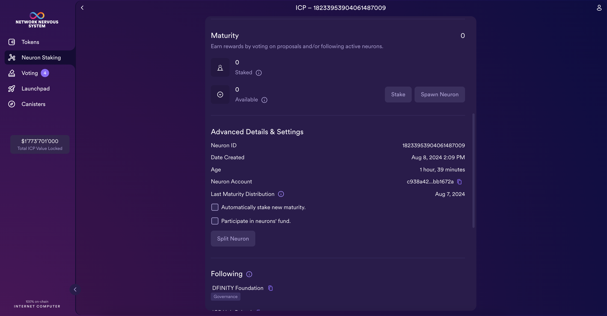

import { MarkdownChipRow } from "/src/components/Chip/MarkdownChipRow";

# 4.5 Using quill

<MarkdownChipRow labels={["Advanced", "Tutorial"]} />

<div class="text--center">
<p> </p>
</div>
<div class="text--center">
<iframe width="660" height="415" src="https://www.youtube.com/embed/wVa4I7pLAcs?si=nyNpubeiI54numjB" title="YouTube video player" frameborder="0" allow="accelerometer; autoplay; clipboard-write; encrypted-media; gyroscope; picture-in-picture; web-share" referrerpolicy="strict-origin-when-cross-origin" allowfullscreen></iframe> </div>

Now that you've covered both the ICP ledger and the NNS, it's time to take a look at a CLI tool that can be used to interact with both. Quill is a ledger and governance toolkit that provides support for self-custody of ICP or ckBTC tokens and functionality to interact with the NNS, SNSes, and ICP ledger from a **cold wallet**.

To hold tokens or digital assets, there are three types of wallet options you can use:

- **Centralized wallet services**: A wallet service owned and operated by a centralized third party, such as a centralized exchange. On a centralized wallet service, the user is not in control of the wallet's private key.

- **Hot wallets**: Any wallet that uses an application on a device connected to the internet. With hot wallets, users are in full control of their wallet's private key.

**Cold wallets**: A wallet that uses an offline device that is not connected to the internet. Like hot wallets, cold wallets also provide users with full control of the wallet's private key.

Each of these options has its benefits, but there is an equal tradeoff between convenience and security. For example, while cold wallets are quite secure since they do not have access to the internet and are safe from malicious cyber attacks, they are not convenient to use since there must be additional steps taken to move the assets to a hot wallet or centralized wallet in order to spend and trade the assets. The opposite is true for hot wallets; while they are convenient to use, they are susceptible to attacks.

[Read more about different types of self-custody wallet options in the documentation](/docs/defi/overview).

In this tutorial, you'll take a look at how to use quill for workflows like interacting with the ICP ledger, sending or receiving ckBTC, and interacting with the NNS and neurons.

## What is quill?

Quill is a CLI tool used for interacting with ICP's governance and ledger canisters. A unique feature of quill is the ability to create signed messages on a cold wallet. Once these messages are created, they must be transferred to an online computer, however, in order for them to take effect on the mainnet. This is possible because ICP uses cryptographically verifiable messages.

To support cold wallets, quill uses two separate steps to send query and update calls to ICP. First, quill generates a transaction payload and signs the message according to the quill subcommand and its arguments. This step does not require a connection to the internet. Then, the `quill send` command is used to submit the transaction payload to ICP, which requires an internet connection. To connect to the internet, users will need to transport the signed message payload, which is returned in JSON or QR code format, from the cold wallet computer to an online computer.

While it is important to know that quill supports cold wallet workflows, it can also be used on a computer connected to the internet without using any cold wallet workflows.

:::info

Transactions that use query requests, such as obtaining an account's balance or returning proposal information, require an internet connection and cannot be run on cold wallets. This is because submitting these query calls locally would not return data, since the mainnet canisters being queried are not running on the local replica. Additionally, query calls do not require the same cryptographic validity that update calls do; therefore, they do not need a signature to be generated and can be submitted directly to the mainnet.

In this tutorial, you'll see that query calls do not generate JSON output and can be submitted directly to the mainnet, while update calls will generate a JSON response that must be saved and submitted using `quill send`.

:::

## Downloading and installing quill

:::info
To install quill on a cold wallet, you can either follow the steps below and then disconnect the computer from the internet, or you can download the release file and transport it to the offline machine using a device such as a USB flash drive.

In this tutorial, it will be assumed that you will be using quill on a machine with an internet connection, but this tutorial will include notes with information for cold wallet workflows.
:::

First, start by downloading the latest [quill release from GitHub](https://github.com/dfinity/quill/releases).

This tutorial will showcase the macOS steps; please see the instructions here for [Linux](https://github.com/dfinity/quill#linux) and [Windows](https://github.com/dfinity/quill#windows).

Then, move the file to the `/usr/local/bin` directory to use it in the CLI:

```bash
mv quill-macos-x86_64 /usr/local/bin/quill
```

Next, give the file executable permissions:

```bash
chmod +x /usr/local/bin/quill
```

Check that quill is now available for use by running the command:

```bash
quill -h
```

## Using quill's basic commands

First, you need an account to use with quill. You can create a new account, or you can use an existing ledger account. To create a new account, generate the account's private key by running the command:

```bash
quill generate
```

This command will return the principal and account IDs for our newly generated private key:

```bash
Principal id: hzpq4-g6feu-vbvwx-oeo5c-fjiz4-de4bq-7q4y2-rldok-whjrq-mnayv-mqe
Legacy account id: 438f6fdc8e33539bbf73625c141cfbfa4b41fd943595f8e1ccd0b8c9e9758772
```

Alternatively, you can use a private key file for our existing ledger account with an ICP balance. To use an existing ledger account, you will need the account's `.pem` file. To get this `.pem` file, you can use the `dfx identity export` command. First, ensure that you're using the `dfx` identity you intend to be:

```bash
dfx identity whoami
```

Then, export the identity's `.pem` file with the command:

```bash
dfx identity export default > my_identity.pem
```

:::info
In this command, the `>` character indicates that you want to save the output of `dfx identity export default` to a file called `my_identity.pem`.
:::

Then, you can pass this `.pem` file into our quill commands with the flag `--pem-file my_identity.pem`.

Next, let's use quill to get our account's balance. Use the following command:

```bash
quill --pem-file my_identity.pem account-balance PRINCIPAL_ID
```

Replace `PRINCIPAL_ID` with the principal value returned from the command `dfx identity get-principal` for the identity that you generated the `.pem` file for.

Running query commands with quill will generate the transaction and then ask if you'd like to send the message or not, such as:

```bash
Sending message with

  Call type:   update
  Sender:      2vxsx-fae
  Canister id: ryjl3-tyaaa-aaaaa-aaaba-cai
  Method name: icrc1_balance_of
  Arguments:   (
  record {
    owner = principal "hzpq4-g6feu-vbvwx-oeo5c-fjiz4-de4bq-7q4y2-rldok-whjrq-mnayv-mqe";
    subaccount = null;
  },
)

Do you want to send this message? [y/N]
```

This subcommand, `account-balance`, cannot be run on offline machines, so selecting 'N' will cancel the request. Selecting 'Y' will query the mainnet for the result, which will be returned such as:

```bash
Request ID: 0x7c8e03ccaa28ad463cd568cc52b14d5c7739fa81039d4548e34818e333d5e752
The request is being processed...
The request is being processed...
The request is being processed...
(100_000_000 : nat)
```

Now, if you want to transfer ICP to another account, you can use the command:

```bash
quill --pem-file my_identity.pem transfer --amount AMOUNT ACCOUNT_ID
```

:::caution
To use the quill transfer command, you need to have a balance of ICP. ICP can be bought through a crypto exchange, or ICP can be received through community activities such as participating in the NNS governance and receiving developer grants.
:::

Replace `AMOUNT` with the numerical number of how many ICP tokens to transfer, and replace `ACCOUNT_ID` with the account ID that should receive the ICP. For example:

```bash
quill --pem-file my_identity.pem transfer --amount 0.5 365cf45f3521653e866a078b157a8d8701c3f63183a6d41ff8ddb913c4a978d3
```

This command will output the transaction's JSON content. This content can be saved to a file and then submitted as a transaction, such as:

```bash
quill --pem-file identity.pem transfer --amount 0.5 365cf45f3521653e866a078b157a8d8701c3f63183a6d41ff8ddb913c4a978d3 > transfer_transaction.json
quill --pem-file identity.pem send transfer_transaction.json
```

Then you'll be prompted to confirm that you'd like to submit this transaction to the mainnet. On a cold wallet, the `transfer_transaction.json` file can be transferred to an online machine to be sent with the `quill --pem-file my_identity.pem send transfer_transaction.json` command.

## Using quill with ckBTC

Quill can be used for interacting with ckBTC. To get started, check the ckBTC balance of your ledger account with the command:

```bash
quill ckbtc balance --of PRINCIPAL_ID
```

Replace `PRINCIPAL_ID` with the principal ID for the identity you want to use.

Like the `account-balance` command, the `quill ckbtc balance` command cannot be run on offline machines, so selecting 'N' will cancel the request. Selecting 'Y' will query the mainnet for the result, which will be returned such as:

```bash
Request ID: 0xbdeef0e77df3c032b9c63d5c0e08aa766bfb33d81ab2b5f783ce0c7eafdccb58
The request is being processed...
The request is being processed...
(0 : nat)
```

Then, to retrieve BTC in exchange for ckBTC, use the command:

```bash
quill ckbtc retrieve-btc WITHDRAW_ADDRESS --satoshis AMOUNT > retrieve_transaction.json
```

Replace `PRINCIPAL_ID` with your principal ID, and replace `AMOUNT` with the number of Satoshis to retrieve.

Then, to submit this transaction, run the command:

```bash
quill send retrieve_transaction.json
```

The output confirming the transaction will resemble the following:

```bash
Sending message with

  Call type:   update
  Sender:      2vxsx-fae
  Canister id: mxzaz-hqaaa-aaaar-qaada-cai
  Method name: icrc1_transfer
  Arguments:   (
  record {
    to = record {
      owner = principal "mqygn-kiaaa-aaaar-qaadq-cai";
      subaccount = opt blob "\0e\b6\de\93\b1y\ae\83+\b3\22\e8\e3\d6\84f0\04E\cb=\e5\b8\afy\bb\8dL\bc\ea\96\d0";
    };
    fee = null;
    memo = null;
    from_subaccount = null;
    created_at_time = opt (1_697_834_874_304_780_000 : nat64);
    amount = 1_000 : nat;
  },
)

Do you want to send this message? [y/N]
```

With quill, you can also transfer ckBTC to another address with the command:

```bash
quill ckbtc transfer PRINCIPAL_ID --satoshis AMOUNT > ckBTC_transfer_transaction.json
```

Then, to submit this transaction, run the command:

```bash
quill send ckBTC_transfer_transaction.json
```

The output confirming the transaction will resemble the following:

```bash
Sending message with

  Call type:   update
  Sender:      2vxsx-fae
  Canister id: mxzaz-hqaaa-aaaar-qaada-cai
  Method name: icrc1_transfer
  Arguments:   (
  record {
    to = record {
      owner = principal "hzpq4-g6feu-vbvwx-oeo5c-fjiz4-de4bq-7q4y2-rldok-whjrq-mnayv-mqe";
      subaccount = null;
    };
    fee = null;
    memo = null;
    from_subaccount = null;
    created_at_time = opt (1_697_835_095_032_290_000 : nat64);
    amount = 1_000 : nat;
  },
)

Do you want to send this message? [y/N]
```

## Using quill with the NNS

Quill can be used with the NNS and any SNS that has been launched on ICP.

In the previous module, [4.4 NNS governance and staking](/docs/tutorials/developer-liftoff/level-4/4.4-nns-governance), you took a look at how to interact with the NNS and neurons through the NNS dapp. Now, let's look at how to use quill instead.

First, let's get some information about a neuron. You'll need a neuron's ID, which you can find on the NNS dapp, as you took a look at in the last module:



Then, you can use the command:

```bash
quill get-neuron-info NEURON_ID
```

Replace `NEURON_ID` with the ID of a neuron. Since this command is a query command, it cannot be run on offline machines, so selecting 'N' will cancel the request. Selecting 'Y' will query the mainnet for the result, which will be returned such as:

```bash
Request ID: 0xf8fa04049bb2d0f968203e008427301f8a6d49018c50647d44f26eabf0fdd114
The request is being processed...
The request is being processed...
The request is being processed...
The request is being processed...
(
  variant {
    Ok = record {
      dissolve_delay_seconds = 252_383_885 : nat64;
      recent_ballots = vec {};
      created_timestamp_seconds = 1_697_751_704 : nat64;
      state = 2 : int32;
      stake_e8s = 200_000_000 : nat64;
      joined_community_fund_timestamp_seconds = null;
      retrieved_at_timestamp_seconds = 1_697_835_643 : nat64;
      known_neuron_data = null;
      voting_power = 399_939_067 : nat64;
      age_seconds = 0 : nat64;
    }
  },
)
```

To create a new neuron owned by the identity you're using with quill, run the following `quill neuron-stake` command to stake ICP in a neuron:

```bash
quill --pem-file my_identity.pem neuron-stake --amount AMOUNT --name NAME > stake_neuron.json
```

Replace `AMOUNT` with the amount of ICP to stake in the neuron and replace `NAME` with the name of the neuron.

Then, submit the command with:

```bash
quill send stake_neuron.json
```

Now, to get a list of all neurons that belong to your identity's principal, run the command:

```bash
quill --pem-file my_identity.pem list-neurons > list_neurons.json
```

Then, submit the command with:

```bash
quill send list_neurons.json
```

Your neuron's details will be returned:

```
Neuron 16528081201153361936
Aging since: 54 years, 7 months, 7 days, 6 hours, 32 minutes, 29 seconds
Staked ICP: 1.00000000 ICP
State: NotDissolving
Dissolve delay: 1 day, 3 hours, 46 minutes, 40 seconds
Created Aug 08 2024 20:00:32 UTC
Controller: hoqq7-3eo6j-dee4s-aiabk-6rqxw-kwgyo-rhru7-bdgmk-k5ipv-chkhx-cqe
KYC verified: Yes
```

To manage your neuron and make a configuration change to it, you can use the command:

```bash
quill --pem-file my_identity.pem neuron-manage NEURON_ID <arguments>
```

For a full list of arguments to use with this command, use `quill neuron-manage --help` for the full list. For example, to increase the dissolve delay of your neuron, run the command:

```bash
quill --pem-file my_identity.pem neuron-manage 16528081201153361936 --additional-dissolve-delay-seconds 100000 > manage_neuron.json
```

Then, submit the command with:

```bash
quill send manage_neuron.json
```

Lastly, quill can be used to get information about the NNS's current proposals. For example, to list currently pending proposals, run the command:

```bash
quill list-proposals --limit 3
```

The `--limit` command is used to limit how many are returned; in this command, the most recent 3 proposals are returned. Since this command is a query command, it cannot be run on offline machines, so selecting 'N' will cancel the request. Selecting 'Y' will query the mainnet for the result, which will be returned such as:

```bash
...
Proposed action: Execute NNS function NnsCanisterUpgrade
Payload:
Proposal ID: 131695
Created at Aug 08 2024 15:49:41 UTC by neuron 73
Status: Open, reward status: AcceptVotes
Deadline: Aug 12 2024 15:49:41 UTC
Rejection cost: 10.00000000 ICP
Current tally: Y 3192928.36102570 (0.67%), N 330234.78091090 (0.07%) as of Aug 08 2024 21:28:57 UTC

"Update subnet pzp6e to replica version 3d0b3f1" (IcOsVersionDeployment)
Summary: "Update subnet pzp6e-ekpqk-3c5x7-2h6so-njoeq-mt45d-h3h6c-q3mxf-vpeq5-fk5o7-yae to replica version [3d0b3f10417fc6708e8b5d844a0bac5e86f3e17d](https://dashboard.internetcomputer.org/release/3d0b3f10417fc6708e8b5d844a0bac5e86f3e17d)"
Proposed action: Execute NNS function DeployGuestosToAllSubnetNodes
Payload: (
  record {
    1_097_286_461 = principal "pzp6e-ekpqk-3c5x7-2h6so-njoeq-mt45d-h3h6c-q3mxf-vpeq5-fk5o7-yae";
    2_560_866_249 = "3d0b3f10417fc6708e8b5d844a0bac5e86f3e17d";
  },
)
Proposal ID: 131694
Created at Aug 08 2024 13:00:38 UTC by neuron 80
Status: Executed, reward status: AcceptVotes
Decided at Aug 08 2024 13:01:53 UTC
Executed at Aug 08 2024 13:01:55 UTC
Deadline: Aug 12 2024 13:00:38 UTC
Rejection cost: 10.00000000 ICP
Current tally: Y 475720489.82021435 (99.43%), N 234104.90888499 (0.05%) as of Aug 08 2024 21:25:37 UTC

"Update subnet nl6hn to replica version 3d0b3f1" (IcOsVersionDeployment)
Summary: "Update subnet nl6hn-ja4yw-wvmpy-3z2jx-ymc34-pisx3-3cp5z-3oj4a-qzzny-jbsv3-4qe to replica version [3d0b3f10417fc6708e8b5d844a0bac5e86f3e17d](https://dashboard.internetcomputer.org/release/3d0b3f10417fc6708e8b5d844a0bac5e86f3e17d)"
Proposed action: Execute NNS function DeployGuestosToAllSubnetNodes
Payload: (
  record {
    1_097_286_461 = principal "nl6hn-ja4yw-wvmpy-3z2jx-ymc34-pisx3-3cp5z-3oj4a-qzzny-jbsv3-4qe";
    2_560_866_249 = "3d0b3f10417fc6708e8b5d844a0bac5e86f3e17d";
  },
)
Proposal ID: 131693
Created at Aug 08 2024 13:00:32 UTC by neuron 80
Status: Executed, reward status: AcceptVotes
Decided at Aug 08 2024 13:01:41 UTC
Executed at Aug 08 2024 13:01:43 UTC
Deadline: Aug 12 2024 13:00:32 UTC
Rejection cost: 10.00000000 ICP
Current tally: Y 475720508.86216562 (99.43%), N 234104.90636442 (0.05%) as of Aug 08 2024 21:25:41 UTC
```

To get detailed information about this proposal, take the value `Proposal ID: 131693`, in this case 131693, and input it into the `get-proposal-info` subcommand:

```bash
quill get-proposal-info 131693
```

## Resources

- [Quill CLI reference](https://github.com/dfinity/quill/)

## Need help?

Did you get stuck somewhere in this tutorial, or do you feel like you need additional help understanding some of the concepts? The ICP community has several resources available for developers, like working groups and bootcamps, along with our Discord community, forum, and events such as hackathons. Here are a few to check out:

- [Developer Discord](https://discord.internetcomputer.org), which is a large chatroom for ICP developers to ask questions, get help, or chat with other developers asynchronously via text chat.

- [Developer liftoff forum discussion](https://forum.dfinity.org/t/developer-journey-feedback-and-discussion/23893).

- [Developer tooling working group](https://www.google.com/calendar/event?eid=MHY0cjBubmlnYXY1cTkzZzVzcmozb3ZjZm5fMjAyMzEwMDVUMTcwMDAwWiBjX2Nnb2VxOTE3cnBlYXA3dnNlM2lzMWhsMzEwQGc&ctz=Europe/Zurich).

- [Motoko Bootcamp - The DAO Adventure](https://github.com/motoko-bootcamp/dao-adventure) - Discover the Motoko language in this 7-day adventure and learn to build a DAO on the Internet Computer.

- [Motoko Bootcamp - Discord community](https://discord.gg/YbksCUxdzk) - A community for and by Motoko developers to ask for advice, showcase projects, and participate in collaborative events.

- [Motoko developer working group](https://www.google.com/calendar/event?eid=ZWVnb2luaHU0ZjduMTNpZHI3MWJkcWVwNWdfMjAyMzEwMTJUMTUwMDAwWiBjX2Nnb2VxOTE3cnBlYXA3dnNlM2lzMWhsMzEwQGc&ctz=Europe/Zurich).

- [Upcoming events and conferences](https://dfinity.org/events-and-news/).

- [Upcoming hackathons](https://dfinity.org/hackathons/).

- Weekly developer office hours to ask questions, get clarification, and chat with other developers live via voice chat. This is hosted on the [Discord](https://discord.internetcomputer.org) server.

- Submit your feedback to the [ICP Developer feedback board](https://dx.internetcomputer.org).

## Next steps

To finish the level 4 developer liftoff section, you'll wrap up with Motoko level 4:

- [4.6 Motoko level 4](/docs/tutorials/developer-liftoff/level-4/4.6-motoko-lvl4).
