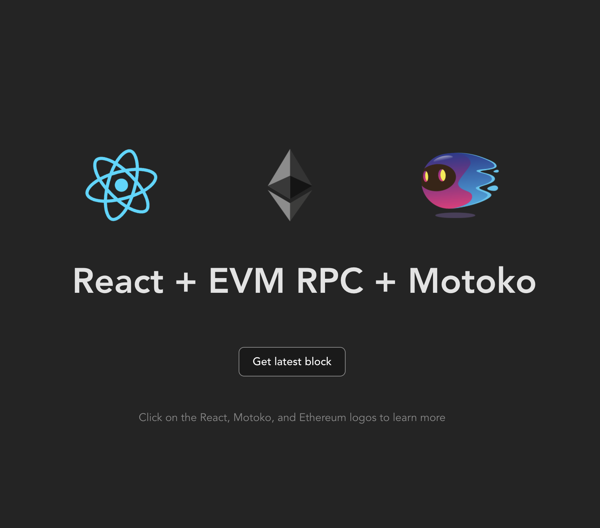
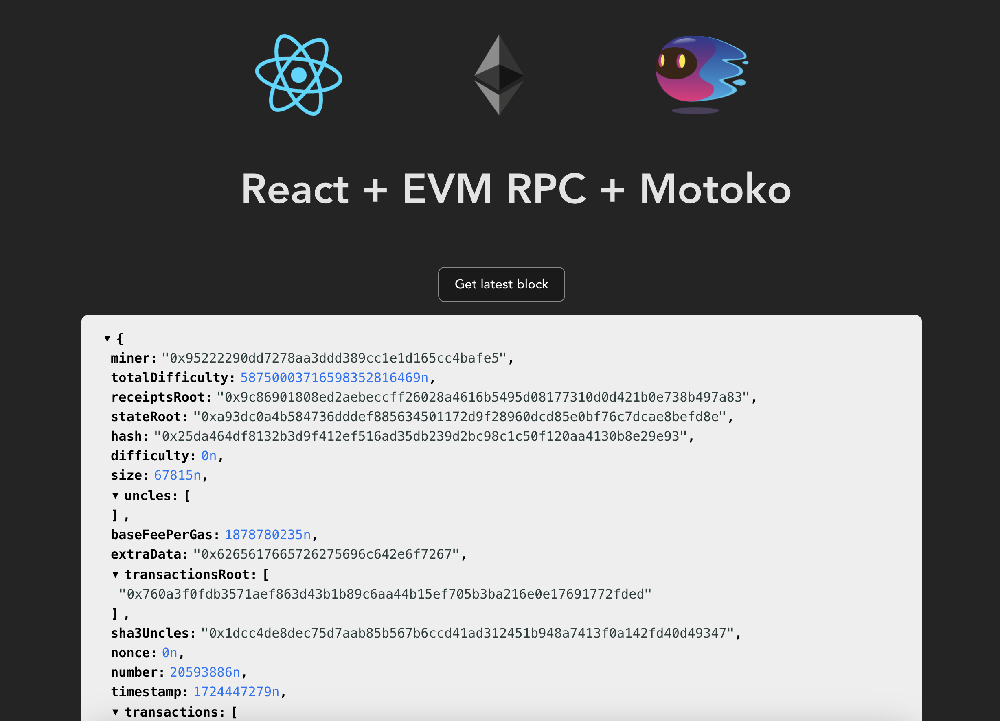

import { MarkdownChipRow } from "/src/components/Chip/MarkdownChipRow";
import '/src/components/CenterImages/center.scss';
import useBaseUrl from "@docusaurus/useBaseUrl";


# 5.2 Using the EVM RPC canister

<MarkdownChipRow labels={["Advanced", "Tutorial"]} />

<div class="text--center">
<p> </p>
</div>
<div class="text--center">
<iframe width="660" height="415" src="https://www.youtube.com/embed/3XHbK5yn_8s?si=yU2zp9Ju5nQ4tlB_" title="YouTube video player" frameborder="0" allow="accelerometer; autoplay; clipboard-write; encrypted-media; gyroscope; picture-in-picture; web-share" referrerpolicy="strict-origin-when-cross-origin" allowfullscreen></iframe> </div>

As you explored in a previous tutorial, the Internet Computer is integrated with the Bitcoin network, allowing for smart contracts to seamlessly communicate from ICP to Bitcoin for multi-chain functionality. ICP also has an integration with Ethereum and EVM networks, but in a different manner than the Bitcoin integration.

The Bitcoin integration is a direct integration, meaning there are nodes running on the ICP mainnet that run the Bitcoin node software. ICP currently does not have any nodes running the Ethereum node software and instead communicates with the Ethereum and EVM-compatible networks through a decentralized RPC integration. To facilitate communication with RPC services, the **EVM RPC** canister is used.

<div class="text-center">
  
</div>

The EVM RPC canister enables your dapp to sign and submit transactions to Ethereum and other EVM networks using [HTTPS outcalls](/docs/building-apps/network-features/using-http/https-outcalls/overview) and [threshold ECDSA signatures](/docs/building-apps/network-features/signatures/t-ecdsa). The EVM RPC canister will eventually be replaced by an onchain Ethereum API on ICP, made possible by running full Ethereum nodes on each ICP replica.

Through ICP's chain-key cryptography feature, the ETH integration also includes chain-key tokens, similar to the design of ckBTC. The ETH integration expands the possibilities of chain-key tokens to include ckETH and ckERC-20 tokens, including ckUSDC, ckEURC, and ckUSDT.

## Deploying the ETH starter project

For this tutorial, a sample boilerplate project will be explored that showcases how to use the EVM RPC canister to query information from the Ethereum network.

### Project technology stack

This starter project is comprised of three canisters:

- The frontend canister, which uses TypeScript, Vite, and React as the core components to create the user interface.

- The backend canister, written in Motoko, that uses the Motoko package manager Mops and mo-dev, a live development server for Motoko.

- The EVM RPC canister, which is pulled into the project using [`dfx deps`](/docs/building-apps/advanced/using-third-party-canisters).

We'll dive deeper into the project's files in the [exploring the project's files](#exploring-the-projects-files) section below.

### Prerequisites

Before you start, verify that you have set up your developer environment according to the instructions in [1.2 Developer environment setup](/docs/tutorials/developer-liftoff/level-1/1.2-dev-env).

### Downloading the starter project's files

To get started, open a new terminal window, navigate into your working directory (`developer_liftoff`), then use the following commands to clone the DFINITY `ic-eth-starter` repo:

```bash
git clone https://github.com/rvanasa/vite-react-motoko.git
cd vite-react-motoko
git switch evm-rpc // Switch to the EVM RPC branch of the repo.
```

### Exploring the project's files

First, let's start by looking at the contents of the project's `dfx.json` file. This file will contain the following:

```json title="dfx.json"
{
  "canisters": {
    "evm_rpc": {
      "type": "pull",
      "id": "7hfb6-caaaa-aaaar-qadga-cai"
    },
    "backend": {
      "dependencies": ["evm_rpc"],
      "type": "motoko",
      "main": "backend/Backend.mo",
      "declarations": {
        "node_compatibility": true
      }
    },
    "frontend": {
      "dependencies": ["backend"],
      "type": "assets",
      "source": ["dist/"]
    }
  },
  "defaults": {
    "build": {
      "packtool": "npm run --silent sources"
    }
  },
  "output_env_file": ".env",
  "version": 2
}
```

In this file, you can see the definitions for the project's four canisters:

- `frontend`: The dapp's frontend canister, which has type "assets" to declare it as an asset canister, and uses the files stored in the `dist` directory. This canister has a dependency on the `backend` canister.

- `backend`: The dapp's backend canister, which has type "motoko" since it uses Motoko source code stored in the file `backend/Backend.mo`. This canister has the dependency of `evm_rpc`.

- `evm_rpc`: This canister is responsible for facilitating communication from the backend canister to RPC services to interact with the Ethereum network. This canister is pulled using `dfx deps` and has canister ID `7hfb6-caaaa-aaaar-qadga-cai`.

Next, let's take a look at the source code for the backend canister. Open the `backend/Backend.mo` file, which will contain the following content. This code has been annotated with notes to explain the code's logic:

```motoko no-repl title="backend/Backend.mo"
import EvmRpc "canister:evm_rpc";

import Debug "mo:base/Debug";
import Cycles "mo:base/ExperimentalCycles";

actor {

  /// Retrieve the latest block on the Ethereum blockchain.
  public func getLatestEthereumBlock() : async EvmRpc.Block {

    // Select RPC services
    let services : EvmRpc.RpcServices = #EthMainnet(?[#Cloudflare]);

    // Call `eth_getBlockByNumber` RPC method (unused cycles will be refunded)
    Cycles.add<system>(1000000000);
    let result = await EvmRpc.eth_getBlockByNumber(services, null, #Latest);

    switch result {
      // Consistent, successful results
      case (#Consistent(#Ok block)) {
        block;
      };
      // Consistent error message
      case (#Consistent(#Err error)) {
        Debug.trap("Error: " # debug_show error);
      };
      // Inconsistent results between RPC providers
      case (#Inconsistent(results)) {
        Debug.trap("Inconsistent results");
      };
    };
  };
};
```

#### What this code does

This backend code has a single function that retrieves the latest block from the Ethereum mainnet. It configures the RPC service to make the call through the Cloudflare RPC provider and attaches cycles to the call. By default, the EVM RPC canister replicates this call across at least three providers to decentralize the RPC call and verify that the results returned from each provider match one another. This backend code checks to make sure the result returned matches the result of the other RPC services.

This tutorial will not dive into the frontend's configuration. [Learn more about frontend canisters](/docs/building-apps/frontends/using-an-asset-canister).

### Deploying the project

It's time to deploy the boilerplate project. To do this, first assure that a local replica is running:

```bash
dfx start --clean --background
```

Then, pull and deploy the `evm_rpc` canister locally with `dfx deps`:

```bash
dfx deps pull
dfx deps init evm_rpc --argument '(record { nodesInSubnet = 31 })'
dfx deps deploy
```

Install the program's packages, generate Candid type bindings, and deploy the canisters with the command:

```bash
npm run setup
```

In the background, this command runs the commands `npm i && dfx canister create --all && dfx generate backend && dfx deploy`.

Then, you can start the local development server with the command:

```bash
npm start
```

This command will return the local URL that the dapp is running at; by default, this will be `http://localhost:3000/`.

### Using the dapp

To use the dapp and query information about the latest Ethereum block, open the local URL that was returned by the `npm start` command, such as `http://localhost:3000`. You'll see the frontend of the dapp:



Click on the "Get latest block" to query the latest block from the Ethereum mainnet.



When this button is clicked, the following is happening in the background:

- The frontend canister triggers the `getLatestEthereumBlock()` method of the backend canister.

- The backend canister uses HTTPS outcalls to send an [`eth_getBlockByNumber`](https://docs.alchemy.com/reference/eth-call) RPC request to an Ethereum JSON-RPC API using the Cloudflare provider. By default, the EVM RPC canister replicates this call across at least 2 other RPC providers.

- This request involves encoding and decoding ABI, which is the Candid equivalent in the Ethereum ecosystem.

- The latest block information is returned to the backend canister. Three responses are returned: one from the specified RPC provider, Cloudflare, and two from the other RPC providers that the EVM RPC canister queried automatically for decentralization purposes. The backend canister checks to be sure that all three responses contain the same information.

- Then, the frontend displays the block information that was returned.

:::info
In this tutorial, you deployed this starter dapp locally. To deploy this dapp on the mainnet, run `dfx deploy --network ic`.
:::

## Calling the EVM RPC canister from the CLI

You can make calls directly to the EVM RPC canister from the CLI. For example, to get the latest Ethereum gas fee information, use the `dfx` command:

```bash
export IDENTITY=default
export CYCLES=2000000000
export WALLET=$(dfx identity get-wallet)
export RPC_SOURCE=EthMainnet
export RPC_CONFIG=null

dfx canister call evm_rpc eth_feeHistory "(variant {$RPC_SOURCE}, $RPC_CONFIG, record {blockCount = 3; newestBlock = variant {Latest}})" --with-cycles=$CYCLES --wallet=$WALLET
```

If the results from each RPC provider match, the result returned will be 'Consistent':

```bash
(
  variant {
    Consistent = variant {
      Ok = opt record {
        reward = vec {};
        gasUsedRatio = vec {
          0.4901801333333333 : float64;
          0.2692428 : float64;
          0.6662872333333333 : float64;
        };
        oldestBlock = 20_594_047 : nat;
        baseFeePerGas = vec {
          2_790_453_437 : nat;
          2_783_602_967 : nat;
          2_623_018_861 : nat;
          2_732_062_498 : nat;
        };
      }
    }
  },
)
```

If the results returned are 'inconsistent,' each individual response will be returned:

```bash
(
  variant {
    Inconsistent = vec {
      record {
        variant { EthMainnet = variant { Ankr } };
        variant {
          Ok = opt record {
            reward = vec {};
            gasUsedRatio = vec {
              0.4223029666666666 : float64;
              0.4901801333333333 : float64;
              0.2692428 : float64;
            };
            oldestBlock = 20_594_046 : nat;
            baseFeePerGas = vec {
              2_845_729_624 : nat;
              2_790_453_437 : nat;
              2_783_602_967 : nat;
              2_623_018_861 : nat;
            };
          }
        };
      };
      record {
        variant { EthMainnet = variant { PublicNode } };
        variant {
          Err = variant {
            ProviderError = variant {
              TooFewCycles = record {
                expected = 555_296_000 : nat;
                received = 449_408_000 : nat;
              }
            }
          }
        };
      };
      record {
        variant { EthMainnet = variant { Cloudflare } };
        variant {
          Ok = opt record {
            reward = vec {};
            gasUsedRatio = vec {
              0.4223029666666666 : float64;
              0.4901801333333333 : float64;
              0.2692428 : float64;
            };
            oldestBlock = 20_594_046 : nat;
            baseFeePerGas = vec {
              2_845_729_624 : nat;
              2_790_453_437 : nat;
              2_783_602_967 : nat;
              2_623_018_861 : nat;
            };
          }
        };
      };
    }
  },
)
```

You can also sign and submit transactions directly to Ethereum with a command such as:

```bash
export IDENTITY=default
export CYCLES=2000000000
export WALLET=$(dfx identity get-wallet)
export RPC_SOURCE=EthMainnet
export RPC_CONFIG=null

dfx canister call evm_rpc eth_sendRawTransaction "(variant {$RPC_SOURCE}, $RPC_CONFIG, \"0xf86c098504a817c800825208943535353535353535353535353535353535353535880de0b6b3a76400008025a028ef61340bd939bc2195fe537567866003e1a15d3c71ff63e1590620aa636276a067cbe9d8997f761aecb703304b3800ccf555c9f3dc64214b297fb1966a3b6d83\")" --with-cycles=$CYCLES --wallet=$WALLET
```

Your transaction ID will be returned from the RPC provider. For example, here is the transaction ID returned from PublicNode:

```bash
  record {
    variant { EthMainnet = variant { PublicNode } };
    variant {
      Ok = variant {
        Ok = opt "0x33469b22e9f636356c4160a87eb19df52b7412e8eac32a4a55ffe88ea8350788"
      }
    };
  };
```

:::info
Some JSON-RPC APIs may only return a `NonceTooLow` status when successfully submitting a transaction. This is because during the HTTP outcall consensus, only the first request is successful, while the others reply with a duplicate transaction status.
:::

## Resources

- [View the full Github repo for this starter project](https://github.com/rvanasa/vite-react-motoko/tree/evm-rpc).

- [How it works: EVM RPC canister](/docs/building-apps/chain-fusion/ethereum/evm-rpc/how-it-works).

- [Using the EVM RPC canister](/docs/building-apps/chain-fusion/ethereum/evm-rpc/evm-rpc-canister).

- [Costs of RPC requests](/docs/building-apps/chain-fusion/ethereum/evm-rpc/costs).

- [Samples using the EVM RPC canister](/docs/building-apps/chain-fusion/ethereum/evm-rpc/evm-rpc-canister).

import TutorialFooter from "@site/src/components/TutorialFooter/";

<TutorialFooter />
## Next steps

- [5.3 Creating a decentralized token swap](/docs/tutorials/developer-liftoff/level-5/5.3-token-swap-tutorial)
