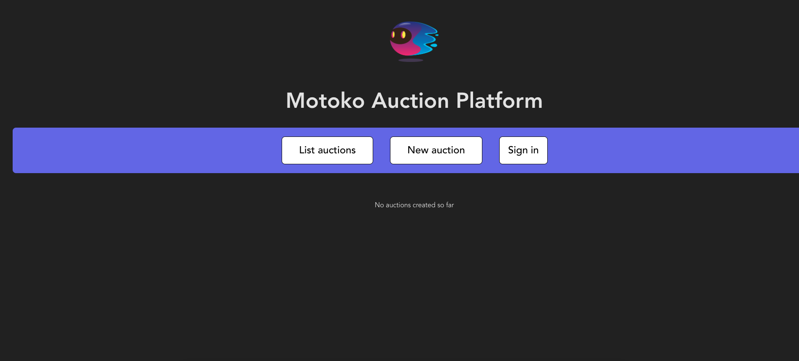
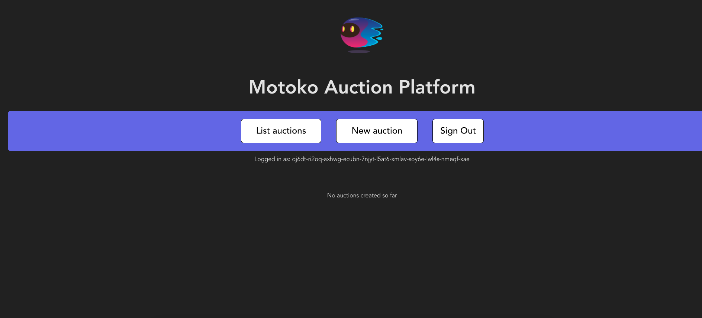
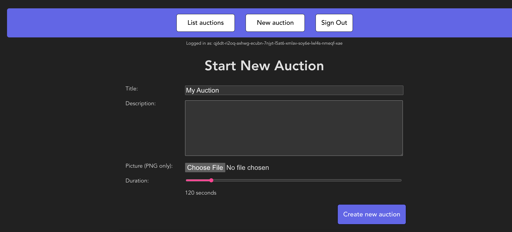
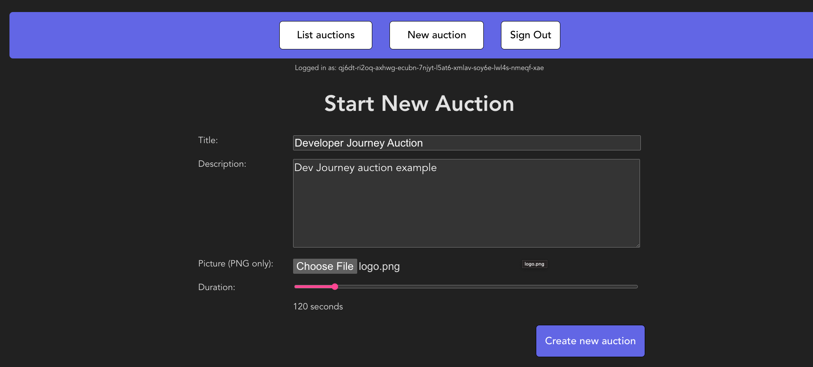
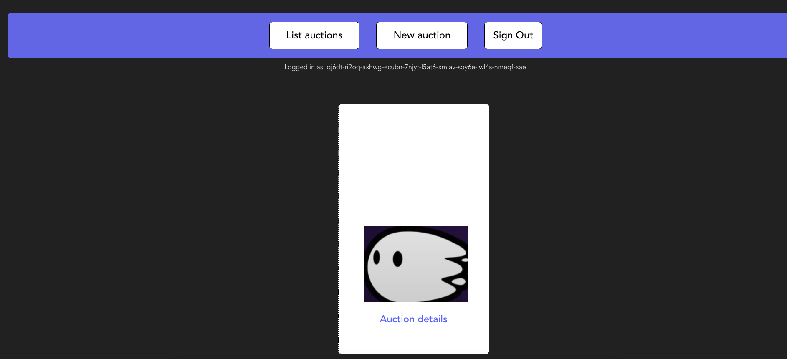
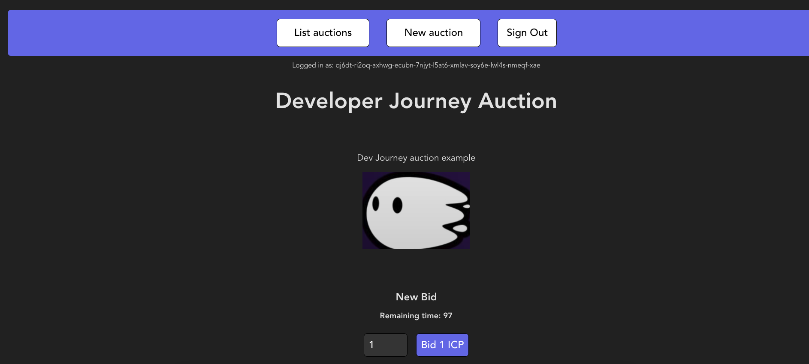
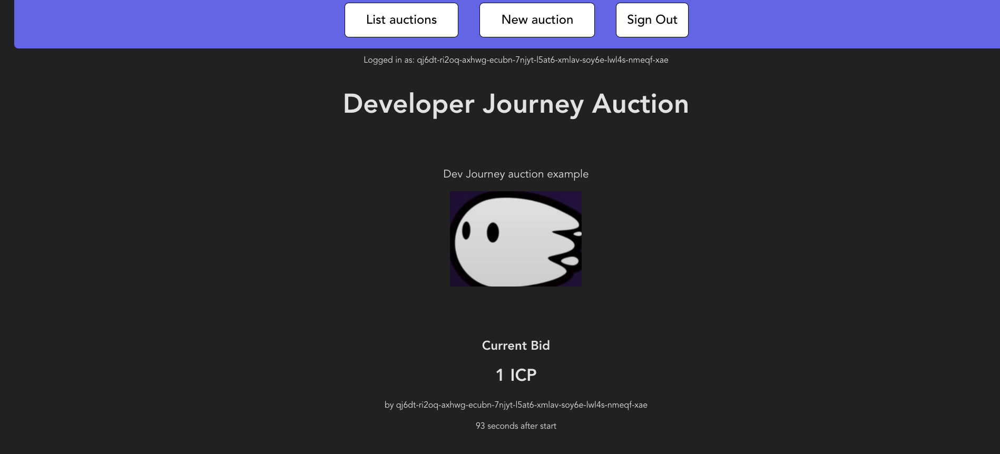
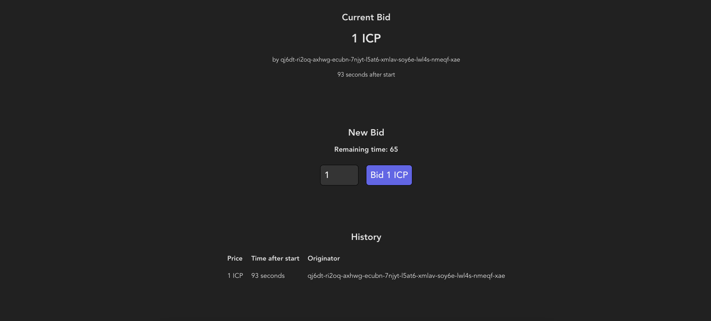

import { MarkdownChipRow } from "/src/components/Chip/MarkdownChipRow";
import '/src/components/CenterImages/center.scss';


# 5.5 Creating an auction dapp

<MarkdownChipRow labels={["Advanced", "Tutorial"]} />

Until this point in the Developer Liftoff series, each tutorial has focused on a specific use case or feature of ICP. To wrap up the series, this tutorial will showcase how to create a general-purpose dapp that provides a real-world use case. In this tutorial, you'll create the foundation for a simple auction dapp.

In this tutorial, you'll create a simple auction dapp that provides functions such as:

- Opening and viewing auctions.

- Bidding on auctions within a defined deadline.

- Logging into the dapp with Internet Identity.

## How does an auction work?

To create an auction, an item needs to be put up for sale. Once that item is for sale, potential buyers can place bids on how much they'd like to pay for the item. Usually, auctions last a few minutes or hours, providing buyers the opportunity to outbid one another. The buyer with the highest bid when the auction ends receives the item.

Auctions are traditionally used for selling items such as:

- Real estate properties.

- Automotive sales.

- Overstock products.

- Storage units.

- Estate sales.

Auctions are also popularly used for charity events to raise money for an organization.

## Creating an auction dapp

By creating an auction on a decentralized platform such as ICP, there is an immutable record of the users who bid on the item and who purchased the item. This allows for verifiable records for sales of high-value items or digital assets such as NFTs.

import TabItem from "@theme/TabItem";
import { AdornedTabs } from "/src/components/Tabs/AdornedTabs";

<AdornedTabs>
<TabItem label="Prerequisites">

:::caution
This example is currently not available in ICP Ninja and must be run locally with `dfx`.
:::

<input type="checkbox"/> Before you start, verify that you have set up your developer environment according to the instructions in <a href="/tutorials/developer-liftoff/level-1/1.2-dev-env"> 1.2 Developer environment setup</a>.

</TabItem>
</AdornedTabs>
### Cloning the `auction` example

To get started, open a new terminal window, navigate into your working directory (`developer_liftoff`), then use the following commands to clone the `auction` example repo:

```bash
git clone https://github.com/luc-blaeser/auction
cd auction
```

### Reviewing the project's files

This project was originally developed for a Motoko workshop at the [KTH summer school](https://cysep.conf.kth.se/). To provide additional context for the students in that workshop, this project's repo includes supplemental resources for learning Motoko. This tutorial will not review those resources, but it is recommended that you review them for additional context.

This project contains the following files:

- `Installation.md`, `ICP_Programming_Tutorial.pdf`, and `Structure.md`: Supplemental learning resources.

- `src/backend/AuctionServer.mo`: The backend canister's source code.

- `src/frontend`: The frontend assets for the UI of the dapp.

- `dfx.json`: The project's configuration file.

This project contains three canisters, as seen in the `dfx.json` file:

```json title="dfx.json" reference
https://github.com/luc-blaeser/auction/blob/solution/dfx.json

```

- `backend`: The auction's backend canister, written in Motoko.

- `frontend`: The auction's frontend canister, implemented using Typescript and React.

- `internet_identity`: This canister is a local instance of the Internet Identity canister and is built from the Candid and Wasm files from the latest DFINITY Internet Identity release.

### Creating the backend canister

Next, open the `src/backend/AuctionServer.mo` file. This file will contain a template that includes placeholder functions; to provide full functionality in your dapp, you will need to replace the template code with functioning code. To do that, start by removing the existing code in the `src/backend/AuctionServer.mo` file and inserting the following code that has been annotated to explain the code's logic:

```motoko no-repl title="src/backend/AuctionServer.mo" reference
https://github.com/luc-blaeser/auction/blob/solution/src/backend/AuctionServer.mo

```

### Deploying the project

Deploy the project's canisters with the commands:

```bash
dfx start --clean --background
npm run setup
```

In the background, this command runs the commands `npm i && dfx canister create --all && dfx generate backend && dfx deploy`.

Then, you can start the local development server with the command:

```bash
npm start
```

This command will return the local URL that the dapp is running at; by default, this will be `http://localhost:3000/`.

### Using the dapp

It's time to use the auction dapp to create and bid on an auction! To get started, open the local URL that was returned by the `npm start` command, such as `http://localhost:3000`. You'll see the frontend of the dapp:



Then, select the 'Sign in' button to authenticate with a local Internet Identity. Need a reminder on how to create an Internet Identity? Review the [3.5 Identities and authentication](/docs/tutorials/developer-liftoff/level-3/3.5-identities-and-auth) level of the Developer Liftoff. Once authenticated, your II principal will be shown in the dapp's UI:



Then, select 'Start New Auction' to create a new auction.



Give your auction a name, description, and image, and set the amount of seconds the auction should last:



Then select 'Create new auction.' The auction will now be listed under 'List auctions.' You can view the auction's details by selecting 'Auction details' under the auction's image:



From the auction details screen, you can place a bid on the auction under 'New bid.' Enter the amount you'd like to bid, then select 'Bid ICP.'



Once your bid is placed, the window will show the current bid and show the II principal that placed the bid, plus the time in the auction when it was placed.



If you scroll down, you will see the option to place another bid, followed by the bidding history so far:




import TutorialFooter from "@site/src/components/TutorialFooter/";

<TutorialFooter />
