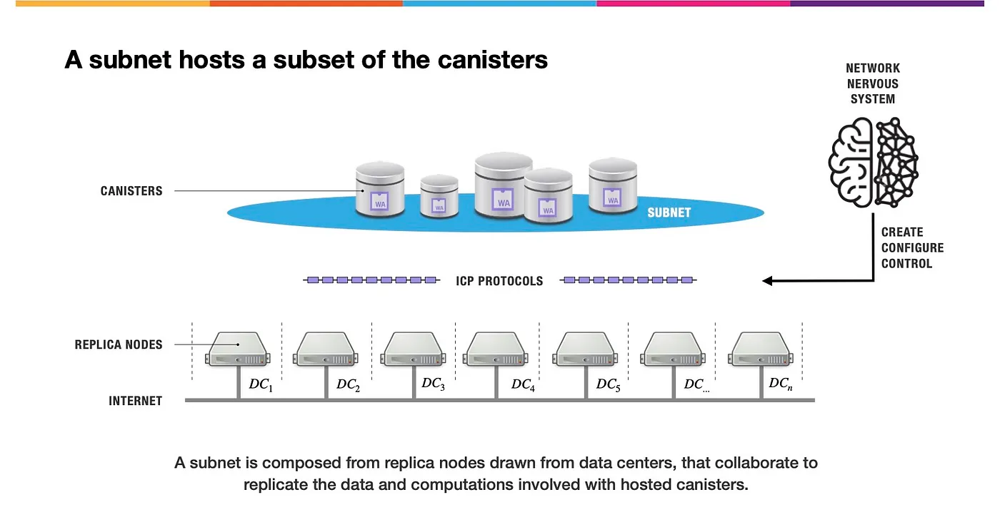

import { MarkdownChipRow } from "/src/components/Chip/MarkdownChipRow";
import '/src/components/CenterImages/center.scss';

# 1: What is the Internet Computer?

<MarkdownChipRow labels={["Beginner", "Tutorial"]} />

The Internet Computer (ICP) is a transparent and secure blockchain network that enables developers to create and deploy fully decentralized applications. Decentralized applications are created through deploying smart contracts, which are known as **canisters** on ICP. Canisters are highly scalable to directly serve user experiences. Each canister on the Internet Computer is hosted on an independent version of the blockchain network called a **subnet**. **Subnets** can seamlessly communicate with each other.

## Vision of the Internet Computer

The [Internet Computer](https://learn.internetcomputer.org/hc/en-us/articles/33152818663444-What-is-ICP)'s vision is to extend the public internet with serverless cloud functionality to create a blockchain so powerful, it plays the role of 'Cloud 3.0.'.

Developers can build almost anything using ICP's advanced smart contract capabilities without using traditional IT infrastructure. Users can interact with decentralized applications deployed on ICP directly in their web browser without needing a crypto wallet.

You can learn more about the vision of the Internet Computer in the [ICP deck](https://deck.internetcomputer.org/).

## Architecture of the Internet Computer Protocol
### Subnets

A subnet is a collection of nodes that run their own instance of the Internet Computer Protocol's [consensus](https://learn.internetcomputer.org/hc/en-us/articles/34207558615956-Consensus) algorithm, essentially running their own blockchain. Each subnet consists of node machines, or nodes, which are used to host canister smart contracts. Each canister's code, along with its state and computation, is replicated across every node on the subnet.

Subnets are designed to be highly scalable and host canister smart contracts efficiently. Each subnet operates concurrently with and independently of the other subnets but can communicate asynchronously with other subnets. Multiple independent subnets run in parallel, allowing the Internet Computer to break through the single-machine barrier that limits traditional blockchains.

### Deterministic decentralization

The term deterministic decentralization refers to a concept used to maximize the decentralization and diversity of each subnet on ICP. Deterministic decentralization measures and maximizes the decentralization of every layer of the ICP infrastructure by maximizing the number of different node providers, data centers, geographies, and jurisdictions. The purpose of deterministic decentralization is to ensure that the network remains diverse and decentralized.

You can read more about deterministic decentralization on the [Internet Computer wiki.](https://wiki.internetcomputer.org/wiki/Deterministic_Decentralization#firstHeading)

### Chain-key cryptography

A core component of ICP is the protocol's advanced cryptographic mechanisms, which are collectively referred to as chain-key cryptography. Chain-key cryptographic methods provide the ability for ICP to achieve functionalities and [scalability](https://learn.internetcomputer.org/hc/en-us/articles/34576974172692-Evolution-Scaling) that other networks can't.

Chain-key cryptography uses a secret signing key in a [threshold signature scheme](/how-it-works/chain-key-technology) that is distributed across all replicas in a subnet.

Chain-key cryptography enables the following functionalities:

- Content received from the Internet Computer can be verified through validating a signature without needing to sync the entire network.

- New subnets and nodes can be added to the network autonomously. Faulty nodes can be recovered autonomously as well.

- Pseudo-randomness through chain-key cryptography can be used within dapps that require randomness.

- Transactions that are targeted at other blockchain networks can be computed fully onchain, allowing for integrations with chains such as Bitcoin and Ethereum.

To learn more about chain-key cryptography, check out [this documentation.](/how-it-works/chain-key-technology/)

## ICP superpowers

### Seamless user onboarding

Users can be onboarded into the ICP ecosystem seamlessly through dozens of different educational resources in all different formats, lengths, and focuses. Seamless onboarding helps developers get started building on ICP quickly and provides resources for connecting with other developers to ask questions or help others. Onboarding also helps facilitate widespread adoption and advocation for ICP. A few onboarding resources include:

- [ICP.Hubs](https://linktr.ee/icp_hubs_network): Local communities dedicated to promoting adoption and awareness of ICP through education, strategic partnerships, and project acceleration. You can learn more about ICP.Hubs [here].

- [ICP.Labs](https://dfinity.org/icplab): An advanced, tailored program provided by the DFINITY Foundation that's dedicated to onboarding teams and individuals onto ICP.

- [Developer Liftoff tutorial series](/docs/tutorials/developer-liftoff/).

- [Developer Liftoff video series](https://www.youtube.com/watch?v=3WpP8ux1zX0).

- [ICP Zero to Dapp workshop series](https://youtube.com/playlist?list=PLfEHHr3qexv8hKOJBV1XR10XhUKkyPIBp&si=KqnDuEgJZt51q4e4).

- [Motoko Bootcamp](https://www.motokobootcamp.com/).

- [ICP on Youtube](https://www.youtube.com/dfinity).

- [ICP Hackathons](https://dfinity.org/events-and-news/).

- [ICP Discord](https://discord.internetcomputer.org).

- [DFINITY forum](https://forum.dfinity.org/).

- [ICP Crash course video](https://www.youtube.com/watch?v=Zmm-oo3ibPA&t=3411s).

### Unbounded scalability

ICP is able to scale infinitely, meaning there is no limit to the amount of canisters it can host, memory it can store, or transactions it can process. This unbounded scalability is achieved through horizontal scaling, where new subnets can be added at any time, without a limit on the maximum number of subnets that can exist.

Infinite scalability is especially beneficial for hosting large-scale projects or applications in a fully decentralized manner. You can learn more in the [documentation](/how-it-works/scalability/#infinite-scalability).

### Cross-chain interoperability

ICP is able to directly integrate with other blockchain networks without using bridges through the ICP's advanced cryptography. Through threshold ECDSA, coupled with chain-key cryptography, ICP can natively create signed transactions on other blockchains like Ethereum and Bitcoin. This allows for dapps deployed on ICP to interact directly with other networks and their smart contracts, tokens, and other digital assets.

ICP is integrated with the Bitcoin network using chain-key ECDSA signatures and a protocol-level integration, allowing for a canister to create a Bitcoin address, then send or receive bitcoin directly as if they were a regular Bitcoin user. ICP will also use chain-key ECDSA to facilitate an upcoming integration with Ethereum that will allow Ethereum smart contracts and digital assets like ERC-20 tokens to be used in ICP canisters.

Using Bitcoin or Ethereum through ICP is faster, cheaper, and more performant than using the other networks directly. You can learn more about cross-chain integrations, such as the Bitcoin integration, in the documentation [here](https://internetcomputer.org/bitcoin-integration/).

### Future-proof

ICP is designed with features that strive to make it future-proof. Some key components of ICP's future-proof capabilities include:

- Decentralization: ICP aims to be owned and operated by as many independent entities in as many geographic locations as possible. Decentralization contributes to the goals of future-proofing as it reduces the risk of a single point of failure within the network.

- Scalability: Through ICP's subnet architecture that enables unbounded scalability, 100% onchain Web3 services are made possible. Scalability helps future-proof ICP as it helps increase adoption, demand, and usage.

- Governance: ICP is governed by an advanced decentralized autonomous organization (DAO) known as the Network Nervous System (NNS), which provides the ICP community with direct control over the [governance](https://learn.internetcomputer.org/hc/en-us/articles/34574082263700-Tokenomics-Governance) of the network. Upgrades made to ICP are executed through proposals that are approved by the NNS without requiring the network to fork. This form of governance makes ICP future-proof as it provides the ability for the network to adapt and change to fit the needs of the ICP community.

- Interoperability: Through chain-key cryptography, ICP is able to directly interact with other blockchains without using bridges. This interoperability contributes to ICP's ability to adapt and change in the blockchain ecosystem.

## Canister smart contracts

The term **canister** refers to a smart contract on ICP. Canisters are a computational unit that bundles together both smart contract code and state. They can define functions that can be called by external services or other canisters. Canisters communicate with one another through asynchronous messages. Each message is executed in isolation, allowing for increased levels of concurrent execution.

At a high level, a canister is used to expose methods. A **method** is a piece of code specifying a task that declares a sequence of arguments and their associated result types. Methods return a response to the caller. Query calls, update calls, and other types of canister calls are used to call those methods to get a response.

Canister code can be written in any language that can be compiled into a Wasm module. Currently, Motoko and Rust are supported and maintained by DFINITY through the [IC SDK](/docs/building-apps/getting-started/install), and there are several community-developed canister development kits such as Python and Typescript.

A canister is managed by a **controller**, which can be a centralized entity, a decentralized entity such as a DAO, or a canister can have no controller at all, which would make it an immutable smart contract. Controllers are the only ones that can deploy the canister to the IC, start or stop their execution, and push updated code to the canister.

You can learn more about canister smart contracts in [this documentation.](https://internetcomputer.org/how-it-works/canister-lifecycle/)

### Capabilities

Canister smart contracts can be used for almost any workflow, use case, or project. A few possible ways to use canisters include:

- Hosting web servers and scripts.

- Hosting databases.

- Hosting server operating systems.

- Hosting distributed code.

- Virtualization.

- Hosting application servers.

- Connecting Web2 services to Web3 services without using oracles.

- Hosting failover and backups.

- Hosting websites, portfolios, and other digital assets.

- Creating virtual games.

- Creating marketplaces.

- Creating digital exchanges.

- Hosting social media applications.

- Hosting live auctions.

- Facilitating cross-chain infrastructure.

Want some inspiration? Check out the [Awesome ICP repo](https://github.com/dfinity/awesome-internet-computer) to see some projects in the ecosystem.

### Cycles

In addition to managing a canister, controllers are also responsible for assuring that a canister contains sufficient **cycles** to pay for the canister's resources, such as used network bandwidth, memory, and computational power. Each execution performed by a canister deployed on the mainnet has a cost of cycles.

Cycles are used to pay for the resources, such as memory, storage, and compute power, that are used by a canister using the Internet Computer Protocol's reverse gas model. When a canister is deployed on the mainnet, cycles are 'charged' for the creation of the canister, then for every action that a canister performs.

To obtain cycles, the Internet Computer Protocol's utility token, ICP, can be converted into cycles and transferred into a canister to be used to pay for that canister's consumed resources. Cycles have a fixed price in [XDR](/docs/references/glossary#x) in order to make canister costs predictable and independent of the price of ICP. One trillion cycles always correspond to one XDR.

### Languages

To develop a canister, many developers use the IC SDK, which natively supports Motoko and Rust. However, canisters can be deployed in any language if the code has been compiled into WebAssembly (Wasm) modules using a canister development kit (CDK). A CDK is an adapter used by the IC SDK that provides programming languages with the necessary tools and features required to create and manage canisters. There are several community-contributed CDKs for languages such as Python and TypeScript.

It is possible to create a dapp that uses multiple canisters written in different languages. Canisters that are written in different languages utilize Candid, an interface description language (IDL), to share and exchange information.

Languages that are supported via the IC SDK and community CDKs currently include:

- **Motoko**: Designed by DFINITY specifically for ICP canister development. It supports ICP's unique features and workflows while providing a robust yet familiar programming environment. Motoko is easy to learn and use for application development. It is similar to languages such as JavaScript, Ruby, Python, or Solidity.

- **Rust**: Supported on ICP through the IC SDK and the DFINITY Rust CDK. The IC SDK automatically comes with the Rust CDK as part of the software, but the Rust CDK can be installed separately.

- **Candid**: Candid is an interface description language used to describe the public interface of a service. In reference to ICP, a service is a program deployed in the form of a canister. Candid is language-agnostic, which allows for interoperability between frontends and services that are written in different languages.

- **Python**: Python is a popular language for web development, AI functions, and data analysis. Python is available through the [Kybra CDK](https://demergent-labs.github.io/kybra) developed by [Demergent Labs](https://github.com/demergent-labs).

- **TypeScript**: TypeScript is available through the [Azle CDK](https://demergent-labs.github.io/azle) developed by [Demergent Labs](https://github.com/demergent-labs).

- **Solidity**: Solidity is an object-oriented language used for writing and implementing smart contracts on blockchain platforms, such as the Ethereum network. Solidity is supported on the IC through [Bitfinity](https://docs.bitfinity.network/), developed by the [Bitfinity EVM team](https://bitfinity.network/).

- **C++**: C++ is available through the [icpp-pro CDK](https://docs.icpp.world/) developed by icpp World.

## Next steps

- [2: Deploying your first full-stack dapp](/docs/tutorials/hackathon-prep-course/deploying-first-fullstack-dapp).