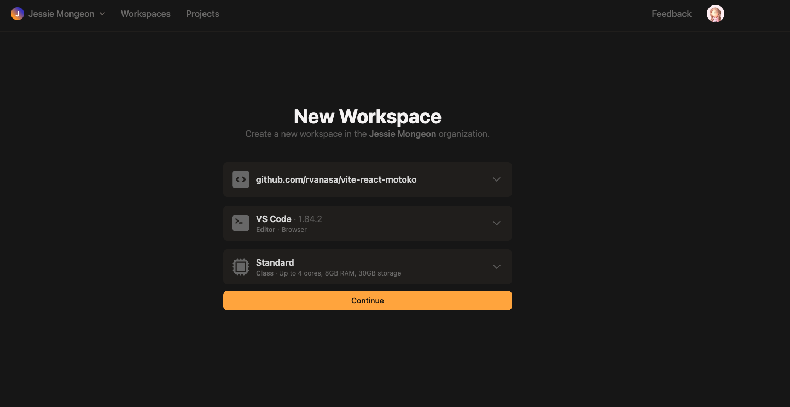
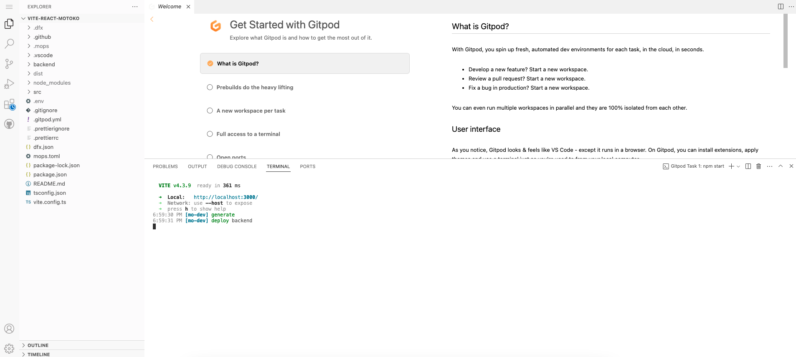
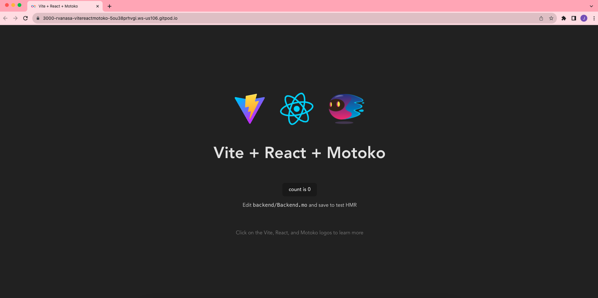
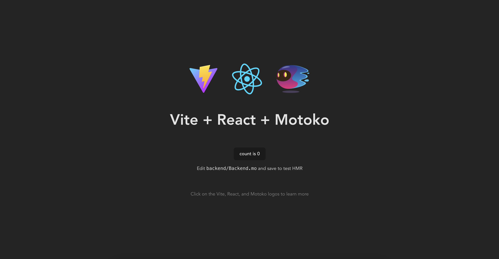
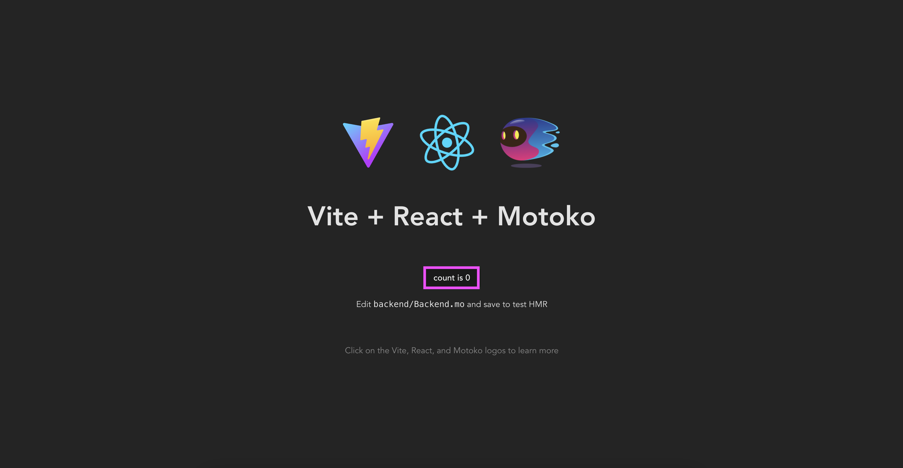

import { MarkdownChipRow } from "/src/components/Chip/MarkdownChipRow";

# 2: Deploying your first full-stack dapp

<MarkdownChipRow labels={["Beginner", "Tutorial"]} />

## Overview

To get started developing on ICP, there are several sample projects, boilerplate templates, and other resources to help you get started. In this tutorial, you'll learn how to deploy your first full-stack dapp using a boilerplate sample. This sample dapp uses Motoko for the backend canister and the frameworks Vite and React to create a frontend user interface (UI) that makes calls to a simple counter method in the backend canister. When the button in the UI is clicked, the counter function increases the value of the count by an increment of 1. The updated count value is then reflected in the UI.

This sample is a great place to start since it provides an easy to understand example of how a frontend canister can create a UI that interacts with a method stored in the backend canister. This project can easily be edited, expanded, and further developed to suit the needs of your own project.

:::info
This sample uses Motoko for the backend canister. A similar example using Rust for the backend source code can be found [here](https://github.com/b3hr4d/ic-rust-nextjs).
:::

### Architecture overview

For this tutorial, the `vite-react-motoko` sample found [here](https://github.com/rvanasa/vite-react-motoko) will be used.

This sample uses the following project architecture:

- Vite: A frontend web development tool known for its high performance.

- React: A component-based UI library.

- TypeScript: JavaScript with an extended syntax for types.

- Motoko: ICP's native programming language.

- Mops: An on-chain package manager for Motoko.

- mo-dev: A development server for Motoko that features live-reload functionality.

- Sass: Extended syntax for CSS.

- Prettier: A code formatting package for that supports several languages.

### Project structure

This template project uses the following project structure:

```
├── README.md
├── backend
│   ├── Backend.mo
│   └── tests
│       ├── Backend.add.test.mo
│       ├── Backend.get.test.mo
│       └── Backend.inc.test.mo
├── dfx.json
├── mops.toml
├── package-lock.json
├── package.json
├── src
│   ├── App.css
│   ├── App.tsx
│   ├── assets
│   │   ├── favicon.ico
│   │   ├── motoko.png
│   │   ├── motoko_moving.png
│   │   ├── motoko_shadow.png
│   │   ├── react.svg
│   │   └── vite.svg
│   ├── index.html
│   ├── index.scss
│   ├── main.tsx
│   ├── setupTests.ts
│   ├── tests
│   │   └── App.test.tsx
│   └── vite-env.d.ts
├── tsconfig.json
└── vite.config.ts
```

In this project structure, the following files and directories are notable:

- `backend/`: The subdirectory used to store the project's backend canister's source code.

- `backend/Backend.mo`: The backend canister's source code file; written in Motoko.

- `dfx.json`: The project's configuration file. This file details which canisters are part of the project and specifies which source code files each canister uses.

- `mops.toml`: The package manager configuration file for the project, using the Mops package manager. You will learn more about Mops in the next module, [3: Exploring the backend](/docs/current/tutorials/hackathon-prep-course/exploring-the-backend).

- `src/`: The subdirectory used to store the frontend canister's assets.

- `src/App.tsx`: The frontend canister's source code.

- `App.css`: The CSS stylesheet for the frontend UI.

- `src/assets`: The subdirectory for assets used by the frontend UI.

- `src/index.html`: The HTML code for the frontend UI.

You can learn more about the project structure of Motoko dapps in the video lecture [here](https://www.youtube.com/watch?v=_T7GgPxxSKo).

### Backend canisters

A backend canister is the backend of an application. This is typically the portion of the application that does not come in direct contact with the users. It is hosts the application's primary source code and functionality, and does not contain user interface assets such as HTML or CSS. In this project, the backend canister's code is located at `backend/Backend.mo`, and uses Motoko source code. You will explore the backend canister further in the next module, [3: Exploring the backend](/docs/current/tutorials/hackathon-prep-course/exploring-the-backend).

### Frontend canisters

A frontend canister hosts the portion of an application that is used to interact with the application's functions through a user interface. Frontend canisters contain the files and assets used to create the interface used by end-users. These assets typically contain things such as CSS, HTML, JavaScript, or React elements. Since the frontend canister contains assets, it is can also be referred to as the asset canister. In this project, the frontend canister's code is located at `src/App.tsx`, `src/App.css`, and `src/index.html`, and uses TypeScript source code. You will explore the frontend canister further in a future module, [4: Exploring the frontend](/docs/current/tutorials/hackathon-prep-course/exploring-the-frontend).

### Identities and principals

Before continuing, it is important to learn about the several different types of identities and authentication methods that you'll encounter while developing on ICP.

- **Developer identity**: An identity created using dfx, which contains a private/public key pair, and has a principal derived from the public key.

- **Principals**: A generic identifier that can be used for users, canisters, and potentially other future concepts. It can be compared to a Bitcoin or Ethereum wallet address. Each principal can control multiple accounts in the ICP (and other) ledgers.

- **Account identifier**: The identifier associated with your ICP ledger account, as specified in the [ledger specification](https://internetcomputer.org/docs/current/references/ledger#_accounts).

- **Wallets**: Wallets are used to store forms of currency or other assets, such as cycles, ICP, or NFTs.

- **Internet Identity**: ICP's native authentication service. Internet Identity doesn't use usernames and passwords; instead it uses a passkey that is stored in your local device's hardware.

You can learn more about identities and principals [here](/docs/current/tutorials/developer-journey/level-3/3.5-identities-and-auth)

### Cycles and cycles wallets

Cycles are used to measure and pay for the resources that are used by a canister, such as the memory, storage, and compute power. For canisters deployed locally, cycles can be fabricated. However, once a canister is deployed to the mainnet, real cycles are charged to pay for the resources being used on the network. This is known as the ICP's 'reverse gas model', which enables developers to pay for the gas costs of their dapp, rather than end-users having to pay gas fees when using a dapp. This helps aid in onboarding new users onto dapps deployed on ICP, since there aren't prerequisites such as needing a cryptowallet containing tokens to interact with a dapp.

To get cycles, you can convert ICP tokens into cycles, or you can obtain a [cycles coupon](/docs/current/tutorials/developer-journey/level-1/1.4-using-cycles#acquiring-cycles-using-a-cycles-coupon) if you haven't previously received one before.

You will learn how to obtain and use cycles in the upcoming module, [7: Obtaining cycles and deploying to the mainnet](/docs/current/tutorials/hackathon-prep-course/obtaining-cycles).

## Deploying the project using Gitpod

You can deploy this project on [Gitpod](https://gitpod.io/#https://github.com/rvanasa/vite-react-motoko). Gitpod is a web-based development environment that provides temporary cloud resources for building and deploying repos. Gitpod is a great choice if you'd like to develop in a browser, without having to set up a local development environment.

Navigate to the [Gitpod URL](https://gitpod.io/#https://github.com/rvanasa/vite-react-motoko) for this project, login with your Github account if necessary, confirm the New Workplace settings, then select 'Continue'.



Then, Gitpod will automatically run all the commands and processes necessary to start the project. In the 'Terminal' section of the window, you will see the output of these processes. When the terminal shows the output of:

```
VITE v4.3.9  ready in 206 ms
  ➜  Local:   http://localhost:3000/
  ➜  Network: use --host to expose
  ➜  press h to show help
11:09:25 AM [mo-dev] generate
11:09:26 AM [mo-dev] deploy backend
```



Then your dapp is ready to use. Click on the `http://localhost:3000/` URL in the Terminal output to open the Gitpod hosted dapp:



## Deploying the project locally

Alternatively, you can deploy the project locally.

### Downloading and setting up the project

Before you can deploy your first dapp on ICP, you will need to set up your developer environment. In your developer environment, you will need:

- [x] An internet connection and access to a shell terminal on your local macOS or Linux computer.

- [x] A command line interface (CLI) window open. This window is also referred to as the 'terminal' window.

- [x] Download and install the IC SDK package as described in the [installing the IC SDK](/docs/current/developer-docs/getting-started/install/) page. The IC SDK includes the CLI tool `dfx`, which is the primary tool used to creating, managing, and deploying canisters. It also includes Motoko, which is ICP's native programming language.

- [x] A code editor installed. The [VSCode IDE](https://code.visualstudio.com/download) is a popular choice.

- [x] Download and install [git](https://git-scm.com/downloads).

- [x] Download and install [Node.js](https://nodejs.org/en).

Then, to download the template project, first create a new directory, then download the project template using the commands:

```
mkdir react-project
cd react-project
npx degit rvanasa/vite-react-motoko react-project
```

Then you will need to start a local replica with `dfx` using the command:

```
dfx start --clean --background
```

Next, run the following command to setup the project using npm:

```
npm run setup
```

In the background, this command runs the following processes:

- `npm i`: Installs the necessary `npm` packages as defined in the `package.json` file.

- `dfx canister create backend`: Creates a canister called `backend` using the parameters defined in the project's `dfx.json` file.

- `dfx generate backend`: Generates the interface description files for the `backend` canister.

- `dfx deploy`: Deploys the project's canisters locally.

The output of this command will return the local canister URLs for the frontend and backend canisters:

```
Deployed canisters.
URLs:
  Frontend canister via browser
    frontend: http://127.0.0.1:4943/?canisterId=a3shf-5eaaa-aaaaa-qaafa-cai
  Backend canister via Candid interface:
    backend: http://127.0.0.1:4943/?canisterId=a4tbr-q4aaa-aaaaa-qaafq-cai&id=asrmz-lmaaa-aaaaa-qaaeq-cai
```

In this example, the frontend of the dapp is deployed to a canister locally. To make changes to the frontend canister, the canister must be redeployed each time a change is made to see the changes reflected at the canister's web browser URL. For quicker feedback loops for changes, this example uses a local development server that features hot module reloading.

For backend canisters, [`mo-dev`](https://github.com/dfinity/motoko-dev-server) enables hot module reloading for backend canisters, which removes the need to redeploy a backend canister to see changes reflected.

Before interacting with the React interface running in the frontend canister, start the local development server with the command:

```
npm start
```

The output of this command will provide the local development URL, such as `http://127.0.0.1:3001/`:

```
VITE v4.3.9  ready in 206 ms
  ➜  Local:   http://127.0.0.1:3001/
  ➜  Network: use --host to expose
  ➜  press h to show help
11:09:24 AM [mo-dev] backend → http://127.0.0.1:4943?canisterId=a4tbr-q4aaa-aaaaa-qaafq-cai&id=asrmz-lmaaa-aaaaa-qaaeq-cai
11:09:25 AM [mo-dev] generate
11:09:26 AM [mo-dev] deploy backend
```

If you open this URL in a web browser, you will see the template Motoko React frontend interface:



If you click on the 'count is 0' button, you can increase the counter value:



For example, if you click the button 3 times, the count value will be `3`:


## Going further: additional starter projects

You can find additional starter projects in the [Awesome Internet Computer repo.](https://github.com/dfinity/awesome-internet-computer#starters)

## Next steps

- [3: Exploring the backend](/docs/current/tutorials/hackathon-prep-course/exploring-the-backend).