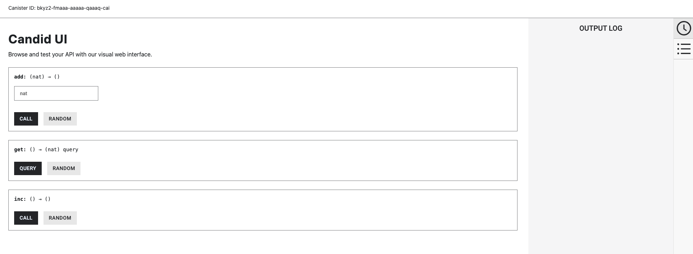

import { MarkdownChipRow } from "/src/components/Chip/MarkdownChipRow";
import '/src/components/CenterImages/center.scss';


# 3: Exploring the backend code

<MarkdownChipRow labels={["Beginner", "Tutorial"]} />

In the previous tutorial, you deployed a sample full-stack dapp using the `vite-react-motoko` example boilerplate. This tutorial builds off of that previous tutorial, so if you haven't followed [2: Deploying your first fullstack dapp](/docs/tutorials/hackathon-prep-course/deploying-first-fullstack-dapp), it is recommended that you complete it prior to starting this tutorial.

Previously, you learned that the frontend UI interacts with the backend canister's method `counter`. When the UI button is clicked, the backend canister's method `counter` increases the value of `count` by an increment of 1. In this tutorial, you'll explore the backend code to learn more about the `counter` method.

## Exploring the `vite-motoko-react` backend code

Recall that the `vite-motoko-react` project includes the following files and subdirectories:

```
├── README.md
├── backend
│   ├── Backend.mo
│   └── tests
│       ├── Backend.add.test.mo
│       ├── Backend.get.test.mo
│       └── Backend.inc.test.mo
├── dfx.json
├── mops.toml
├── package-lock.json
├── package.json
├── src
│   ├── App.css
│   ├── App.tsx
│   ├── assets
│   │   ├── favicon.ico
│   │   ├── motoko.png
│   │   ├── motoko_moving.png
│   │   ├── motoko_shadow.png
│   │   ├── react.svg
│   │   └── vite.svg
│   ├── index.html
│   ├── index.scss
│   ├── main.tsx
│   ├── setupTests.ts
│   ├── tests
│   │   └── App.test.tsx
│   └── vite-env.d.ts
├── tsconfig.json
└── vite.config.ts
```

The backend canister's code, stored at `backend/Backend.mo`, contains the following:

```motoko title="backend/Backend.mo"
actor class Backend() {
  stable var counter = 0;
  // Get the current count
  public query func get() : async Nat {
    counter;
  };
  // Increment the count by one
  public func inc() : async () {
    counter += 1;
  };
  // Add `n` to the current count
  public func add(n : Nat) : async () {
    counter += n;
  };
};
```

Let's breakdown each portion of this code.

First, the code defines an actor called `Backend`. In Motoko, programs consist of an actor expression that is introduced using the keyword `actor`. An actor is a process with encapsulated state that communicates with other running actors. Each canister can only contain one actor. You can learn more about Motoko actors [here](/docs/tutorials/developer-liftoff/level-1/1.2-motoko-lvl1).

```motoko no-repl title="backend/Backend.mo"
actor class Backend() {
```

Next, the code defines a variable (`var`) called `counter` with a value of `0`. This variable is defined with the word `stable`, which indicates it is a **stable variable**. A stable variable is a variable defined within an actor that uses the `stable` keyword in the variable's declaration. This indicates that the data stored in the variable should be persisted during canister upgrades. This tutorial will go further into stable storage in the section [stable memory](#stable-memory) If this stable keyword is not used, the variable is defined as flexible by default.

```motoko no-repl title="backend/Backend.mo"
stable var counter = 0;
```

Next, the code defines a public function called `get()`. The function is modified with the keyword `query`, which defines that calls to this function will use a query call. A query call is used for querying information from a canister's method. This tutorial will go into further detail on query calls in the section [query and update calls](#query-and-update-calls). This function simply returns the value of the `counter` variable.

```motoko no-repl title="backend/Backend.mo"
public query func get() : async Nat {
    counter;
};
```

In the next portion of the code, a public function called `inc()` is defined. This function increases the value of the `counter` variable by `1` every time the function is called.

```motoko no-repl title="backend/Backend.mo"
public func inc() : async () {
    counter += 1;
};
```

Lastly, the `add(n : Nat)` function is defined. This function adds `n` to the current count, where `n` is a numerical value passed to the function when it is called. In the frontend UI, the button used to increase the counter value does not use this function; however, it can be called manually from the command line or Candid interface of the backend canister. This tutorial will go into further detail on Candid in the section [Candid](#candid).

```motoko no-repl title="backend/Backend.mo"
public func add(n : Nat) : async () {
    counter += n;
};
```

You can learn more about Motoko in the following resources:

- [Motoko level 1](/docs/tutorials/developer-liftoff/level-1/1.2-motoko-lvl1).

- [Motoko level 2](/docs/tutorials/developer-liftoff/level-2/2.6-motoko-lvl2).

- [Motoko level 3](/docs/tutorials/developer-liftoff/level-3/3.6-motoko-lvl3).

- [Motoko level 4](/docs/tutorials/developer-liftoff/level-4/4.6-motoko-lvl4).

- [Motoko bootcamp](https://github.com/motoko-bootcamp/bootcamp-2022), a week-long crash course to learning all things Motoko.

- [Motoko documentation](/docs/motoko/main/getting-started/motoko-introduction).


## Learning more about backend canisters

To further understand and develop your own backend canisters, let's review a few fundamental features, concepts, and workflows that pertain to backend canisters.

### Single versus multi-canister projects

When you design a dapp to be deployed on ICP, one of the first decisions you will make is how your dapp should be structured. Dapps can consist of a single canister, such as only the backend canister; they can consist of a single backend canister and a single frontend canister, as this sample `vite-react-motoko` starter project does, or they can consist of several canisters.

Typically, service-based dapps that don't include a frontend UI work well as single canister projects, while projects that involve several reusable services can work well as multi-canister projects.

### Importing external canisters

When developing a project, certain third-party canisters may be beneficial to integrate within your project. Third-party canisters refer to canisters created by DFINITY or canisters created by developers in the ICP community that are designed to provide a reusable service. One popular third-party canister that many developers choose to integrate into their project is the Internet Identity canister, which provides ICP's native authentication service.

When integrating with third-party canisters, it is important to test the integration locally to assure that the integration is accurate and correct. Performing tests locally is beneficial since tests executed in a local developer environment do not cost cycles, use non-production data, and have a faster completion time when run locally.

To test the integration with a third-party canister locally, dfx supports pulling a third-party canister from the mainnet via the [`dfx deps`](/docs/building-apps/advanced/using-third-party-canisters) workflow. Using this workflow, you can pull a canister from the mainnet by configuring your project's `dfx.json` file to include a `dependency` of the canister you'll be pulling. Then, define the pullable canister as type `pull` and include the canister's ID on the mainnet. For example, to pull the Internet Identity canister with canister ID of `rdmx6-jaaaa-aaaaa-aaadq-cai`, the following `dfx.json` file can be used:


```json title="dfx.json"
{
    "canisters": {
        "example_backend": {
            "type": "motoko",
            "main": "src/example_backend/main.mo",
            "dependencies": [
                "internet_identity"
            ]
        },
        "internet_identity": {
            "type": "pull",
            "id": "rdmx6-jaaaa-aaaaa-aaadq-cai"
        }
  },
  "defaults": {
    "build": {
      "args": "",
      "packtool": ""
    }
  },
  "output_env_file": ".env",
  "version": 1
}
```

For more information on using third-party canisters, check out the documentation [here](/docs/tutorials/developer-liftoff/level-2/2.3-third-party-canisters).

### Query and update calls

When calls are made on ICP, there are two primary types: query calls and update calls.

**Query calls** are calls that do not alter the state of a canister, making them 'read-only' operations. Query calls are used to query the current state of a canister or make a call to a method that operates on the canister's state. They are executed synchronously and answered immediately once received. Query calls are executed on a single node within a subnet. Query methods can be called in replicated mode as update calls. The backend canister in this example uses the following query call, defined by the keyword `query` as seen above:

```motoko title="backend/Backend.mo"
actor countCharacters {
  public query func get() : async Nat {
      counter;
  };
}
```

**Update calls** are able to alter the canister's state. Any changes made with an update call are persisted. They are executed on all nodes of a subnet since the result must go through the subnet's [consensus](https://learn.internetcomputer.org/hc/en-us/articles/34207558615956-Consensus) process. Update calls are submitted and answered asynchronously since they must go through consensus. Update calls are not defined with a function modifier as query calls are. Below is a simple update call example that provides a method counting the number of characters within a given string, then updates the canister's state. If the string is divisible by 2, the function returns a value of 'true.'

```motoko title="backend/Backend.mo"
actor countCharacters {
    public func test(text : Text) : async Bool {
        let size = Text.size(text);
        return size % 2 == 0;
    };
};
```

Additionally, there are several other terms regarding calls that you will come across as an ICP developer, such as:

**Composite queries** are query calls that can call other queries (on the same subnet). They can only be invoked via ingress messages using `dfx` or through an agent such as a browser front-end, and not by other canisters.

**Certified variables** are verifiable pieces of data that have an associated certificate that proves the data's authenticity. Certified variables are set using an update call, then read using a query call.

**Inter-canister calls** are used to make calls between different canisters.

You can learn more about canister calls in the documentation [here](/docs/tutorials/developer-liftoff/level-2/2.2-advanced-canister-calls).

### Candid service descriptions

Candid is an interface description language that is used to describe the public interface of a service. On ICP, a service is an application deployed as a canister. The public interfaces of a canister are used to interact with the canister. Candid is used on ICP since it supports the unique features and functions of the protocol.

For example, a simple service description that defines a service without any public methods would look like this:

```candid
service : {}
```

A service description that does not have any public methods is not very useful. To add a public method, you can add a simple `ping` method:

```candid
service : {
  ping : () -> ();
}
```

In this `ping` method, there are no arguments passed to the method, and there are no results returned, so the empty sequence of () is used for both the arguments and the results.

To interact with the service descriptions defined by Candid, you can make calls directly to the canister's defined method, interact with the method through a frontend service (such as an agent), or you can use the CandidUI. CandidUI is a user interface that can be used to interact with a canister's public methods through the web browser. When a backend canister is deployed, the backend canister URL that is returned in the terminal window is the CandidUI URL, indicated by 'via Candid interface':

```bash
URLs:
  Frontend canister via browser
    frontend: http://127.0.0.1:4943/?canisterId=bd3sg-teaaa-aaaaa-qaaba-cai
  Backend canister via Candid interface:
    backend: http://127.0.0.1:4943/?canisterId=be2us-64aaa-aaaaa-qaabq-cai&id=bkyz2-fmaaa-aaaaa-qaaaq-cai
```

For example, in this `vite-react-motoko` example, the CandidUI resembles the following:



You can learn more about Candid in the documentation [here](/docs/tutorials/developer-liftoff/level-2/2.4-intro-candid).

### Canister upgrades

Once a canister has been deployed and is running, there may need to be changes made to the canister's code to fix bugs or introduce new features. To make these changes, the canister must be upgraded.

The ability to upgrade a canister is a key feature of ICP, since it allows canisters to persist using Wasm memory that utilizes ICP's stable memory feature. When a canister is upgraded, the existing state of the canister is preserved as the canister's code is changed. You will learn more about upgrading and managing a canister in the module [8: Managing canisters](/docs/tutorials/hackathon-prep-course/managing-canisters).

You can learn more about upgrading canisters in the documentation [here](/docs/tutorials/developer-liftoff/level-2/2.1-storage-persistence#upgrading-canisters).

### Stable memory

Stable memory on ICP is a long-term data storage feature that can be utilized by canisters written in any language. Stable memory can hold up to 500GiB of data if the subnet the canister is deployed on can accommodate it. When a canister is upgraded, stable memory is not cleared, and anything stored in the canister's stable memory is persisted across the upgrade.

In contrast to stable memory, heap storage refers to the regular Wasm data storage for a canister. Heap storage is temporary and does not persist across canister upgrades. When a canister is upgraded or reinstalled, the heap storage is cleared. Heap storage is limited to 4GiB.

A few other important terms regarding memory on ICP include:

- **Stable storage**: A Motoko-specific term referring to the Motoko stable storage feature. Stable storage uses the stable memory feature to persist data across canister upgrades. Stable storage is designed to accommodate changes to both the application data and the Motoko compiler.

- **Stable variables**: A Motoko-specific feature referring to variables defined using the `stable` modifier in a Motoko canister. The value of a stable variable is persisted across canister upgrades. An example of this was shown earlier in this tutorial, with the stable variable defined in the backend canister code, `stable var counter = 0;`.

You can learn more about storage and data persistence in the documentation [here](/docs/tutorials/developer-liftoff/level-2/2.1-storage-persistence).

### Mops

Mops is a package manager for Motoko, supporting over 60 libraries that include different functionalities such as utility, encoding, cryptography, data structure libraries, and more. A package manager is a collection of tools that automates installing, upgrading, configuring, or removing software libraries or packages to help efficiently manage a project's dependencies.

In this `vite-react-motoko` example, you saw that the project's files include a file called `mops.toml`. This file is used to specify the packages that the project uses. In this project, the `mops.toml` file includes the following dependency:

```title="mops.toml"
# Motoko dependencies (https://mops.one/)

[dependencies]
base = "0.7.4"
```

Additionally, Mops is defined as the project's package manager in the project's `dfx.json` file, using the `packtool` definition of `mops sources`:

```json title="dfx.json"
...
{
  "defaults": {
    "build": {
      "packtool": "mops sources"
    }
  }
}
...
```

To add additional packages to your project's dependencies, you can use the command `mops add` followed by the package name:

```bash
mops add base
```

Then, to install all packages specified in the `mops.toml` file, use the command:

```bash
mops install
```

You can [learn more about Mops](/docs/tutorials/developer-liftoff/level-3/3.1-package-managers).

## Next steps

- [4: Exploring the frontend](/docs/tutorials/hackathon-prep-course/exploring-the-frontend).