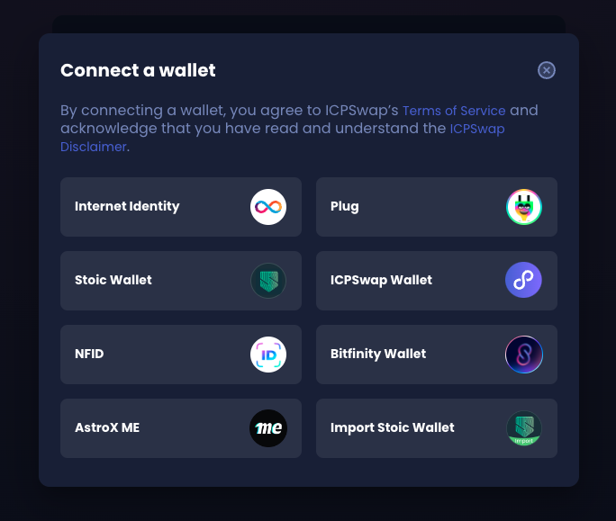
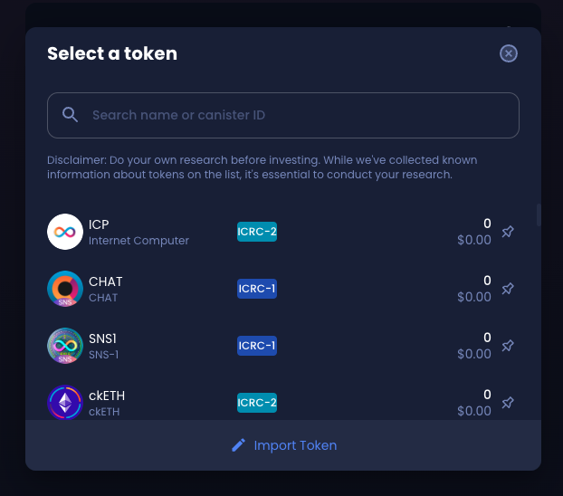

import { MarkdownChipRow } from "/src/components/Chip/MarkdownChipRow";
import '/src/components/CenterImages/center.scss';


# 5: Integrating with tokens

<MarkdownChipRow labels={["Beginner", "Tutorial"]} />

When building dapps on the Internet Computer, integrating tokens into your dapp may be necessary for enabling DeFi, governance, a marketplace, or other tokenomic functions. There are several types of tokens in the Internet Computer ecosystem, such as the protocol's native token ICP, fungible tokens that use the ICRC-1 or ICRC-2 standards, and soon non-fungible tokens that will use the upcoming ICRC-7 standard.

This tutorial will cover the different types of tokens and how to interact with them.

## Fungible and non-fungible tokens

A **fungible token** is a type of token that can always be transferred 1:1 for another token of the same type.

A **non-fungible token** (NFT) is a tokenized asset that is assigned a unique identifier and cannot be exchanged 1:1 for another token of the same type, as the value of each non-fungible token may vary.

For example, 1 USD can always be exchanged for 1 USD. However, 1 unique painting cannot be exchanged for another unique painting, since the value of the two paintings will be different. On the Internet Computer, ICP is a fungible token that can always be exchanged for ICP of equal value. However, a non-fungible token deployed on ICP cannot be traded 1:1 with another NFT token deployed on ICP.

On the Internet Computer, there are several different token standards for both fungible tokens and non-fungible tokens. Some of these standards include:

- **ICRC-1:** A fungible token standard used to create custom fungible tokens on the Internet Computer. The ICRC-1 standard was designed to create a universally accepted standard for creating and recording token transactions on the Internet Computer. The ICRC-1 standard defines the general functionalities of ledgers; any tokens and their corresponding ledgers that want to support the ICRC-1 standard must fulfill all requirements within the standard. [View a detailed account of the standard](https://github.com/dfinity/ICRC-1/tree/main/standards/ICRC-1).

- **ICRC-2:** The ICRC-2 standard is an extension of the ICRC-1 standard that enables the approve-transfer-from pattern that became popular in the Ethereum ecosystem with the ERC-20 token standard. It specifies a way for an account owner to delegate token transfers to a third party, usually a canister, on the owner's behalf. [View a detailed account of the standard](https://github.com/dfinity/ICRC-1/blob/main/standards/ICRC-2/README.md).

- **ICRC-7:** A new standard for non-fungible tokens on the Internet Computer. It is designed to be a minimal standard for allowing an NFT collection to be deployed on ICP. In an NFT collection, each NFT may have unique metadata information. This metadata may include a unique image, traits or tags, or a description describing the NFT. [View a detailed account of the standard](https://github.com/dfinity/ICRC/blob/icrc7-wg-draft/ICRCs/ICRC-7/ICRC-7.md).

## ICP

ICP is the native token of the Internet Computer Protocol. ICP tokens have three key functionalities on the protocol:

- Facilitating the network's governance through neuron staking.

- Creating cycles by converting ICP into cycles, which are then used to pay for canister computation and resources.

- Rewarding NNS participants by providing ICP tokens to users that stake ICP in neurons and actively participate in voting on proposals.

To interact with ICP tokens, you will need to use a specialized canister known as the ICP ledger. The ledger canister is used to hold ledger accounts and record a traceable history of all ICP transactions.

The ICP ledger supports the ICRC-1 and ICRC-2 standards but also implements its own standard that has significant differences when compared to the ICRC-1 and ICRC-2 standards, most notably around the notion of an `Account`.

:::info
The ICP ledger can only be used to interact with ICP tokens; to interact with other tokens, such as ICRC tokens, the respective ICRC ledger will need to be used.
:::

### Accounts

An account on the ICP ledger is identified by the `AccountIdentifier` value, which is a value derived from the account owner's ICP principal and subaccount. Accounts can only be owned by one principal; however, since a principal can refer to a canister, joint accounts can be implemented as a canister.

If you are familiar with an Ethereum or Bitcoin user's public key, a principal identifier can be thought of as the ICP equivalent. When you use a principal, your corresponding secret key is used to sign messages, authenticate with the ledger, and execute transactions on your account.

### Transaction types

Within the ICP ledger canister, there are three types of transactions:

- **Minting**: A minting transaction generates a new token for an account.

- **Burning**: A burning transaction eliminates a token from existence.

- **Transferring**: A transferring transaction transfers ICP between accounts.

### Deploying the ICP ledger locally

Integrating your project with the ICP ledger can provide necessary functionality for dapps such as decentralized exchanges, token swaps, and other DeFi applications. To integrate with the ICP ledger, first it is recommended to test the integration in your local developer environment. [Learn how to deploy the ICP ledger locally](/docs/tutorials/developer-liftoff/level-4/4.1-icp-ledger).

### Interacting with the ICP ledger on the mainnet

To interact with the ICP ledger, first you need to get your local ledger account ID with the command:

```
dfx ledger account-id
```

Then, to check the balance of that account, use the following command, replacing `ACCOUNT_ID` with the output from the `dfx ledger account-id` command:

```
dfx ledger --network ic balance ACCOUNT_ID
```

:::info
To interact with the mainnet ledger, you must use the `--network ic` flag. Otherwise, `dfx` will try to use the local replica.
:::

To transfer ICP tokens from one account to another, use the following command, replacing `AMOUNT` with the number of ICP tokens to transfer, `MEMO` with a brief message to describe the reason for the transfer, and `RECEIVER_ACCOUNT_ID` with the account ID to receive the tokens:

```
dfx ledger transfer --amount AMOUNT --memo MEMO RECEIVER_ACCOUNT_ID
```

## ICRC-1 tokens

ICRC-1 is a fungible token standard used to create custom fungible tokens on ICP. It was designed to create a universally accepted standard for creating and recording token transactions. The ICRC-1 standard defines the general functionalities of ledgers; any tokens and their corresponding ledgers that want to support the ICRC-1 standard must fulfill all requirements within the standard. [View a detailed account of the standard](https://github.com/dfinity/ICRC-1/tree/main/standards/ICRC-1).

In comparison to ICP tokens, the ICP and ICRC-1 ledgers use different endpoints, different transactions, and different block objects, in addition to other subtle differences.

### AccountIdentifiers

The ICP ledger uses `AccountIdentifier`s to represent accounts, which are essentially a hash of the ICRC-1 `Account` value.

An `Account` can be converted into an `AccountIdentifier`, but an `AccountIdentifier` cannot be converted into an `Account`. This factor provides the ICP ledger with a level of anonymity, though it means the ICP ledger cannot have the same internal representation as an ICRC-1 ledger.

### Extensions of the standard

The ICRC-1 standard intentionally excludes certain ledger functions that are necessary for building diverse DeFi applications, such as transaction notifications for smart contracts, an interface and structure for fetching blocks, and pre-signed transactions.

The ICRC-1 standard defines the `icrc1_supported_standards` endpoint to accommodate these functions through extensions of the standard. This endpoint returns all specifications implemented by the ledger, such as `ICRC-2` or `DIP-20`.

### Metadata

The ICRC-1 token standard allows for several optional metadata fields to be specified. Metadata can be used to help improve the user experience and simplify the token's integration with wallets. Each metadata key is an arbitrary Unicode string that uses the format `<namespace>:<key>`, where the namespace `icrc1` is reserved for metadata defined for the ICRC-1 standard. Metadata entries include:

- `icrc1:symbol`: The token's currency code, such as `variant { Text = "XTKN" }`.

- `icrc1:name`: The token's name, such as `variant { Text = "Test Token" }`.

- `icrc1:decimals`: The number of decimals used by the token, such as `variant { Nat = 8 }`

- `icrc1:fee`: The token's default transfer fee, such as `variant { Nat = 10_000 }`.

### Transaction types

Within the ICRC-1 ledger canister, there are three types of transactions:

- **Minting**: A minting transaction generates a new token for an account.

- **Burning**: A burning transaction eliminates a token from existence.

- **Approve**: An approve transaction can be used to authorize a token transfer to a third party.

- **Transferring**: A transferring transaction transfers ICP between accounts.

## Deploying an ICRC-1 ledger locally

To learn how to deploy your own token using one of the ICRC standards, you can check out the following documentation tutorial:

- [ICRC-1 ledger setup](/docs/defi/token-ledgers/setup/icrc1_ledger_setup)

## Making payments with ICRC-2

The ICRC-2 standard provides functionality for the **approve-transfer-from** pattern that is a popular function of the ERC-20 standard in the Ethereum ecosystem. This pattern specifies a way for an account owner to delegate token transfers to a third party (on the Internet Computer this is usually a canister) on the owner's behalf.

To interact with ICRC-2 locally, you will need to deploy the [ICRC-1 ledger canister locally](/docs/tutorials/developer-liftoff/level-4/4.2-icrc-tokens#deploying-a-icrc-1-ledger-locally).

To interact with ICRC-2 on the mainnet, you will need to interact with the ICRC-1 ledger using the `--network ic` flag and the canister ID of the ICRC-1 ledger rather than the canister's name.

One common workflow for ICRC-2 is to make payments. This is supported through the `icrc2_transfer_from` method, which transfers a token amount from the from account to the to account using the allowance of the spender's account.

To make a payment of 100_000 tokens, first you must approve the value of `100_000` tokens for the principal of the token spender, for example, the principal `sckqo-e2vyl-4rqqu-5g4wf-pqskh-iynjm-46ixm-awluw-ucnqa-4sl6j-mqe`. To do this, you can use the command:

```
dfx canister call icrc1_ledger_canister icrc2_approve "(record { amount = 100_000; spender = record{owner = principal \"sckqo-e2vyl-4rqqu-5g4wf-pqskh-iynjm-46ixm-awluw-ucnqa-4sl6j-mqe\";} })"
```

:::info
This sample command references a [locally deployed ICRC-1 ledger canister](/docs/tutorials/developer-liftoff/level-4/4.2-icrc-tokens#deploying-a-icrc-1-ledger-locally).
:::


Then, to confirm that this command worked correctly, you check the principal's allowance by running the command:

```
dfx canister call icrc1_ledger_canister icrc2_allowance "(record { account = record{owner = principal \"${DEPLOY_ID}\";}; spender = record{owner = principal \"sckqo-e2vyl-4rqqu-5g4wf-pqskh-iynjm-46ixm-awluw-ucnqa-4sl6j-mqe\";} })"
```

An expiration date can be sent for the approval, such as:

```
dfx canister call icrc1_ledger_canister icrc2_transfer_from "(record { amount = 90_000; from = record{owner = principal \"${DEPLOY_ID}\"}; to= record{owner = principal \"${DEPLOY_ID}\"}; })"
```

Now, if the spender wants to spend these tokens and make a payment to another principal, they can use the `icrc2_transfer_from` method in a command such as:

```
dfx canister call icrc1_ledger_canister icrc2_transfer_from "(record { amount = 90_000; from = record{owner = principal \"${DEFAULT}\"}; to= record{owner = principal \"${DEFAULT}\"}; })"
```

The principal making this call has to be the spender, since they are the one that received the approval.

:::info
The entire allowance cannot be transferred as there is a fee for making the transfer that must be subtracted from the transferred amount; this fee is set to 0.0001 tokens in our example.
:::


## Accepting payments

To accept a payment from a spender account, you can use the `icrc2_approve` method. This method entitles the spender to transfer the token amount on behalf of the caller from account `{ owner = caller; subaccount = from_subaccount }`. The number of transfers the spender can initiate from the caller's account is unlimited as long as the total amounts and fees of these transfers do not exceed the allowance. For example:

```
dfx canister call icrc1_ledger_canister icrc2_approve "(record { spender = record { owner = principal \"$(dfx canister id minter --network ic)\" }; amount = 900_000 })"
```

[Learn more about the ICRC-2 standard](https://github.com/dfinity/ICRC-1/tree/main/standards/ICRC-2).

## Swapping between tokens

To swap between tokens, such as ICP, an ICRC-1 token, or a chain-key token such as ckBTC or ckETH, you can use a tool such as [ICPSwap](https://app.icpswap.com/swap), [Sonic](https://www.sonic.ooo/), and [ICLight](https://iclight.io/).

On ICPSwap, you can connect to the dapp with several different wallet types, such as Internet Identity, NFID, Bitfinity, and more:



Then, you can select what type of token you'd like to swap for another, such as ICP, and enter the value you'd like to swap:



Then, select the token you'd like to receive in return for your ICP:


## ICRC-2 token swap

To explore a simple token swap example, you can check out the following sample project that provides a way to deposit, swap, and withdraw two different ICRC-2 tokens:

- [ICRC-2 token swap example.](https://github.com/dfinity/examples/tree/master/motoko/icrc2-swap)

## Next steps

- [6: Authentication](/docs/tutorials/hackathon-prep-course/authentication)