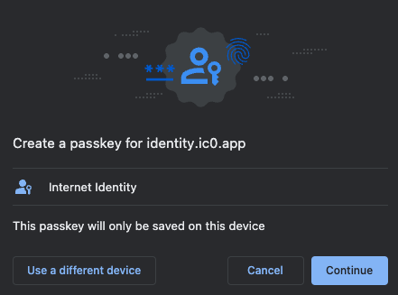

import { MarkdownChipRow } from "/src/components/Chip/MarkdownChipRow";
import '/src/components/CenterImages/center.scss';


# 6:  Authentication

<MarkdownChipRow labels={["Beginner", "Tutorial"]} />


For end-users to interact with the frontend of applications on ICP, Internet Identity can be used. Internet Identity is ICP's native form of digital identity that can be used to authenticate with apps, such as the NNS dashboard, without having to manage a username or password. Instead, Internet Identity uses a cryptographic key pair that's stored in your local device's hardware.

This allows you to authenticate to your Internet Identity using methods that unlock your device, such as TouchID, FaceID, or another method. Through this simple and flexible authentication method, developers can provide end users with a frictionless way to authenticate and use their application.

## Creating an Internet Identity

To create an Internet Identity, navigate to the II frontend URL: https://identity.internetcomputer.org/

Select 'Create New' from the UI.


Next, select 'Create Passkey.'


When prompted, choose how to create your passkey, either on your current device or you can use another device.



Then, enter the CAPTCHA to continue.


Your Internet Identity has been created! It'll be shown on the screen, and it is recommended that you write it down in a safe location to save it.

This number is your Internet Identity. With this number and your passkey, you will be able to create and securely connect to Internet Computer dapps. If you lose this number, you will lose any accounts that were created with it. This number is not secret but is unique to you.

Once you save it, select the 'I saved it, continue' button.


Then, you can connect your Internet Identity to dapps, shown in the Dapps Explorer:


If you scroll down, you will see an option to add another passkey, and you will see options to enable recovery methods. **It is highly recommended to enable the recovery methods so that you can recover your Internet Identity if the hardware passkey is ever lost.**


## Integrating Internet Identity into your dapp

To integrate II into your dapp, you can **pull** the Internet Identity canister from the mainnet. This is an example of using the `dfx deps` functionality, which you covered briefly in the previous module, [3: Exploring the backend](/docs/tutorials/hackathon-prep-course/exploring-the-backend).

Using the same `vite-motoko-react` example project directory, edit your `dfx.json` file to reflect the following content:

```json title="dfx.json"
{
  "canisters": {
    "backend": {
      "type": "motoko",
      "main": "backend/Backend.mo",
    },
    "internet_identity": {
        "type": "pull",
        "id": "rdmx6-jaaaa-aaaaa-aaadq-cai"
    },
    "frontend": {
      "dependencies": [
        "backend",
        "internet_identity"
      ],
      "type": "assets",
      "source": ["dist/"]
    }
  },
  "defaults": {
    "build": {
      "packtool": "npm run --silent sources"
    }
  },
  "output_env_file": ".env",
  "version": 2
}
```

Now let's redeploy this project locally. First, pull the II canister using `dfx deps`, then deploy the project:

```bash
dfx deps pull
```

Then, you need to initialize the canister. By running the `dfx deps init` command, it'll show that our II canister requires an init argument:

```bash
dfx deps init
```

This command will return an error showing the following:

```bash
WARN: The following canister(s) require an init argument. Please run `dfx deps init <NAME/PRINCIPAL>` to set them individually:
rdmx6-jaaaa-aaaaa-aaadq-cai (internet_identity)
```

This output shows you that the Internet Identity canister requires an init argument but doesn't include what that init argument is. For more information, run the command `dfx deps init rdmx6-jaaaa-aaaaa-aaadq-cai`, which will provide an error message that includes more information:

```bash
Error: Canister rdmx6-jaaaa-aaaaa-aaadq-cai (internet_identity) requires an init argument. The following info might be helpful:
init => Use '(null)' for sensible defaults. See the Candid interface for more details.
candid:args => (opt InternetIdentityInit)
```

From this error message, you can see that the `(null)` value can be passed to the init command to use the defaults. To do so, run the command:

```
dfx deps init rdmx6-jaaaa-aaaaa-aaadq-cai --argument null
```

Then, you'll need to edit your frontend canister's JavaScript code to include some logic to interact with the II canister. First, import the `AuthClient` from `@dfinity/auth-client`:

```javascript title="src/declarations/frontend/index.js"
import { AuthClient } from "@dfinity/auth-client";
import { handleAuthenticated, renderIndex } from "./views";
```

Then, define some variables to define a day in nanoseconds:

```javascript title="src/declarations/frontend/index.js"
// One day in nanoseconds
const days = BigInt(1);
const hours = BigInt(24);
const nanoseconds = BigInt(3600000000000);
```

Next, set some default options, including the `loginOptions`, which will allow the `identityProvider` to be either the II mainnet canister if you are using the local environmental variable `DFX_NETWORK` set to `ic` or the locally deployed II canister. Your local replica will not accept signatures from the mainnet canister.

```javascript title="src/declarations/frontend/index.js"
export const defaultOptions = {
  createOptions: {
    idleOptions: {
      // Set to true if you do not want idle functionality
      disableIdle: true,
    },
  },
  loginOptions: {
    identityProvider:
      process.env.DFX_NETWORK === "ic"
        ? "https://identity.internetcomputer.org/#authorize"
        : `http://localhost:4943?canisterId=rdmx6-jaaaa-aaaaa-aaadq-cai#authorize`,
    // Maximum authorization expiration is 8 days
    maxTimeToLive: days * hours * nanoseconds,
  },
};
```

Next, initialize the AuthClient. Then, check to see if the user has previously logged in. If so, their previous identity is verified:

```javascript title="src/declarations/frontend/index.js"
const init = async () => {
  const authClient = await AuthClient.create(defaultOptions.createOptions);

  if (await authClient.isAuthenticated()) {
    handleAuthenticated(authClient);
  }
  renderIndex();
  setupToast();
};
```

Lastly, define a function that listens for the button on the frontend to be clicked and initializes the client:

```javascript title="src/declarations/frontend/index.js"
async function setupToast() {
  const status = document.getElementById("status");
  const closeButton = status?.querySelector("button");
  closeButton?.addEventListener("click", () => {
    status?.classList.add("hidden");
  });
}


init();
```

Then, you can deploy the II canister and the other canisters in the project with the command:

```bash
dfx deps deploy
dfx deploy
```

You can learn more about Internet Identity and integrating it into a dapp in the tutorial [here](/docs/tutorials/developer-liftoff/level-3/3.5-identities-and-auth).

## Next steps

- [7: Obtaining cycles](/docs/tutorials/hackathon-prep-course/obtaining-cycles).