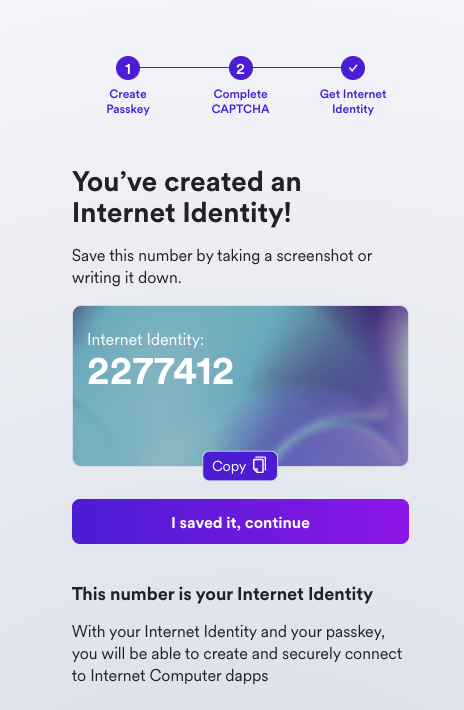

import { MarkdownChipRow } from "/src/components/Chip/MarkdownChipRow";
import '/src/components/CenterImages/center.scss';

# 6: Add user authentication to a dapp

<MarkdownChipRow labels={["Beginner", "Tutorial"]} />

For end-users to interact with the frontend of applications on ICP, Internet Identity can be used. Internet Identity is ICP's native form of digital identity that can be used to authenticate with apps, such as the NNS dashboard, without having to manage a username or password. Instead, Internet Identity uses a cryptographic key pair that's stored in your local device's hardware.

This allows you to authenticate to your Internet Identity using methods that unlock your device, such as TouchID, FaceID, or another method. Through this simple and flexible authentication method, developers can provide end users with a frictionless way to authenticate and use their application.

## Creating an Internet Identity

To create an Internet Identity, navigate to the II frontend URL: https://identity.ic0.app/

Select 'Create New' from the UI.


Next, select 'Create Passkey.'


When prompted, choose how to create your passkey, either on your current device or you can use another device.


Then, enter the CAPTCHA to continue.


Your Internet Identity has been created! It'll be shown on the screen, and it is recommended that you write it down in a safe location to save it.

This number is your Internet Identity. With this number and your passkey, you will be able to create and securely connect to Internet Computer dapps. If you lose this number, you will lose any accounts that were created with it. This number is not secret but is unique to you.

Once you save it, select the 'I saved it, continue' button.



Then, you can connect your Internet Identity to dapps, shown in the Dapps Explorer:


If you scroll down, you will see an option to add another passkey, and you will see options to enable recovery methods. **It is highly recommended to enable the recovery methods so that you can recover your Internet Identity if the hardware passkey is ever lost.**


## Integrating Internet Identity into your dapp

Developer identities and ledger accounts are two types of authentication that are used for interacting with canisters and cycles, but what about interacting with applications or websites built on ICP? For that, end users can use **Internet Identity**. It is ICP's native form of digital identity that can be used to authenticate with apps, such as the NNS dashboard, without having to manage a username or password. Instead, Internet Identity uses a cryptographic key pair that's stored in your computer's hardware. Through this simple and flexible authentication method, developers can provide end users with a frictionless way to authenticate and use applications.

Now let's look at a simple example of how to integrate Internet Identity into the frontend of a dapp.

Open the [ICP Ninja Who am I? example](https://icp.ninja/projects/who-am-i). In the project's `dfx.json` file, you will see a definition for the Internet Identity canister:

```json title="dfx.json" file=../../references/samples/motoko/who_am_i/dfx.json
```

In the file, you will see the code that initializes and creates the AuthClient, which uses Internet Identity to provide user authentication:

```js title="frontend/src/App.jsx" file=../../references/samples/motoko/who_am_i/frontend/src/App.jsx
```

This code does the following:

- First, it creates an `AuthClient` instance using `AuthClient.create()`. This is from the [`auth-client`](/docs/current/developer-docs/developer-tools/off-chain/agents/javascript-agent#authentication) library used for handling authentication with Internet Identity.

- It gets the user's identity from the `authClient`.

- Then it creates an actor using the `createActor` function.

- Checks if the user is authenticated using `authClient.isAuthenticated()`.

- Updates the component's state with the new actor, `authClient`, and `isAuthenticated` status.

- Lastly, the `result` variable awaits the response of a call to the backend's `whoami` function. When the response is returned, the `principal` variable stores it as a `String` data type.

The backend's `whoami` function is defined in `backend/app.mo`:

```motoko title="backend/app.mo" file=../../references/samples/motoko/who_am_i/backend/app.mo
```